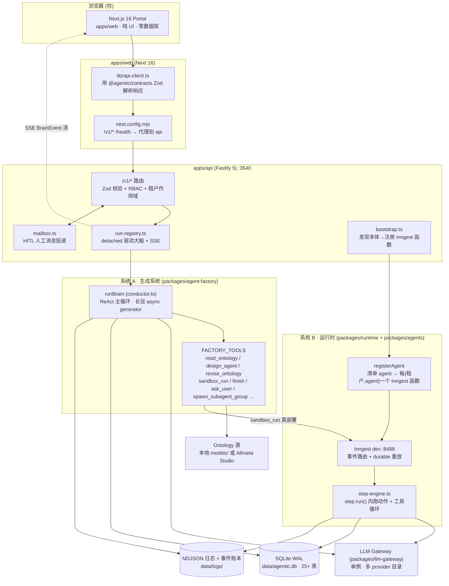
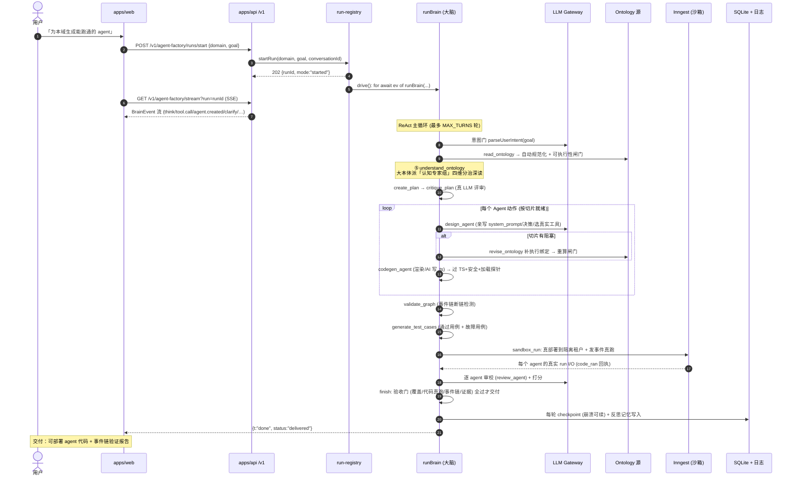
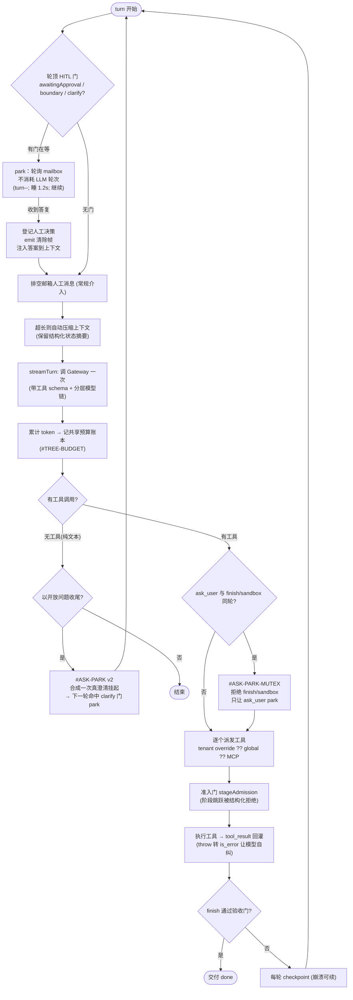
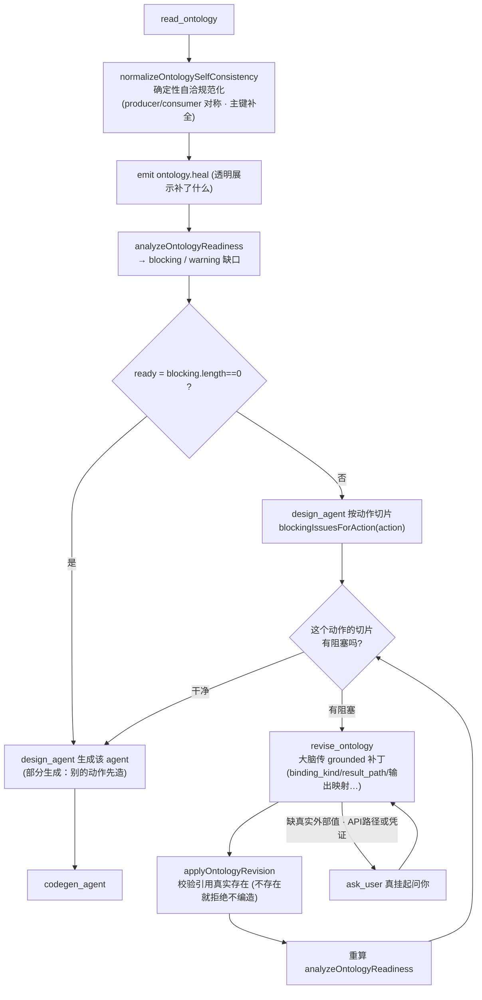
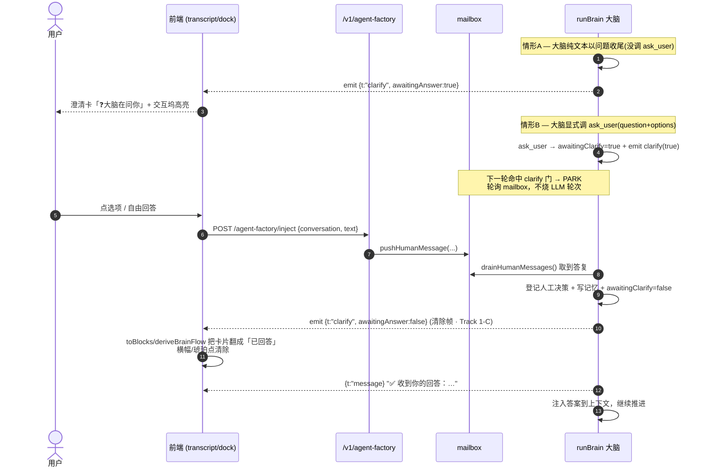
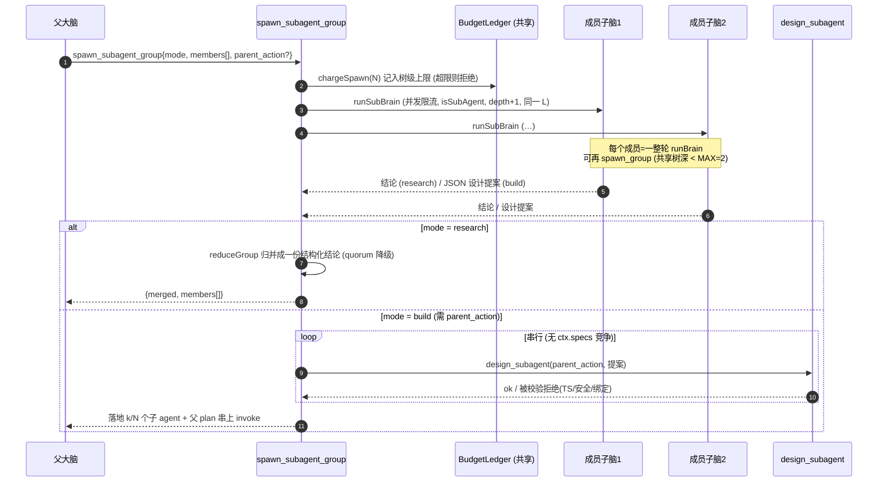
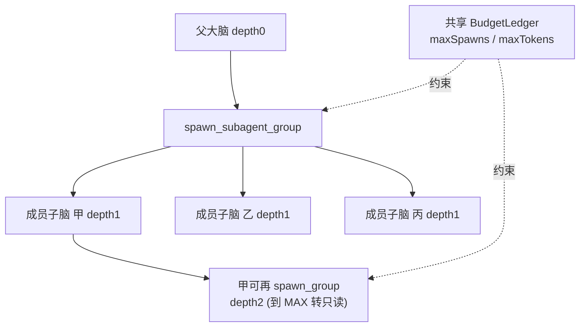
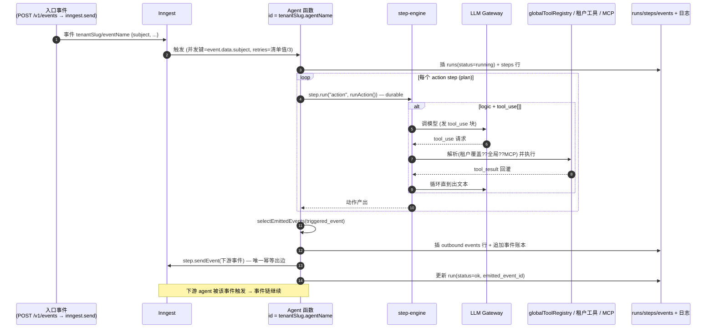
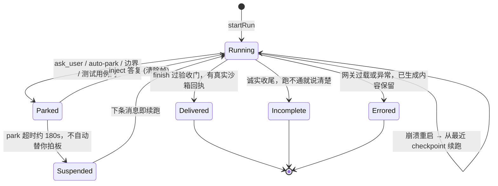
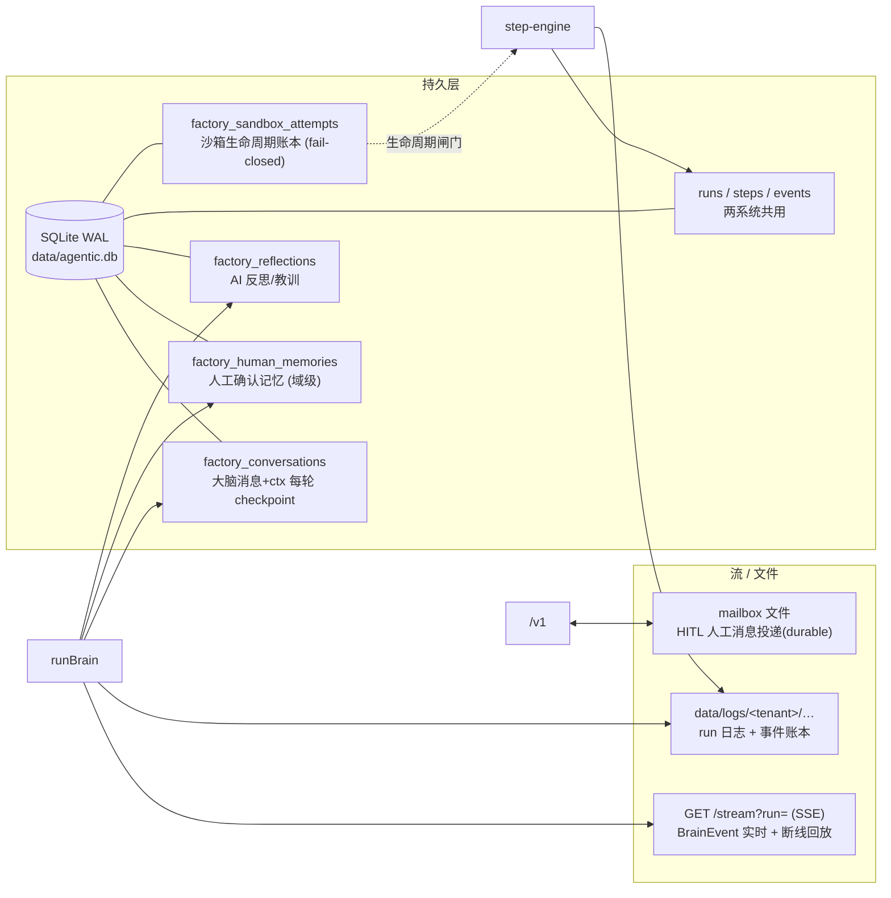

# Agent 工厂 · 技术原理与流程架构（图解）

> 本文用 mermaid 序列图 / 流程图 / 状态图逐层讲清 Agent 工厂的技术原理。所有图都对齐真实代码（文件名、事件名、工具名均可在仓库中检索）。
> 在支持 mermaid 的地方（GitHub / VS Code 预览 / Obsidian / mermaid.live / Claude）可直接渲染。

---

## 0. 一句话心智模型

工厂里其实有**两个系统**，共用一套 `runs`/`steps` 表与 SSE 日志：

- **系统 A —「生成系统」(Factory Brain)**：一个长驻的 ReAct 大脑（`packages/agent-factory/src/conductor.ts` 的 `runBrain`），读业务本体（Ontology），**推理并生成**可部署的业务 agent。
- **系统 B —「运行时」(Runtime)**：把生成好的 agent 注册成 Inngest 函数（`packages/runtime`），由**事件**触发**真正执行**，一个 agent 的产出事件触发下一个 agent，串成事件链。

工厂 = 系统 A 生成 → 沙箱用系统 B 真跑验证 → finish 晋升上线。

---

## 1. 全局架构：两进程 + 两系统

**要点**
- `apps/web` **零数据库**：每次读写都走 `/v1/*` 到 `apps/api`；`@agentic/contracts` 的 Zod schema 是请求/响应的单一事实源。
- 大脑是**detached** 驱动的（`run-registry.drive()`）：关掉 SSE 连接大脑仍在跑，重连即回放。
- 系统 A 生成的 agent，通过 `sandbox_run`/`finish` 进入系统 B 被真正注册、被事件驱动执行。

---

## 2. 端到端生成流水线（核心序列图）

从你在聊天框敲一句话，到工厂造出一组可运行 agent 并验证事件链。

**关键闸门（都是"结构强制"，不是提示词口头约束）**
- `read_ontology` 后**可执行性闸门**：本体不完整就挡住生成（见 §4）。
- `finish` 的**验收门**：必须有真实沙箱执行回执（`code_ran`）、事件链跑通、覆盖齐全，才算"交付"，否则 `finish` 返回 `ok:false` 把大脑打回。
- 全程**HITL 门**：拿不准就 `ask_user` 真挂起等你（见 §5）。

---

## 3. 大脑 ReAct 主循环（每一轮做什么）

`runBrain` 是一个 `async generator`，每 `turn` 一轮。gates 在**轮顶**（先处理人工/park），再 LLM 一次，再派发工具，再落检查点。

**为什么这样设计**
- 门在轮顶 → 人工介入优先于模型行动；park 不烧 LLM 轮次。
- 工具 `throw` → 运行时转成 `tool_result is_error`，模型下一轮自我纠正（ReAct 闭环）。
- 工具解析顺序：`租户覆盖 ?? 全局 globalToolRegistry ?? MCP`，`tool_use[]` 白名单是信任边界。

---

## 4. 本体可执行性闸门 + in-loop 修复（Track 2）

从上游语义建模器（Allmeta）拉来的本体是给**人看的语义**，缺工厂要的**执行绑定**（binding_kind / lookup result_path / 输出→事件映射）。旧设计一刀切禁止生成 → 死循环。现在是**闭环**：

**要点**
- **A 类自洽缺口**（本体单边已声明的）→ `read_ontology` 里**确定性自动补**，很可能一次消掉一大批。
- **B/C 类执行绑定/引用缺口** → `revise_ontology` 环内修，每个补丁**校验真实实体**，坏的拒绝、绝不编造；真实外部值先 `ask_user`。
- `design_agent` 从"全或无"改成**按动作切片**：切片干净的动作照常生成，只挡真正受阻的。**"分析→禁止→继续→又禁止"的死循环从机制上消除。**

---

## 5. HITL 澄清 park 生命周期（Track 1 / 1-C · 已实景验证）

这是"ask_user 开了却不暂停"三个成因的修复后形态。下图即 2026-07-14 真实 LLM run 里抓到的帧序列。

**三个成因都修了**
- **纯文本提问不 park** → 合成真 park（`AUTO_PARK_MAX` 上限防死挂）。
- **同轮 ask_user + finish 抢跑** → 互斥门，两种排列都拦住 finish/sandbox。
- **跨会话 dedup 回放 / 记忆越会话泄漏** → 记忆改 `role:system` 背景注入、不预填 askedQuestions，ask_user 真正暂停。
- **清除帧**（`awaitingAnswer:false`）→ 前端把"等你回答"翻成"已回答"，不再永久常亮。

---

## 6. 递归子智能体组（Track 3）

一个内部 agent 推理后可决定**开一组分工子脑**，每个各自独立推理（一整轮 `runBrain`），结果回灌；整棵树共享一个预算账本。

**要点**
- **共享预算账本** `BudgetLedger`：全树 token + spawn 计数统一上限，防"并行×递归"成本爆炸（**必须先于递归落地**）。
- **research**：只读调研组 → `reduceGroup` 归并（存活成员 quorum 降级）。
- **build**：每成员产出**隔离**设计提案 → **串行**调真实 `design_subagent` 逐个落地（每个过 TS/安全/绑定校验，坏提案被拒不污染）→ 父→子 invoke 工作流。串行=无共享 ctx 竞争。

---

## 7. 系统 B · 运行时：生成好的 agent 怎么被"真跑"

声明式清单 agent → `registerAgent` → **每 (租户, agent) 一个 Inngest 函数**，事件触发，串成事件链。

**durability 纪律（关键）**
- 每个 DB 写必须在 `step.run("name", ...)` 里 → Inngest 重放时**恰好一行**。
- `step.sendEvent` 是**唯一**幂等出边，绝不在 step 体里 `inngest.send`。
- HITL：`step.run` 建 `tasks` 行 → `step.waitForEvent("task.resolved", if: taskId==...)`。
- 另有**代码定义 agent**（`packages/agents` 的 `BaseAgent` 子类）走同一 `runs`/`steps` 表与 SSE。

---

## 8. 一个工厂 run 的状态机

- **park ≠ 结束**：挂起等你，不会拿"AI 初判"替你自动生效（尤其涉及真实部署/授权）。
- **崩溃可续**：每轮 checkpoint（`tsx watch` 重启/进程死都能从最近完成轮续跑）。
- **诚实收尾**：跑不通不硬凑，`analyze_failure` 说清是数据/环境/本体限制。

---

## 9. 持久化与数据面

---

## 10. 一页速查：核心组件 → 文件

| 层 | 组件 | 文件 |
|---|---|---|
| 生成大脑 | ReAct 主循环 / 门 / park | `packages/agent-factory/src/conductor.ts` |
| 生成大脑 | 40+ 工厂工具 | `packages/agent-factory/src/tools.ts` |
| 本体闸门 | 可执行性分析 | `packages/agent-factory/src/ontology-readiness.ts` |
| 本体修复 | 自洽规范化 + 补丁 + 切片 | `packages/agent-factory/src/ontology-normalize.ts` |
| 认知专家 | 四维分治深读 (LIGHT 嵌套) | `packages/agent-factory/src/specialists.ts` |
| 意图/预算 | 意图门 / 共享账本类型 | `specialists.ts` · `brain-types.ts` |
| 驱动/流 | detached 驱动 + SSE + mailbox | `apps/api/src/services/agent-factory/{run-registry,mailbox}.ts` |
| 路由 | /v1 端点 + RBAC | `apps/api/src/routes/v1/agent-factory.ts` |
| 运行时 | 清单→Inngest 函数 | `packages/runtime/src/register.ts` |
| 运行时 | step 内动作 + 工具循环 | `packages/runtime/src/step-engine.ts` |
| 代码 agent | BaseAgent 子类 | `packages/agents/src/*` |
| 工具库 | 全局工具注册表 | `packages/tools/src/registry.ts` |
| 网关 | LLM 多 provider 单例 | `packages/llm-gateway` |
| 前端 | 事件→区块投影 | `apps/web/app/portal/[tenant]/(views)/factory/model.ts` |

---

*生成于 2026-07-14。图对齐当时的真实代码；若架构演进，以代码为准。*
