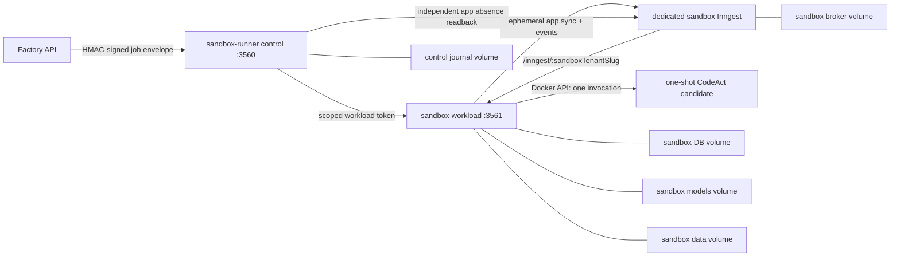

# Agent Factory 外部 sandbox 运行面

> 目标：生成的 function 不在 Agentic Operator API 进程、主 Inngest app 或业务 tenant 数据目录中运行。每次测试使用独立 attempt/app 身份，完成后必须删除并验证不存在，否则禁止 promotion。

## 1. 当前真实状态

真正独立 VM/node 的可部署模板、fail-closed validator、secret 交付边界和主 API connector overlay 位于 [`deploy/factory-sandbox/README.md`](../deploy/factory-sandbox/README.md)。该 standalone stack 与下述根目录同宿主 profile 不同：它不引用主 `api`/network/volume，默认不发布 3560，并要求远端 host identity、HTTPS ingress 和 exact registry digests。没有域名/证书、独立 VM、镜像 digest 和 secret manager 输入时只能保持 blocked，模板不会把 example 配置冒充成运行环境。

`docker-compose.yml` 提供可选的 `factory-sandbox` profile，把 `sandbox-runner` control 与 `sandbox-workload` 拆成不同服务、环境变量、network、volume 和 Docker build target。`sandbox-control` 只复制 control entrypoint 及直接依赖，不复制 `models/`、`tenants/`、bootstrap、workload route 或 candidate executor；`sandbox-workload` 仅额外携带经审计的 tenant adapter 源码，也不复制生产 `models/`。当次 candidate manifest/replay 只能从签名 bundle 物化到独立 volume。control/workload 两个 target 携带 pnpm 运行所需的通用 workspace packages；`sandbox-broker-gateway` 只暴露受控 broker 代理；`codeact-candidate` 只含 Node 与受信 JSON-lines bootstrap。生产发布会分别锁定四个第一方 target 的 digest、生成 SPDX SBOM、扫描、签名并回验 provenance/SBOM。只有一次真实 tag release 成功后才有可部署供应链证据；仓库里存在 workflow 本身不等于镜像已经发布或验签。

没有 runner 镜像、可验证的删除能力、独立 broker 密钥或安全探针结果时，预检结果必须是 `blocked/ask_user`，不能退回到 API 进程内执行，也不能把“0 个 function”当成“app 已删除”。

## 2. 信任边界



- API 只加入 control network，只能持有 runner URL、请求/结果 HMAC 引用和 runner 身份允许列表。
- broker 和 workload 只加入 execution network。API 不得持有 sandbox broker event/signing key 或 delete/workload token，也不得直连 broker/workload。
- control runner 是两个内部网络之间唯一的组件；它持有 HMAC 和受限 workload/delete token，但没有 broker event/signing key，也不加载生成代码。
- workload 服务持有 sandbox broker key、受限 workload token，以及只用于启动候选容器的 Docker socket；不得持有 request/result/receipt HMAC，因此不能自己伪造可晋升 receipt。每次生成代码调用创建一个新的非 root `codeact-candidate` 容器：`network=none`、只读 rootfs、空 env、无 mount/secret、`cap_drop=ALL`、`no-new-privileges`，并限制 CPU、内存和 PID。代码/输入与 `ctx` RPC 只走 JSON-lines stdin/stdout；workload 必须等待退出、显式删除，再反查容器不存在。
- 目标业务 tenant 的生产 Inngest 凭证不下发到 control/workload。Factory API 在生产凭证所在的控制面计算带域分隔的 event/signing/broker/app-namespace SHA-256 身份，并将这份无密钥证明绑定进签名 bundle；workload 只比较 sandbox 配置的哈希身份。目标配置不可解析或任一身份相同就 `ask_user`，不能为了测试把生产密钥复制进 workload。
- Compose 不发布 control/workload/broker 端口，两个 sandbox network 均为 `internal: true`。主 API 与 control 都不挂 Docker socket；只有 workload 挂载它，而且 candidate 容器本身仍是零 mount。control/workload 都不挂主 `agentic-data`/`agentic-models` volume 或业务 tenant 凭证。
- 本地 Compose 的 internal bridge 阻断公网出站；生产还必须用 NetworkPolicy/防火墙实现单向 control 访问和默认拒绝 egress，不能只依赖应用环境变量。
- `inngest dev` 的回调不带生产签名。workload 只能通过 `INNGEST_SANDBOX_CONFIG_REFS.devModeEnv` 引用自己的 `SANDBOX_INNGEST_DEV_MODE`；值只接受空、`0`、`1`。只有同时满足 `SANDBOX_RUNNER_ROLE=workload`、`AGENTIC_PROCESS_ROLE=sandbox-runner-workload`、`SANDBOX_RUNNER_EGRESS_MODE=deny_all` 时，`1` 才会把该 nonce App 的 SDK client 显式设为 `isDev:true`，并继续锁定专用 `baseUrl`。任一角色不符都 blocked。它不读取或设置全局 `INNGEST_DEV`，也不会改变 API/control 的签名策略。

### 生产 CodeAct 不是测试 workload

晋升后确实标记为 `codeExecuted=true` 的纯推理 handler 由独立的 `production-codeact-executor` 服务启动，不复用某次 Factory sandbox workload。主 API 只加入单独的 internal `production-codeact` network，持有 executor URL、专用 HMAC 文件和非密钥 expected identity；它仍没有 Docker socket、候选镜像启动权限或 sandbox broker 凭证。executor 使用 curated Docker target，只包含 `codeact-executor.ts` 与通用 runtime 依赖，不包含 models、tenants、API server、迁移或 provider 配置。

executor 的 `/health` 会深探 Docker socket、候选镜像的精确 image ID，并清理本执行平面的过期孤儿；清理无法证明时保持 `503`。收到 SIGTERM 后它立即进入 `draining`、拒绝新任务、向所有活动候选发送 abort，并在有界等待后强制删除、反查不存在；Compose 的 `stop_grace_period` 必须长于 `PRODUCTION_CODEACT_DRAIN_TIMEOUT_MS`，避免编排器在删除证据落定前直接 SIGKILL。

每次执行命令和 executor→API 的 `ctx` RPC 都绑定 tenant id/slug、run id、agent、correlation id、promotion version、regression suite fingerprint 与代码 SHA-256，并以独立 HMAC 验签。API 只接受精确匹配 `PRODUCTION_CODEACT_EXPECTED_EXECUTOR_ID`、`PRODUCTION_CODEACT_EXPECTED_BUILD_ID`、`PRODUCTION_CODEACT_ALLOWED_CANDIDATE_REFS` 与 `PRODUCTION_CODEACT_ALLOWED_CANDIDATE_IMAGE_IDS` 的 signed terminal；“签名正确但镜像/构建不是本次部署”仍会失败。RPC exact route 不使用普通的 100/min IP 限流，而由 execution identity、RPC id 去重和 4096 上限控制；其他 internal route 不因此放宽。route body 上限是 9 MiB，candidate JSON-lines 自身仍是 8 MiB，超限不会绕过身份账本。

executor `/health` 不是进程存活探针：它必须连通 Docker socket、inspect 到允许列表内的 candidate image id，并完成 production-plane orphan 扫描。候选容器带 `io.agentic.execution-plane=production-codeact` label；reaper 只删除这个平面的过期非活跃容器，删除后还要 inspect 证明不存在。socket/image 不可用、orphan 尚在 grace、删除失败或残留反查失败都返回 503；Compose 让 API 等待该深度健康，不能以“HTTP 进程已启动”冒充执行面可用。

在 durable command protocol 完成前，带 reason、tool、memory、invoke/spawn、foreach、step-output binding 或错误策略的生成代码不能成为 CodeAct owner。代码仍可保存、展示和人工修改，但真实 owner 固定为 declarative plan，由宿主把每个模型调用和副作用包装成稳定 Inngest step；这不是失败，也不会无意义地停在 `ask_user`。只有不发起外部 RPC、也不读取 `Date.now()`、零参 `new Date()`、`Math.random()`、crypto 随机值或 performance 时钟的确定性计算/collect-emits handler 可以走 production CodeAct；所需时间和 ID 由宿主 durable step 捕获后作为 input 传入，避免外层 action 重试时重复费用、副作用或产生漂移输出。

## 3. API 与 runner 契约

API 端使用 `FACTORY_SANDBOX_REMOTE_CONFIG_REFS` 。JSON 中只放环境变量名，不放 URL、HMAC 或 token 字面量。字段和当前客户端实现保持一致：

```json
{
  "runnerUrlEnv": "FACTORY_SB_RUNNER_URL",
  "requestSigningKeyEnv": "FACTORY_SB_REQUEST_HMAC",
  "resultSigningKeyEnv": "FACTORY_SB_RESULT_HMAC",
  "receiptSigningKeyEnv": "FACTORY_SB_RECEIPT_HMAC",
  "keyIdEnv": "FACTORY_SB_KEY_ID",
  "runnerIdEnv": "FACTORY_SB_RUNNER_ID",
  "allowedBuildIdsEnv": "FACTORY_SB_ALLOWED_BUILD_IDS",
  "allowedImageDigestsEnv": "FACTORY_SB_ALLOWED_IMAGE_DIGESTS"
}
```

control runner API 默认监听容器内 `3560`，需实现：

| 路径 | 用途 |
| --- | --- |
| `GET /live` | 只证明 control 进程存活；不作为回放、清理或 promotion 证据 |
| `GET /internal/health/delete-control` | 用 workload/delete token 验证窄化删除端点已监听；Compose 只用它安排冷启动恢复顺序 |
| `GET /health` | 深度 readiness，包括 broker、存储、reaper、清理积压和镜像身份 |
| `POST /internal/v1/sandbox-jobs` | 提交不含凭证字面量的签名 bundle |
| `POST /internal/v1/sandbox-jobs/:attemptId/status` | 读取签名状态/结果 |
| `POST /internal/v1/sandbox-jobs/:attemptId/cancel` | 请求取消；取消仍必须进入 cleanup |

消息是 canonical JSON + HMAC-SHA256 信封，包含 purpose、key id、短有效期、nonce 和 payload hash。请求、结果日志、可晋升执行回执使用三把不同的 HMAC 密钥，每把至少 32 bytes；请求重放、过期、身份/镜像摘要不在允许列表或结果/回执签名错误都必须 fail closed。

control 不再等待 workload 完整健康后才启动。它先在 broker/gateway 就绪后监听 authenticated delete-control；workload 通过 Compose dependency 和一次真实的跨容器认证探针确认该端点可达，随后才读取 durable orphan ledger 并执行恢复。control 的签名 `/health` 仍要等待 workload reaper、候选容器清理和 broker 反查全部通过，所以这个启动顺序不会把 delete-control readiness 冒充完整 cleanup readiness，也不会形成 control↔workload 的循环健康依赖。

control 侧对应使用 `SANDBOX_RUNNER_REQUEST_HMAC`、`SANDBOX_RUNNER_RESULT_HMAC`、`SANDBOX_RUNNER_RECEIPT_HMAC`、`SANDBOX_RUNNER_KEY_ID`、`SANDBOX_RUNNER_ID`、`SANDBOX_RUNNER_BUILD_ID` 和 `SANDBOX_RUNNER_RUNTIME_IMAGE_DIGEST`。Compose 会把 API 的三组 `FACTORY_SB_*_HMAC_FILE` 映射成 control 所读的变量名，并将对应 `*_HOST_FILE` 指定的宿主机文件挂载到该容器内路径。`*_FILE` 是容器内绝对路径，`*_HOST_FILE` 是必须已存在的宿主机源文件；两者要成对配置。未使用 file 模式时，Compose 只挂载一个不被应用读取的 `/dev/null` 占位，不会把 direct value 和 `_FILE` 同时打开。`request-hmac` 保护持久化 `consumed-nonces.ndjson` 防重放账本，`result-hmac` 保护持久化 job journal，`receipt-hmac` 只签可独立验证的执行证据；三者都不能共用，也不能由通用 secret 轮换单独替换。只有在带 key-id 的版本化 keyring 能验证旧记录，并能原子迁移/重签所有未过期 nonce、journal 和 receipt 后，才允许协调轮换。control 与 workload 另用至少 32 bytes 的 `SANDBOX_WORKLOAD_TOKEN` 互认；它不是 receipt HMAC。若生产 broker 或其 sidecar 的 GraphQL 控制面要求 bearer，可只在 control/workload 注入 `SANDBOX_INNGEST_CONTROL_BEARER` 或其 `_FILE`；查询、删除和权威反查都会携带它，candidate 容器仍看不到。Compose 的 workload token 与 broker bearer 文件模式同样要配对 `SANDBOX_WORKLOAD_TOKEN_FILE` + `SANDBOX_WORKLOAD_TOKEN_HOST_FILE` 以及 `SANDBOX_INNGEST_CONTROL_BEARER_FILE` + `SANDBOX_INNGEST_CONTROL_BEARER_HOST_FILE`。这些应用层 secret 当 direct value 和 file 同时出现时都拒绝启动，避免轮换期间的歧义。sandbox broker 自身的 event/signing key 是 Inngest 进程配置，不在这组应用层 `_FILE` 承诺内；生产编排应按所选 Inngest 发行版的 secret 接口注入。

## 4. 镜像契约

Compose 的本地 tag 分别是 `agentic-sandbox-control:dev` 和 `agentic-sandbox-workload:dev`，并配合 repository Dockerfile 的 `sandbox-control`/`sandbox-workload` targets 与 `pull_policy=never`：本地必须明确 build，不会从公网拉取同名镜像。生产通过 `FACTORY_SANDBOX_CONTROL_IMAGE` 和 `FACTORY_SANDBOX_WORKLOAD_IMAGE` 分别使用 registry digest，并把实际 workload digest 放入 API 允许列表。

`SANDBOX_RUNNER_RUNTIME_IMAGE_DIGEST` 只接受规范的小写 `sha256:<64 hex>`，API 允许列表也拒绝 tag、短摘要和其他自定义字符串；但它仍是运行面声明，不是镜像证明。任意镜像都能自报一个格式正确的摘要。生产必须由编排器/admission 验证实际运行 digest 和签名 attestation，control 再把该可信平台证明绑定到 receipt；不得只对比自报 env。

runner 镜像必须：

1. 以非 root 用户运行，由 `SANDBOX_RUNNER_ROLE=control|workload` 只启动一种角色；禁止一个进程同时启动 signer 和生成代码执行器。
2. control 仅在 `/sandbox/control` 和 `/tmp` 写入；workload 仅在 `/sandbox/db`、`/sandbox/models`、`/sandbox/data` 和 `/tmp` 写入；其余根文件系统只读。workload 的 import 暂存区固定为 `/sandbox/models/.imports`，与最终 manifest 共用 `factory-sandbox-models` 文件系统，才能保持 `fsync + atomic rename` 的提交/崩溃恢复语义；不得改回独立 data volume，也不得用非原子 copy 兜底。
3. control 持久化 job/nonce/cleanup 账本；workload 对每个 attempt 创建唯一目录和 Inngest app id，不就地修改或重用上一次 app。service-auth token 只在受信 control/workload 之间使用，不注入任何 candidate 容器；因此 receipt 证明的是 `candidateSecretsIssued=false`，不伪造“已撤销一个从未签发给 candidate 的租约”。
4. 不包含主系统的 `.env`、tenant 密钥、生产 models/data 或 Docker/Kubernetes 管理凭证。
5. 对不可识别的 bundle schema、凭证字面量、未允许 tool/integration 和需要公网出站的测试立即拒绝。

`factory-sandbox-models` 的备份、配额和删除策略必须把隐藏目录 `.imports` 一并视为事务恢复数据；删除这个 volume 会同时删除尚未完成发布或等待启动恢复的 staging，不得当作普通缓存清理。

如果 `src/sandbox-runner.ts` 未实现、未通过深度 health 或无法产生合格的签名 cleanup receipt，就保持 profile 不可用并请人修复/提供镜像；不要改用主 API server 路径。

## 5. 独立 Inngest app 生命周期

每一次生成/修改都是新 attempt：

1. API 预检 control identity/build/image allowlist、HMAC、control↔workload 身份、目标 tenant 的无密钥 Inngest 隔离身份、删除探针和当前 cleanup backlog。
2. control 生成 attempt/nonce 身份并记账，workload 创建 app id 与 `sandboxTenantSlug`，在 dedicated broker 注册 workload 真实的 `/inngest/:sandboxTenantSlug` serve URL。不得回调 Factory API 的 `/inngest` 或 control 的 job API。
3. 测试只使用 fixture/cassette 和沙箱数据。需要 GoHire、RAAS、Allmeta 或其他公网/内网真实写入时，停下并 `ask_user`，由人确认受限 proxy/测试 tenant，不为了“跑通”打开通用 egress。
4. 执行结束后 workload 先停止接收新 event，等待 in-flight run 排空，再通过受限 token 调用 control 的窄化 delete endpoint。生产外部 delete control 必须是 HTTPS；Compose 内部明文 HTTP 只限 internal execution network 上的这个固定 service 身份，不允许通用内网 URL。
5. workload 只在所有 one-shot candidate 容器都已退出、显式删除并反查不存在，当次物化的 manifest/tenant/tool/replay workspace 已删除、nonce App cleanup 已完成后，才返回带 content-addressed `evidenceHash` 的 infrastructure cleanup 证据。control 还必须自己从 broker 权威 app 列表反查该 app id 已不存在；不能只信 workload 的 app 删除声明。
6. 只有 control 完成独立 broker 反查后才签名 `agent-factory-sandbox-execution/v2` receipt。其 `infrastructureCleanup` 必须精确包含 `candidateExecutionAbsent=true`、`workspaceAbsent=true`、`candidateSecretsIssued=false`、`isolation=isolated_container`、每次 CodeAct 的 code/image/policy/exit/removal 证据、有效 `verifiedAt` 和可重算的 `evidenceHash`，Factory 才能接受测试结果并进入 promotion。workload 永远没有 receipt 签名密钥。

清理超时、delete mutation 失败、反查失败、app 仍存在或本地目录删除失败，都把 attempt 置为 `cleanup_failed/quarantined`。禁止 promotion，禁止将该 app/attempt 复用给修改后代码。reaper 可重试清理，但不能篡改原始失败证据。

cleanup 后保留的 archived tenant/deployment 是审计墓碑，不是等待恢复的活跃部署。启动恢复只能修复未归档 tenant 的 staging/manifest；即使 archived tenant 的代码目录已经按清理契约删除，也不得重新物化代码、重新注册 Inngest App 或重新触发 deployment。审计记录的保留与代码/运行资源的垃圾回收必须是两条独立生命周期。

## 6. TTL、lease 与 reaper

推荐的开发基线（均可配置，无效组合必须拒绝启动）：

| 参数 | 消费进程 | 基线 | 约束 |
| --- | --- | ---: | --- |
| attempt lease | workload | 180 s | 必须大于 heartbeat |
| heartbeat | workload | 30 s | 持久化，不只放内存 |
| job TTL | control | 18 min | 必须覆盖最长 15 min candidate run + 至少 3 min cleanup；超时后 cancel + cleanup，不直接删记录 |
| reaper interval | control + workload | 60 s | Compose 将同一部署基线分别以两个进程实际读取的变量名注入；不触碰未过期的活跃 lease |
| delete verify timeout | workload | 8 s | 超时即 cleanup failed |

`.env.production` 同时被 Compose 用作变量替换源和 API `env_file`，因此 Compose 在 API service 中显式将这些外部运行面参数置空，再只将 lease/heartbeat/delete verify 注入 workload，将 job TTL 注入 control。这不是丢失配置，而是防止主 API 意外恢复 in-process sandbox 权限。

reaper 要扫描持久化 DB，处理进程崩溃、broker 重启和网络短断留下的 orphan。attempt/app/status/lease/cleanup evidence 和未过期 nonce 只存在 `Map`/`Set` 内存不算完成这个契约；这种实现只能用于开发，生产 readiness 必须 blocked。`GET /health` 必须显示 reaper 最后成功时间、待清理数、最旧 orphan 年龄和 cleanup failure 数。只要有未解决 cleanup failure，sandbox readiness 就不是 green。

workload health 使用版本化 schema，只有 durable reaper 已至少完整成功一次、持久账本可读、cleanup failure 和 outstanding attempt 都为 0 时才返回 200。control 还会把自己的 job journal reaper 与 workload 的 durable reaper 时间、失败和最旧 orphan 合并显示；普通候选失败不能冒充 cleanup failure，但任何尚未被零残留证明收口的 failed job 仍保持 readiness 红灯。

## 7. 本地开发

主 stack 不需要 runner 镜像：

```bash
docker compose --env-file .env.production up -d api web inngest
```

启动 sandbox profile 前，在不入库的安全 env 文件或 shell 中提供 runner 镜像、runner 身份、workload token 和 sandbox broker 凭证。密钥不得使用文档里的占位文本。

`/secure/agent-factory-sandbox.env` 由运维自己保管，至少要提供下列键（下面的 `<...>` 只是说明，不是可运行默认值）：

```dotenv
# 本地 build 时留空，使用两个专用 dev tag。部署才分别设私有 digest。
# FACTORY_SANDBOX_CONTROL_IMAGE=<private-control-image@sha256:digest>
# FACTORY_SANDBOX_WORKLOAD_IMAGE=<private-workload-image@sha256:digest>
FACTORY_SB_RUNNER_ID=<runner-identity>
FACTORY_SB_KEY_ID=<active-hmac-key-id>
FACTORY_SB_RUNNER_BUILD_ID=<exact-runner-build-id>
FACTORY_SB_RUNTIME_IMAGE_DIGEST=sha256:<exact-workload-image-digest>
FACTORY_SB_ALLOWED_BUILD_IDS=<same-exact-build-id-or-a-reviewed-list>
FACTORY_SB_ALLOWED_IMAGE_DIGESTS=sha256:<same-exact-workload-image-digest>
FACTORY_SB_REQUEST_HMAC=<at-least-32-random-bytes>
FACTORY_SB_RESULT_HMAC=<different-at-least-32-random-bytes>
FACTORY_SB_RECEIPT_HMAC=<third-different-at-least-32-random-bytes>
SANDBOX_WORKLOAD_TOKEN=<separate-at-least-32-random-bytes>
SANDBOX_INNGEST_EVENT_KEY=<sandbox-only-event-key>
SANDBOX_INNGEST_SIGNING_KEY=<sandbox-only-signing-key>
# 仅本地 bundled `inngest dev` profile 设 1；生产 durable broker 必须为 0。
SANDBOX_INNGEST_DEV_MODE=1
```

如果用 Compose 文件 secret，将上述四个应用层 direct value（请求、结果、回执、workload token）改为成对路径（不要保留同名 direct value）：

```dotenv
FACTORY_SB_REQUEST_HMAC_FILE=/run/secrets/factory-sandbox-request-hmac
FACTORY_SB_REQUEST_HMAC_HOST_FILE=/secure/factory-sandbox-request-hmac
FACTORY_SB_RESULT_HMAC_FILE=/run/secrets/factory-sandbox-result-hmac
FACTORY_SB_RESULT_HMAC_HOST_FILE=/secure/factory-sandbox-result-hmac
FACTORY_SB_RECEIPT_HMAC_FILE=/run/secrets/factory-sandbox-receipt-hmac
FACTORY_SB_RECEIPT_HMAC_HOST_FILE=/secure/factory-sandbox-receipt-hmac
SANDBOX_WORKLOAD_TOKEN_FILE=/run/secrets/sandbox-workload-token
SANDBOX_WORKLOAD_TOKEN_HOST_FILE=/secure/sandbox-workload-token
# 只有 broker control plane 需要 bearer 时才配置：
# SANDBOX_INNGEST_CONTROL_BEARER_FILE=/run/secrets/sandbox-inngest-control-bearer
# SANDBOX_INNGEST_CONTROL_BEARER_HOST_FILE=/secure/sandbox-inngest-control-bearer
```

Compose 以 `bind.create_host_path=false` 挂载；宿主机源文件缺失会直接失败，不会偷偷创建空目录并让运行时误以为 secret 已挂载。

这个文件不能被 API service 当作 `env_file` 整体注入。Compose 只把明确列出的 runner URL/HMAC/身份字段传给 API；`SANDBOX_WORKLOAD_TOKEN` 只传给 control/workload，`SANDBOX_INNGEST_EVENT_KEY`/`SIGNING_KEY` 和 `SANDBOX_INNGEST_DEV_MODE` 只传给 workload/broker。API service 还把可能从宽泛 `.env.production` 继承的同名 dev-mode 值显式清空。生产不建议用这种平面文件，应改为编排器 secret mount 和 `${NAME}_FILE`。

```bash
docker compose \
  --env-file .env.production \
  --env-file /secure/agent-factory-sandbox.env \
  --profile factory-sandbox \
  config --quiet

docker compose \
  --env-file .env.production \
  --env-file /secure/agent-factory-sandbox.env \
  --profile factory-sandbox \
  up -d --build sandbox-inngest sandbox-workload sandbox-runner
```

主 API 与 sandbox profile 都启动后，可从只连接 control network 的 API 容器运行一次真实基础设施探针：

```bash
docker compose \
  --env-file .env.production \
  --env-file /secure/agent-factory-sandbox.env \
  --profile factory-sandbox \
  exec api ./node_modules/.bin/tsx scripts/probe-factory-sandbox.ts
```

该探针会提交一段自包含的精确生成代码，在专用 Inngest 创建一次性 App、触发事件、核对成功终态与签名 execution receipt，然后删除并权威反查 App 不存在。它使用合成 target identity，只证明外部运行面本身可用；不能代替某个业务 domain 的 ontology、工具 cassette、安全探针和人工审查。

Agent 没有绑定工具并不自动等于降级：纯计算、校验、路由、事件编排等 function 可以合法地是零工具。Factory 只能依据结构化 Ontology integration requirement、精确的 tool/runtime/event binding、显式 `degraded=true` 或缺失的验证证据判定执行面是否不完整；不得从 Action 描述里的“调用”“接口”等词语猜工具，也不得为了通过预检生成假的工具绑定。

`config --quiet` 不打印展开后的密钥。不要把 `docker compose config` 的完整输出附到 issue/日志。

如果本地改用已构建的私有 control/workload image，要先分别显式 `docker pull`/验签，再保持 `FACTORY_SANDBOX_CONTROL_PULL_POLICY=never` 和 `FACTORY_SANDBOX_WORKLOAD_PULL_POLICY=never`；或经运维确认后对对应 image 设 `missing`。`never` 不会自动拉取私有镜像。

本地零 egress 下，测试所需的 npm 依赖、编译器和 fixture 必须已在不可变 runner/workload 镜像中，运行时不许从公网下载代码。

本地 `sandbox-inngest` 运行的是 `inngest dev`，所以 Compose 的 opt-in `factory-sandbox` profile 默认只给 workload 设置 `SANDBOX_INNGEST_DEV_MODE=1`。runtime 会把该 App 标成 `mode=development`、`readiness=degraded`，不会把 unsigned callback 和内存 broker 冒充成生产就绪。实测该模式的 broker DB 是 memory；命名 volume 只用于与主 stack 分开挂载边界，不能把 dev broker 写成“生产持久化”。control 的 attempt/reaper 账本必须写入 `/sandbox/control`；workload 的独立 DB 才位于 `/sandbox/db`。broker 重启后丢失 app 也不能伪造之前的 cleanup receipt。broker key 是受信 workload 的 service 凭证，不会传给 candidate 容器；但 dev broker 仍只用于本地回放，不是生产运行面。

`SANDBOX_INNGEST_CONTROL_BEARER` 只表示 control/workload 会向 GraphQL 请求附带 bearer header，不等于 broker 已经校验它。`inngest dev` 的 `/v0/gql` 不提供可依赖的 application-level 控制面鉴权，本地只能把 internal network 当作开发隔离；生产必须由支持鉴权的 broker 或校验 bearer/mTLS 的窄化 sidecar 提供 app list/delete/readback，不能仅设置这个环境变量就宣称 GraphQL 已受保护。

## 8. 生产部署

Compose profile 是本地集成拓扑，不是生产网络隔离的充分证明。生产至少要求：

- control/workload 使用不同 service account 和密钥 ACL，最好位于独立 node pool/project；两者都使用不可变 image digest 和签名镜像策略。
- repository Dockerfile 中 `NODE_BASE_IMAGE=node:26-slim` 的默认值与 `inngest/inngest:latest` 仅供本地构建。sandbox release 已用代码审查过的 `docker.io/library/node@sha256:...` 覆盖全局 build arg，并把 base ref 写进已签名 release manifest；control/workload 最终镜像也按 digest 发布。broker 的生产镜像仍必须由所选 Inngest 部署单独锁定、签名和准入。所有实际运行 digest 都要由 admission policy 校验；不得把自报的 `SANDBOX_RUNNER_RUNTIME_IMAGE_DIGEST` 当成平台证明。
- 用支持持久化状态和鉴权删除/权威反查的 dedicated self-hosted Inngest；不把 `inngest dev` 当成生产 broker。
- `SANDBOX_INNGEST_DEV_MODE` 保持空或 `0`；生产编排可以保留 `devModeEnv` 引用用于同一镜像的显式配置，但不得将值设为 `1`。生产状态必须是 `self_hosted/ready`，不能接受 `development/degraded` 作为 durable sandbox 证明。
- 默认拒绝入站/出站；仅放行 API 到 control port、control 到 workload/broker readback、workload 到 dedicated broker/delete endpoint、broker 到 workload callback。
- HMAC 从 secret manager 以 file 方式只挂到 API/control；workload 不得看到任何 receipt/result/request HMAC。broker event/signing key 只对 workload/broker 可见，受限 workload token 只对 control/workload 可见。
- DB/models/data/broker 使用独立加密 volume，有容量上限、快照期限和安全擦除策略，不与业务 tenant 备份混合。
- 将 runner deep health、orphan/cleanup backlog、TTL cancel、broker delete verify 失败和 receipt 签名失败接入告警。
- key/image allowlist 变更是受审批变更。当前契约只支持一个 active key id；轮换要先 drain 旧 attempt，再协调切换 API/control。如果需要新旧 key 重叠窗口，必须先实现并测试 keyring，不能靠文档宣称已支持。

### 8.1 供应链发布与部署准入

Factory sandbox 镜像不复用普通 API 的 `latest` 发布口径。精确 tag ref 上的 release job 会：

1. 用代码内审阅过的 Node OCI base digest 覆盖 Dockerfile 的本地默认 tag，再用独立 `sandbox-control` / `sandbox-workload` / `sandbox-broker-gateway` / `codeact-candidate` / `production-codeact-executor` target 构建 `linux/amd64` 镜像，并写入精确 source SHA/role OCI label。当前只发布一个明确平台，避免拿 amd64 扫描结果冒充 multi-arch 完整 SBOM；需要 arm64 时必须增加独立构建、扫描和准入，而不是只改 platform 列表。
2. 以 registry 返回的 manifest digest 为 subject，生成 BuildKit provenance/SBOM，并用 Anchore Syft 生成可下载的 SPDX 2.3 JSON。
3. 用 Grype 从刚生成的 SBOM 扫描五个第一方镜像；任一 critical 漏洞都会阻断 release 并保留 JSON 报告。随后由 `actions/attest` 使用 GitHub OIDC 对五个镜像的 SLSA provenance 与 SPDX SBOM 分别签名。所有 Action 均锁定到 commit SHA，release job 只允许 GitHub-hosted runner 的证书通过自身回验。
4. 生成 `agent-factory-sandbox-image-release/v4` 清单。清单包含 exact repository/tag/source SHA、五个第一方 digest-only image ref、平台及五个 SBOM 文件摘要；衍生字段不一致或含 tag/非规范 digest 时生成器直接失败。已发布的 v3 清单仍可验证和生成 sandbox-only env，但不会推断或填入 `PRODUCTION_CODEACT_EXECUTOR_IMAGE`；生产 Compose 因缺少这个必填值而继续 fail closed。新 release 只能生成 v4。
5. 使用刚产生的 Sigstore bundle、精确 signer workflow、source SHA 和 tag ref 回验全部十一份 attestation（release manifest provenance，加五个镜像各自的 provenance 与 SBOM）。成功后才把清单、SBOM、bundle 和 checksum 附到 draft GitHub Release。

部署机器先登录承载镜像的 registry，并安装 Node 26 与支持 `gh attestation verify` 的 GitHub CLI。下载同一 release 的全部供应链附件到一个目录，然后运行：

```bash
export FACTORY_SANDBOX_EXPECTED_REPOSITORY='owner/repository'
export FACTORY_SANDBOX_EXPECTED_COMMIT='<exact-40-char-release-sha>'
export FACTORY_SANDBOX_EXPECTED_REF='refs/tags/v1.2.3'

pnpm verify:factory-sandbox-release -- \
  ./release-assets/agent-factory-sandbox-release.json \
  ./factory-sandbox-images.env \
  ./release-assets
```

验证脚本按清单校验本地 SBOM 精确字节，使用 release 附带的 Sigstore bundles 验证 signer/source/predicate，再生成权限 `0600` 的非密钥 env fragment。它同时写本机诊断 Compose 的 `FACTORY_*`、独立 VM Compose 的 `EXTERNAL_SANDBOX_*` 四个沙箱 digest ref，以及晋升后运行面必需的 `PRODUCTION_CODEACT_EXECUTOR_IMAGE` digest ref、精确 build/digest allowlist、candidate allowlist、CodeAct 显式开关和 `pull_policy=never`；Inngest/Postgres/Redis 等第三方镜像仍需由基础设施侧另外锁定 digest，HMAC、broker key、workload token 仍必须由 secret manager 单独注入。随后先按清单 digest 显式 pull 五个第一方镜像，再使用生成的 fragment 启动；`never` 确保 Compose 不在启动时悄悄解析或拉取 tag。

GitHub artifact attestation 对私有仓库的可用性取决于 GitHub 方案。没有该能力、registry push 权限或 OIDC 信任时，release 会失败，这是预期的 fail-closed 结果。若组织改用 Cosign KMS/HSM 或私有 Sigstore trust root，必须同时替换签发步骤和 `verify-factory-sandbox-supply-chain.sh` 的信任策略并做真实回验；不能设置“跳过验签”开关。仓库也无法代替运维创建 registry/KMS 权限或启用集群 admission。生产集群仍需按[GitHub/Sigstore admission 指南](https://docs.github.com/en/actions/how-tos/secure-your-work/use-artifact-attestations/enforce-artifact-attestations)启用准入，校验 Pod 实际 imageID；本地 Compose 无法提供这个平台事实。

## 9. 停机与紧急清理

1. 停止新 job 提交，记录活跃 attempt/app id。
2. 等待 workload 正常 drain + cleanup；control reaper 处理过期 lease。
3. 通过 runner/delete control 删除 app，并从 broker 权威列表反查。直接删 volume 不会删掉 broker 中的 app。
4. 保存脱敏 cleanup receipt/审计记录后，才停 runner/broker。
5. 只有确认无遗留 app 时才可删除 sandbox named volumes。不要把 `docker compose down --volumes` 当成常规 cleanup。

```bash
docker compose --env-file .env.production \
  --env-file /secure/agent-factory-sandbox.env \
  --profile factory-sandbox stop sandbox-workload
# control 完成 app 反查和审计保存后：
docker compose --env-file .env.production \
  --env-file /secure/agent-factory-sandbox.env \
  --profile factory-sandbox stop sandbox-runner
docker compose --env-file .env.production \
  --env-file /secure/agent-factory-sandbox.env \
  --profile factory-sandbox stop sandbox-inngest
```

## 10. 上线前检查表

- [ ] control/workload/gateway/candidate/production executor 镜像均可构建/可拉取并分别验签，生产使用 digest，build id、workload digest、candidate allowlist 和 `PRODUCTION_CODEACT_EXECUTOR_IMAGE` 均与签名清单一致。
- [ ] 请求/结果 HMAC 均至少 32 bytes，非占位值；API 无 broker/workload token，workload 无任何 HMAC。
- [ ] sandbox broker URL/key 与主/业务 Inngest 不同，两者的 app 列表无交集。
- [ ] delete control 只能删除 sandbox prefix + nonce 形状的 app，鉴权失败和非 sandbox app 都被拒绝。
- [ ] 删除探针完成“创建临时 app → 删除 → 权威列表不存在”，证据不含 token。
- [ ] API 只能访问 runner control，workload 无 control network，broker 无公开端口，control/workload 无公网 egress。
- [ ] DB/models/data/broker volume 与主系统分离；API/control 没有 Docker socket，只有 workload 挂载；candidate 容器没有任何 mount/env/secret。
- [ ] TTL/reaper 活着，cleanup backlog 为 0，人为制造的 cleanup 失败能阻止 promotion。
- [ ] 运行同一 bundle 的沙箱回放可重现，修改后使用新 attempt/app，旧 app 已删除并验证。

任一项不能确认时，Factory 应该用人话说明缺的是“runner 镜像”、“HMAC”、“broker/delete 能力”还是“安全探针证据”，再请用户选择或提供；不自动补默认凭证、不改用主 Inngest、不跳过 cleanup。
