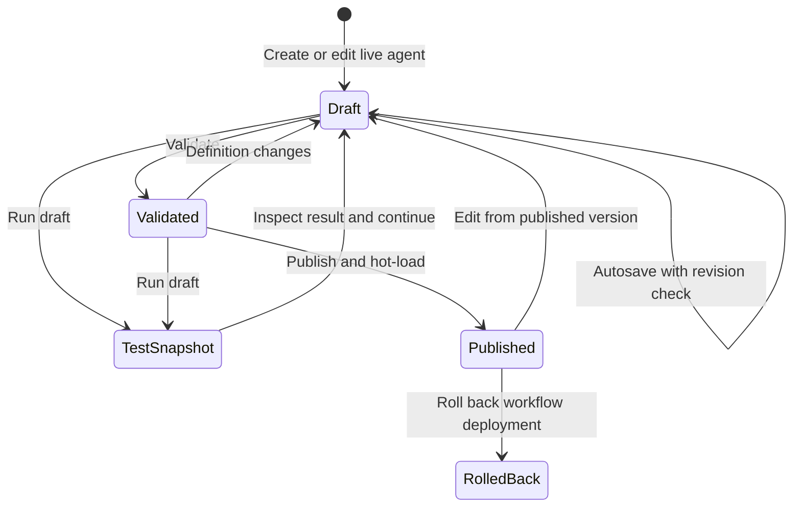
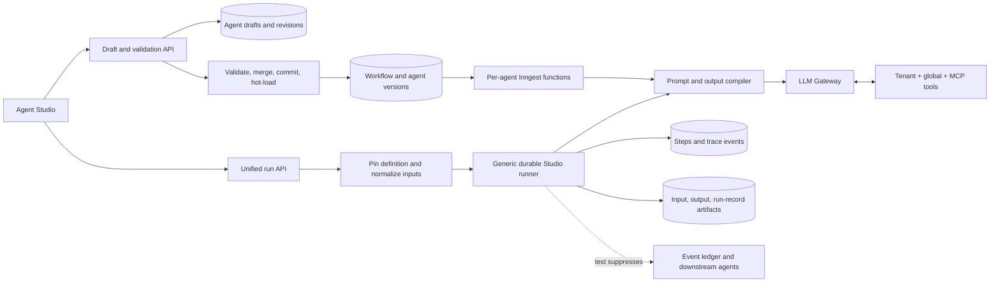

# Agent Studio and Workflow Editor

**Status:** Implemented core release (Phases 0–3; Phase 4 partially enabled)
**Date:** 2026-07-15
**Audience:** Product, design, frontend, API, runtime, platform, and QA
**Primary surface:** `/portal/:tenant/agents/:agentId`
**Related surface:** `/portal/:tenant/workflows`

Implementation note: the canonical v2 definition lives in the existing
dependency-leaf `@agentic/contracts` package rather than a new package. Drafts,
publishing, typed I/O, prompt compilation, JSON output validation/artifacts,
Test Lab execution, trace/log/output inspection, history, replay, multiple
emissions, condition branching, cron, concurrency, and action-level LLM limits
are wired end to end. Delay and subflow fields are preserved but remain visibly
marked as preview until their durable Inngest execution semantics are complete.

## 1. Executive decision

Build a full-page **Agent Studio** around one canonical, versioned agent definition. The same definition powers guided forms for non-technical users, a raw JSON/TypeScript view for technical users, draft test runs, workflow-node ports, deployment, and historical replay.

The important product boundaries are:

1. **Save draft, run draft, and publish are different actions.** Saving never changes production. A test run executes an immutable snapshot of the draft. Publishing creates a new immutable workflow and agent version.
2. **Every agent has named inputs and outputs.** One reserved prompt input is always sent as the LLM `user` message. Other inputs are validated and appended as structured context. Outputs are validated against an author-controlled JSON Schema.
3. **Every terminal run has artifacts.** `output.json` contains the exact user-defined output shape. `run-record.json` contains the stable operator envelope, including version, inputs or redacted references, validation, timing, tokens, and artifact links.
4. **The tool list is an execution allow-list.** The editor must show the same resolved tenant/global/MCP catalog the runtime can actually call, including configuration and side-effect metadata.
5. **The Test Lab is part of the editor.** It combines a chat-style prompt composer, schema-generated input controls, live sequence/trace, logs, validated output, artifacts, and durable history.
6. **“Thinking” means a safe reasoning summary and execution evidence.** The product exposes step objectives, model calls, tool calls, validation/repair decisions, timings, and an optional concise model-provided rationale. It does not request, store, or display hidden chain-of-thought.
7. **Workflow edges remain event-driven.** Named ports add schema and mapping to the existing event graph; they do not introduce an unrelated direct-call orchestration model.

This evolves the working create-agent wizard, manifest import/deploy path, tool catalog, runs UI, log SSE, and artifact viewer already in the repository. It does not create a parallel editor or runtime.

## 2. Why the current implementation cannot simply be “wired up”

The repository has several strong foundations:

- The runtime manifest already preserves editor-oriented fields such as `input_data`, `ontology_instructions`, `tool_use`, and `typescript_code`, and preserves unknown keys through `.passthrough()` in `packages/runtime/src/manifest.ts`.
- The create-agent flow already generates an editable system prompt, selects live models and tools, configures retry/timeout/concurrency, commits through the robust manifest-import path, and hot-loads the function in `apps/api/src/services/agent-authoring.ts` and `apps/web/app/portal/components/agents/DeployAgentModal.tsx`.
- Successful manifest runs already persist `run-output.json` and artifact metadata in `packages/runtime/src/register.ts`.
- Run detail already has timeline, trace, logs, I/O, artifacts, events, stop, and replay surfaces in `apps/web/app/portal/[tenant]/(views)/runs/[id]/page.tsx`.

The blockers are architectural, not cosmetic:

| Gap                     | Current behavior                                                                                                                                             | Required correction                                                                                                                    |
| ----------------------- | ------------------------------------------------------------------------------------------------------------------------------------------------------------ | -------------------------------------------------------------------------------------------------------------------------------------- |
| Schema ownership        | `packages/runtime/src/manifest.ts` is richer than the duplicate contract in `packages/contracts/src/agents.ts`; the narrower upload schema can strip fields. | One dependency-leaf schema package imported by runtime, contracts, API, schema generation, and tests.                                  |
| Agent read              | `GET /v1/agents/:kebab` returns only identity, events, actions, and workflow version. The portal fills prompt/tool/model/input/code with empty values.       | Return the complete normalized definition, live version, draft metadata, validation state, and capabilities.                           |
| Agent edit              | The current “Save & deploy” button only exits local edit mode; several controls are placeholders.                                                            | Server-persisted draft with optimistic concurrency, autosave, validate, run, and publish endpoints.                                    |
| Workflow quick edit     | The current draft serializer can replace actions with a stub and drop fields.                                                                                | Patch the selected definition without reconstructing or truncating it. Preserve unknown keys.                                          |
| Inputs                  | `input_data` is an untyped object; custom run input is one raw JSON textarea.                                                                                | Named ports, JSON Schema, defaults/examples, file inputs, trigger mappings, and generated forms.                                       |
| User prompt             | Generated agents serialize the trigger payload into a generic user turn.                                                                                     | A deterministic prompt compiler that always inserts the reserved prompt input as `role:user` and appends validated structured context. |
| Outputs                 | No manifest-level output schema; structured parsing is best-effort.                                                                                          | Provider JSON mode where available, strict parse/validate, bounded repair, explicit failure, and exact JSON artifact.                  |
| Multiple outputs/events | Actions are sequential and only `triggered_event[0]` is emitted.                                                                                             | Multiple logical output ports and explicit event payload mappings; use one idempotent `step.sendEvent` per mapped event.               |
| Test run                | Manifest invoke returns an event/correlation ID, not an immediate run ID, and can only invoke an agent with a trigger.                                       | Reserve a run ID first and use a generic durable Studio runner that executes a pinned draft/live definition.                           |
| Trace                   | Tool arguments/results are transient, manifest steps omit model/token fields, and step sidecars are intentionally disabled.                                  | Persist structured spans, step I/O refs, model/tool evidence, output validation, and safe reasoning summaries.                         |
| Versions                | Workflow deployments are shown as a proxy for agent versions.                                                                                                | Agent-centric draft and published-version history, with exact definition and run pinning.                                              |

The old `POST /v1/agents` upload route must not back the Studio. Single-agent publish should merge into the current live workflow and delegate to the existing validated, staged, atomic manifest-import `commit()` path.

## 3. Users and interaction modes

### 3.1 Non-technical builder

The default **Guided** mode uses plain-language forms:

- start from a template;
- describe the job and generate instructions with AI;
- add inputs and output fields with a schema builder;
- choose tools from the catalog and fill only permitted configuration;
- select a model and safe runtime defaults;
- test with a prompt and generated variable form;
- review validation and publish.

JSON Schema, event payload paths, provider IDs, and manifest field names remain available as secondary detail, not prerequisites.

### 3.2 Technical builder

The **Advanced** mode edits the same in-memory draft through:

- raw agent-definition JSON in Monaco;
- JSON Schema editors for inputs and outputs;
- the effective system/user message preview;
- tool argument/config/return schemas;
- all runtime limits;
- action-specific fields;
- TypeScript metadata or the existing code-agent deployment surface;
- a semantic diff against the live version.

Guided and Advanced are two projections of one state tree. Switching modes must round-trip without dropping pass-through fields. There is never a “simple configuration” and a separate “real configuration.”

### 3.3 Operator and viewer

- Operators can run a draft, inspect traces, replay, compare outputs, and stop an active run.
- Viewers can inspect definitions, versions, runs, logs, and artifacts but cannot modify or execute.
- Publishing and enabling live side effects require an admin role or a dedicated `agents:publish` grant.

## 4. Information architecture

Keep the existing agent URL, but turn the detail page into the Studio shell:

```text
/portal/:tenant/agents
/portal/:tenant/agents/new
/portal/:tenant/agents/:agentId
/portal/:tenant/agents/:agentId?section=inputs
/portal/:tenant/agents/:agentId?section=test&run=:runId
```

The header always shows:

- agent title, stable ID, actor, and enabled state;
- `LIVE <version>` and `DRAFT r<n>` badges;
- validation state and autosave state;
- `Validate`, `Save draft`, `Publish`, and primary `Run` actions;
- an explicit run target: **Draft** or **Live**.

The section rail is:

1. **Overview** — identity, description, actor, template, stage, enabled state.
2. **Instructions** — editable `ontology_instructions`, AI generation, locked platform preamble, effective-message preview.
3. **Inputs** — named ports, schemas, defaults, examples, controls, files, and trigger bindings.
4. **Outputs** — named ports, JSON shape, examples, validation policy, file policy, and event mappings.
5. **Steps** — ordered `tool`, `logic`, `manual`, `condition`, `delay`, and `subflow` actions.
6. **Tools** — allow-list, schemas, integration state, configuration, and side-effect policy.
7. **Runtime** — model/provider and execution, resilience, scale, and observability limits.
8. **Workflow** — inbound/outbound events, port mappings, upstream/downstream impact, and “Open in graph.”
9. **Test** — prompt composer, input form, live trace, output, logs, artifacts, and history.
10. **Versions** — draft revisions, published versions, diff, rollback, and version-pinned runs.
11. **Advanced** — raw definition, TypeScript metadata, and preserved unknown fields.

On smaller screens, the section rail becomes a select and the Test Lab becomes a full-width lower section. Avoid a modal for the main editor; the existing deploy modal becomes a quick-create launcher that creates a draft and opens the full Studio.

## 5. Studio layout and behavior

### 5.1 Main workbench

Desktop uses four logical regions without duplicating data:

```text
┌ Agent identity · LIVE v12 · DRAFT r7 ─ [Validate] [Save] [Publish] [Run] ┐
├ Agent list ┬ Section rail ┬ Guided editor / JSON editor ┬ Context panel  ┤
│ search     │ Instructions │ field/schema/action editor  │ validation     │
│ status     │ Inputs       │                             │ manifest diff  │
│ drafts     │ Outputs      │                             │ dependencies   │
└────────────┴──────────────┴─────────────────────────────┴─────────────────┘
```

The context panel changes with the active section:

- Instructions: effective system and user messages.
- Inputs/Outputs: generated example and JSON Schema.
- Tools: permission/config summary.
- Runtime: estimated limits and inherited defaults.
- Workflow: connection compatibility and downstream impact.
- Advanced: semantic diff and validation issues.

Validation issues use JSON Pointer paths and clicking one focuses the matching Guided field or raw JSON location.

### 5.2 Draft lifecycle



Rules:

- Autosave is debounced and server-backed. A visible `Saved at …` state replaces optimistic ambiguity.
- `PATCH` requires the last seen draft revision. A stale update receives `409 draft_revision_conflict` with the current revision and a mergeable diff.
- Running creates an immutable draft revision snapshot first. Later edits cannot change the definition associated with that run.
- Publishing performs a three-way merge using the draft’s base workflow version. Unrelated live agent changes are rebased automatically; a concurrent change to the same agent returns `409 publish_conflict`.
- In-flight runs remain pinned to their original `agent_version_id` or `draft_revision_id`.

### 5.3 Workflow editor relationship

`/workflows` remains the orchestration canvas. It should provide quick edits for title, position/stage, triggers, emitted events, and port connections. A node action opens the full Studio for prompts, schemas, tools, steps, runtime, tests, and versions.

Named ports appear on graph nodes:

- input ports on the left;
- output ports on the right;
- events remain labeled edges;
- schema-compatible mappings connect immediately;
- ambiguous or missing required fields open a mapping dialog;
- connection changes update the same server draft used by the Studio.

The graph must patch a definition, never regenerate the whole agent from a reduced UI shape.

## 6. Canonical Agent Definition v2

### 6.1 Schema ownership

Create a dependency-leaf package such as `packages/agent-definition` that depends only on Zod and exports:

- `AgentDefinitionV2Schema`;
- `WorkflowManifestV2Schema`;
- input/output/action/runtime types;
- V1-to-V2 normalization and migration;
- semantic validation issue types;
- deterministic JSON Schema generation.

`@agentic/runtime`, `@agentic/contracts`, API services, schema generation, and tests import it. The web consumes the serialized contract and JSON Schema. This removes the current runtime/contracts/generated-schema drift without creating a dependency cycle.

The canonical file shape becomes:

```json
{
  "$schemaVersion": 2,
  "agents": []
}
```

Bare V1 arrays remain importable. All loaders must call the same `migrateAndParseWorkflowManifest()` before validation; no loader may call `WorkflowManifestSchema.parse(rawFile)` directly.

### 6.2 Additive example

The v2 agent keeps every current manifest concept and adds typed I/O, prompt assembly, output validation, and observability. Existing top-level runtime keys remain canonical initially so the runtime does not have two conflicting sources of truth.

```json
{
  "id": "5-candidate-assessor",
  "name": "candidateAssessor",
  "title": "Candidate Assessor",
  "description": "Assess a candidate against a job and explain the result.",
  "actor": ["Agent"],
  "stage": 5,
  "template": "extract",

  "trigger": ["CANDIDATE_READY"],
  "trigger_bindings": {
    "CANDIDATE_READY": {
      "prompt": {
        "template": "Assess {{event.candidate.name}} for {{event.job.title}}."
      },
      "candidate": { "path": "$.candidate" },
      "job": { "path": "$.job" }
    }
  },

  "inputs": [
    {
      "id": "prompt",
      "label": "Request",
      "kind": "prompt",
      "required": true,
      "schema": { "type": "string", "minLength": 1 },
      "default": "Assess this candidate and return a hiring recommendation.",
      "ui": { "control": "textarea" }
    },
    {
      "id": "candidate",
      "label": "Candidate",
      "kind": "value",
      "required": true,
      "schema": {
        "type": "object",
        "required": ["id", "resume"],
        "properties": {
          "id": { "type": "string" },
          "resume": { "type": "string" }
        },
        "additionalProperties": false
      },
      "example": { "id": "cand-102", "resume": "…" },
      "ui": { "control": "json" }
    },
    {
      "id": "job",
      "label": "Job",
      "kind": "value",
      "required": true,
      "schema": {
        "type": "object",
        "required": ["id", "title", "requirements"],
        "properties": {
          "id": { "type": "string" },
          "title": { "type": "string" },
          "requirements": { "type": "array", "items": { "type": "string" } }
        }
      }
    }
  ],
  "input_data": {
    "prompt": "Assess this candidate and return a hiring recommendation."
  },

  "ontology_instructions": "You are a careful recruiting analyst. Use only the supplied candidate and job data. Do not invent experience.",
  "user_prompt_template": "<candidate>{{json inputs.candidate}}</candidate>\n<job>{{json inputs.job}}</job>",
  "generated": true,
  "prompt_provenance": {
    "mode": "ai-assisted",
    "source_hash": "sha256:…",
    "provider": "openai",
    "model": "gpt-5",
    "generated_at": "2026-07-14T10:00:00.000Z"
  },

  "tool_use": [
    {
      "name": "matchResumeApi",
      "description": "Compare a resume to a job description.",
      "input_schema": {
        "type": "object",
        "required": ["resume", "job_description"],
        "properties": {
          "resume": { "type": "string" },
          "job_description": { "type": "string" }
        }
      },
      "config": { "timeout_ms": 60000 }
    }
  ],

  "actions": [
    {
      "order": "1",
      "name": "assessCandidate",
      "description": "Assess evidence, use the match tool when needed, and produce the declared outputs.",
      "type": "logic",
      "retries": 1,
      "timeout_s": 90
    }
  ],

  "outputs": [
    {
      "id": "assessment",
      "label": "Assessment",
      "required": true,
      "schema": {
        "type": "object",
        "required": ["recommendation", "score", "evidence"],
        "properties": {
          "recommendation": {
            "type": "string",
            "enum": ["advance", "hold", "reject"]
          },
          "score": { "type": "number", "minimum": 0, "maximum": 100 },
          "evidence": { "type": "array", "items": { "type": "string" } }
        },
        "additionalProperties": false
      }
    },
    {
      "id": "summary",
      "label": "Operator summary",
      "required": true,
      "schema": { "type": "string", "maxLength": 1200 }
    }
  ],
  "output_config": {
    "format": "json",
    "strict": true,
    "repair_attempts": 1,
    "artifact": {
      "filename": "output.json",
      "persist_individual_outputs": false
    }
  },
  "triggered_event": ["CANDIDATE_ASSESSED"],
  "output_bindings": {
    "CANDIDATE_ASSESSED": {
      "candidate_id": { "input": "candidate", "path": "$.id" },
      "assessment": { "output": "assessment" },
      "summary": { "output": "summary" }
    }
  },

  "provider": "openai",
  "model": "gpt-5",
  "temperature": 0.2,
  "max_tokens": 2400,
  "timeout_s": 120,
  "retries": 3,
  "concurrency": {
    "enabled": true,
    "max_concurrent_executions": 8,
    "key": "$.inputs.candidate.id"
  },
  "tool_loop": { "max_iterations": 8 },
  "cron": null,
  "cron_timezone": null,

  "observability": {
    "trace_level": "standard",
    "reasoning_summary": true,
    "persist_rendered_prompts": false,
    "retention_days": 30
  },
  "typescript_code": ""
}
```

### 6.3 Current-field treatment

| Current field                                                                                            | Studio treatment                                                                                                                                                                     |
| -------------------------------------------------------------------------------------------------------- | ------------------------------------------------------------------------------------------------------------------------------------------------------------------------------------ |
| `id`, `name`, `title`, `description`, `actor`                                                            | Overview; `id` and `name` become immutable after first production publish unless a deliberate clone/rename flow is used.                                                             |
| `trigger`, `triggered_event`                                                                             | Workflow section and graph edges; remain canonical event rosters.                                                                                                                    |
| `actions`                                                                                                | Steps section with all six current action types and type-specific fields.                                                                                                            |
| `input_data`                                                                                             | Default manual-run values and legacy compatibility, not a schema.                                                                                                                    |
| `ontology_instructions`                                                                                  | User-authored system-instruction block.                                                                                                                                              |
| `tool_use`                                                                                               | Tool allow-list plus catalog-derived schema/config forms.                                                                                                                            |
| `typescript_code`                                                                                        | Advanced metadata for manifest agents. The UI must clearly state that arbitrary inline TypeScript is not executed; executable code agents continue through the code deployment path. |
| `generated`                                                                                              | Prompt/runtime mode and compatibility flag.                                                                                                                                          |
| `provider`, `model`, `retries`, `timeout_s`, `concurrency`, `cron`, `cron_timezone`, `template`, `stage` | Promoted from pass-through values into declared, validated schema fields.                                                                                                            |
| unknown pass-through keys                                                                                | Preserved in Advanced mode and through every save/publish round trip.                                                                                                                |

## 7. Input model and deterministic prompt assembly

### 7.1 Input ports

Every agent has one or more unique `inputs[]` entries:

- `prompt` — exactly one reserved conversational input for LLM agents;
- `value` — string, number, boolean, object, or array described by JSON Schema;
- `file` — artifact-backed upload with media-type and size limits;
- human agents may omit `prompt` but still use typed value/file inputs.

Each port supports `id`, label, description, kind, required, schema, default, example, sensitivity annotation, and UI hint. JSON Schema is the contract; UI hints never change validation.

File values are artifact references, not unbounded base64 injected into messages. A tool or extraction step reads the file when required.

### 7.2 Trigger bindings

Production events bind payload values to input ports through a restricted JSONPath subset or a constant/template. Bindings are compiled and validated at publish time. External `$ref`, arbitrary JavaScript, function calls, environment reads, and network access are forbidden.

A missing required binding fails before the first model call and appears as an input-validation span. It does not become a vague LLM error.

### 7.3 User-message compiler

For an LLM agent, the runtime always sends one user message assembled as:

```text
<the exact value of inputs.prompt>

<agent-inputs>
<content rendered by user_prompt_template from non-prompt inputs>
</agent-inputs>

<attachments>
<artifact metadata, never hidden filesystem paths>
</attachments>
```

The prompt input is a locked first block in Guided mode. A custom template controls the structured context, but cannot omit or promote user text into the system message. If a raw template does not reference the prompt, the compiler still prepends it.

Template expressions are deliberately small: `{{inputs.name}}`, `{{json inputs.name}}`, and approved metadata such as `{{run.subject}}`. Every reference is statically checked. Values are escaped/serialized rather than evaluated.

### 7.4 Effective system message

The Instructions preview shows the exact composition:

1. locked platform and tenant safety policy;
2. the editable `ontology_instructions`;
3. generated output-contract instructions;
4. generated tool-use constraints.

This removes the current surprise where a generic prelude and description are added outside the editor. The locked preamble is visible, versioned, and identified separately from user-authored text.

## 8. Output model, JSON format, and files

### 8.1 Named outputs and exact JSON shape

`outputs[]` contains one or more named ports. The compiler constructs the final object schema from those ports:

```json
{
  "assessment": { "recommendation": "advance", "score": 86, "evidence": ["…"] },
  "summary": "Strong fit with two gaps to verify."
}
```

Changing a port name, type, fields, required set, enum, array shape, or nested structure changes the required `output.json` format. Guided mode provides field rows and examples; Advanced mode edits JSON Schema directly.

For a single output, Advanced mode may opt into `unwrap_single_output`; otherwise the named-object form stays consistent. Multiple outputs always use an object root so graph mapping remains deterministic.

### 8.2 Generation and validation

The runtime:

1. compiles the port schemas into one JSON Schema;
2. uses provider-native structured output/JSON mode when available;
3. parses the final model response;
4. validates it locally with a pinned JSON Schema implementation;
5. if configured, performs at most `repair_attempts` correction turns using only validation errors and the invalid response;
6. fails with `output_schema_invalid` when strict validation still fails;
7. records parse, validation, and repair spans.

External schema references, excessive nesting/property counts, and unbounded output sizes are rejected at authoring time. A permissive legacy output uses `{}` and `strict:false` until the user adopts a schema.

### 8.3 Artifact contract

Every run writes through the shared artifact service under the configured data root; callers never choose an arbitrary directory.

| Artifact            | Content                                                                                                                                                                                                              | Policy                                                         |
| ------------------- | -------------------------------------------------------------------------------------------------------------------------------------------------------------------------------------------------------------------- | -------------------------------------------------------------- |
| `run-input.json`    | Normalized input values and artifact references; sensitive values are redacted or referenced. Session-context runs also store the exact bounded prior turns under the reserved `__agentic_conversation_history` key. | Always for Studio runs; configurable retention for production. |
| `output.json`       | Exact user-defined output JSON.                                                                                                                                                                                      | Mandatory for every successful run.                            |
| `run-record.json`   | Stable platform envelope: IDs, pinned definition, status, input/output artifact IDs, validation, events, model, tokens, timing, and errors.                                                                          | Mandatory for every terminal state.                            |
| `raw-response.txt`  | Provider text before parse/repair.                                                                                                                                                                                   | Off by default; permission- and retention-controlled.          |
| step/tool artifacts | Redacted request/result payloads for selected trace levels.                                                                                                                                                          | Controlled by trace and sensitivity policy.                    |

Write a temporary file, flush/close it, atomically rename it, insert the artifact row, and only then mark a successful run `ok`. A failed mandatory output write makes the run fail with `artifact_persistence_failed`; it must not report success without the promised file. A boot reconciler detects orphaned files and missing artifact rows.

The API streams artifacts by opaque ID after tenant authorization. It never returns or accepts physical filesystem paths.

## 9. Instructions generated with AI

The current system-prompt generator is retained and expanded. The Studio action sends the complete draft context:

- role, title, description, actor, template, and stage;
- input names, schemas, examples, and trigger bindings;
- output names, schemas, quality rules, and emitted events;
- selected tools and their real catalog descriptions/schemas;
- runtime limits and human-review behavior;
- tenant policy identifiers, never secrets.

The result is a proposed patch, not an automatic save. The UI supports:

- **Generate** from the description;
- **Improve** the selected instructions;
- **Shorten** without removing constraints;
- **Add guardrails**;
- **Explain changes** as a diff summary.

Accepting a result updates only the user-owned instruction block. Store provider, model, time, source-definition hash, and token usage in `prompt_provenance`; audit generation and acceptance separately. If the definition changes materially, show “Generated from an older draft” rather than silently regenerating.

## 10. Tools and permissions

### 10.1 Resolved catalog

The picker must represent the runtime resolution order:

```text
tenant override -> global registry -> namespaced MCP/skill tools
```

Extend the catalog response with source, availability, integration state, input/config/output schemas, aliases, and:

```ts
sideEffect: "none" | "read" | "write" | "external";
testPolicy: "allow" | "simulate" | "confirm" | "deny";
sensitiveOutput: boolean;
```

The existing global registry metadata and Tools portal become reusable picker/detail components. Tenant-native and MCP tools must be included so the editor and runtime cannot disagree.

### 10.2 Enforcement

- Only names in `tool_use[]` are advertised or dispatchable.
- Tool-call input is validated against the resolved schema before handler execution.
- `config` is validated against the catalog config schema.
- Credentials come from tenant integrations or tenant-scoped references; literal keys remain forbidden.
- Test mode allows read-only tools by default, simulates where supported, and requires explicit confirmation for write/external tools.
- Tool call input/output is redacted according to schema annotations before trace persistence.

## 11. Runtime configuration

The Runtime section uses progressive disclosure and shows inherited values explicitly.

**Model**

- provider and model;
- temperature;
- maximum output tokens;
- provider fallback policy when supported.

**Execution**

- run timeout;
- agent retries and backoff;
- action-level timeout/retries;
- tool-loop maximum iterations;
- strict output and repair attempts.

**Scale and triggers**

- concurrency enabled/limit/key;
- schedule and time zone;
- maximum input, attachment, output, and artifact sizes.

**Observability and retention**

- trace level (`minimal`, `standard`, `debug`);
- reasoning summary on/off;
- rendered-prompt persistence on/off;
- retention days;
- sensitive-field redaction preview.

Only fields the runtime actually honors may be shown as enabled. Cron, condition branching, durable delay, subflow, memory, and per-action limits must either be wired end-to-end before exposure or visibly marked unsupported; pass-through JSON must never imply working behavior.

## 12. Test Lab and run history

### 12.1 Interaction model

The Test section is a persistent workbench, not a JSON modal:

```text
┌ Target: Draft r7 ▾ · Safe tools ▾ · History ▾                 [Stop] [Replay] ┐
├ Prompt and inputs (36%) ┬ Sequence / trace (34%) ┬ Result (30%)              ┤
│ chat-style prompt       │ input validation       │ validated JSON            │
│ schema-generated form   │ prompt/model spans     │ output ports               │
│ file inputs             │ tool calls/results     │ artifacts                  │
│ Form ↔ JSON             │ output validation      │ Logs / raw response        │
│                  [Run]  │ timing + tokens        │                            │
└─────────────────────────┴────────────────────────┴────────────────────────────┘
```

The left pane contains:

- a chat-style prompt composer bound to the reserved `prompt` input;
- a form generated from all other input schemas;
- a Form/JSON toggle over the same values;
- file controls for file ports;
- a clear Draft/Live target;
- a safe-tools/live-tools execution policy.

Submitting a user message creates one run. The API defaults `contextMode` to `isolated` for backwards compatibility, while the Test Lab chat composer explicitly uses `contextMode: "session"` when continuing a conversation. Session mode validates that the session belongs to the same tenant and agent, rejects a second queued/running/waiting run in that session with `session_busy`, and loads only completed prior user and assistant messages before appending the current user message.

Conversation history is normalized at the API boundary: user turns preserve the stored prompt verbatim except for canonical LF line endings, while assistant JSON is serialized with deterministic key ordering. The newest history is capped at 20 messages and 64 KiB. The exact bounded array is stored in `run-input.json` under `__agentic_conversation_history`, sent with the durable Inngest event, and inserted between the immutable system instructions and current user prompt by the runtime. A replay reuses the original artifact snapshot—even if the session has received newer messages—and caller input patches cannot replace the reserved history key. Older isolated artifacts without the key continue to replay without conversation history.

The center pane shows live ordered spans. Expanding a span reveals redacted input/output, model/provider, tokens, duration, retry number, and errors. The right pane renders the validated output by port, exact JSON, artifacts, and logs.

### 12.2 Reasoning and “thinking”

The UI label is **Reasoning summary**, not “chain of thought.” Sources are:

- declared action objective;
- a provider-returned reasoning summary when explicitly supported;
- model-authored concise rationale fields explicitly requested by the application;
- deterministic runtime facts such as “selected tool X,” “retried after schema error,” or “suppressed event in test mode.”

The system does not request or persist private scratchpad reasoning. Logs, prompts, tool arguments/results, model metadata, and validation evidence provide auditability without pretending hidden reasoning is available.

### 12.3 Run target and side effects

- **Draft** is the default target and pins a draft revision snapshot.
- **Live** pins the currently deployed `agent_version_id`.
- Test runs suppress downstream production events by default and record what would have been emitted.
- Tools tagged `write` or `external` require an explicit per-run confirmation unless a simulator is available.
- A prominent badge distinguishes `TEST`, `LIVE INPUT`, `REPLAY SAME VERSION`, and `REPLAY LATEST`.

### 12.4 History

History is server-paginated and filterable by version, draft revision, status, source, session, date, and side-effect mode. Each row opens the full trace and supports:

- **Replay same version** — reproducible default;
- **Run with current draft** — explicitly upgrades the definition;
- **Use inputs in composer** — copies non-sensitive values;
- **Compare** — inputs, definition hash, outputs, tokens, timing, and trace differences.

Sensitive values are never copied from a redacted artifact; the user must re-enter them.

## 13. Runtime architecture



### 13.1 Shared execution core

Refactor the current registrar so production functions and the generic Studio function share an `executeAgentDefinition()` core for:

- input normalization and prompt compilation;
- ordered actions and tool loop;
- structured output parsing/repair/validation;
- trace spans and artifacts;
- terminal run finalization.

Inngest durability remains the boundary. Database writes, artifact registration, and emitted-event records occur inside named `step.run` blocks. Downstream events use `step.sendEvent` outside the write body, one stable step ID per event mapping.

The Studio function differs only in how it loads the pinned definition and in its default side-effect/event policy. It must not dynamically register a production function for every autosaved draft.

### 13.2 Reserve the run before dispatch

`POST /v1/agents/:id/runs` performs:

1. authorize target version/draft and requested tool policy;
2. validate and normalize inputs;
3. snapshot the draft when necessary;
4. allocate `runId`, session, queued row, definition artifact, and input artifact;
5. send the durable execution event carrying the reserved IDs;
6. return `202` immediately with run and stream URLs.

If dispatch fails, the reserved run becomes `failed` with `dispatch_failed`. Manifest and code agents return the same response envelope.

### 13.3 Execution sequence

```mermaid
sequenceDiagram
    actor User
    participant Studio
    participant API
    participant Runner as Durable runner
    participant LLM as LLM gateway
    participant Tool as Tool registry
    participant Store as DB and artifacts

    User->>Studio: Prompt + named inputs + Run
    Studio->>API: POST agent run, target=draft revision
    API->>Store: Validate, snapshot, create queued run and input artifact
    API-->>Studio: 202 runId + trace stream URL
    API->>Runner: Dispatch reserved run
    Runner->>Store: Mark running; append input/prompt spans
    Runner->>LLM: System + compiled user message + tool allow-list + output schema
    opt Model requests a tool
        LLM-->>Runner: Tool call
        Runner->>Tool: Validated arguments and tenant config
        Tool-->>Runner: Result or typed error
        Runner->>Store: Append redacted tool span
        Runner->>LLM: Tool result
    end
    LLM-->>Runner: Final JSON candidate
    Runner->>Store: Parse, validate, optionally repair, write output and run-record
    Runner->>Store: Mark terminal and append completion span
    Runner-->>Studio: SSE trace/output updates
```

## 14. Structured trace model

Plain text logs remain available for raw diagnostics, but the product UI needs append-only structured trace data.

Add `run_trace_events` (or equivalently named spans) with:

```text
id, tenant_id, run_id, step_id?, parent_id?, seq,
kind, level, name, status, started_at, ended_at, duration_ms,
summary, data_json?, artifact_id?, visibility
```

Kinds include `run`, `input`, `prompt`, `step`, `llm`, `tool`, `output_validation`, `artifact`, and `event`. `(run_id, seq)` is unique and monotonically ordered. Sensitive or large bodies live in authorized artifacts; trace rows contain summaries and safe attributes.

This table powers:

- sequence and nested trace views;
- resumable `Last-Event-ID` streaming and catch-up;
- tool/model timing and token analytics;
- output repair evidence;
- safe reasoning summaries;
- durable history after API restart.

Populate the existing `steps.input_ref`, `output_ref`, `provider`, `model`, `tokens_in`, and `tokens_out` fields for both manifest and code execution paths. Tool calls become child trace events rather than disappearing into transient `StepOutput.meta`.

## 15. Persistence model

### 15.1 Stable identity and draft state

Extend `agents` with direct `tenant_id` and `lifecycle = draft | active | archived`. `enabled` remains a separate operational kill switch. Agent identity is stable; changing stage or title never changes it. Enforce a tenant-wide non-archived name/function-ID uniqueness rule because runtime function IDs use `${tenantSlug}.${agentName}`.

Create `agent_drafts`:

| Column                                                               | Purpose                                                                                                                               |
| -------------------------------------------------------------------- | ------------------------------------------------------------------------------------------------------------------------------------- |
| `id`, `tenant_id`, `workflow_id`, `agent_id`                         | Stable ownership and tenant scope. New-agent creation allocates the disabled draft agent identity first so test runs keep a valid FK. |
| `base_agent_version_id`, `base_workflow_version_id`                  | Three-way merge base.                                                                                                                 |
| `definition_json`, `schema_version`, `content_hash`                  | Complete current draft.                                                                                                               |
| `revision`                                                           | Monotonic optimistic-concurrency ETag.                                                                                                |
| `validation_status`, `validation_json`, `validated_hash`             | Validation belongs to a specific content hash.                                                                                        |
| `created_by`, `updated_by`, `created_at`, `updated_at`, `deleted_at` | Collaboration and audit support.                                                                                                      |

Create immutable `agent_draft_revisions` when a user runs, explicitly checkpoints, or publishes:

```text
id, draft_id, revision, definition_json, schema_version,
content_hash, reason(run|checkpoint|publish), created_by, created_at
```

This prevents an autosave from changing historical test meaning without creating a published workflow version for every keystroke.

Do not repurpose `deployments.status='pending'`; those rows are short-lived manifest-import locks, not collaborative drafts.

### 15.2 Published versions

Keep `workflow_versions` immutable. Keep `agent_versions` as the definition snapshot belonging to a workflow version and add/expose:

- real `created_at` and `updated_at` fields already present in SQL migration but missing from the Drizzle declaration;
- content hash and definition schema version;
- author/publisher and publish time;
- optional agent revision/changelog metadata.

Never overwrite a published file or row. Disk manifests are immutable deployment artifacts/cache generated from DB-backed definitions, not the editable source of truth.

Default reads and invocation must join through the explicit live workflow deployment. “Newest workflow version by creation time” is not equivalent to live after rollback or draft creation.

### 15.3 Runs and sessions

Add `agent_run_sessions` for the chat/history grouping:

```text
id, tenant_id, agent_id, created_by, title,
created_at, updated_at, last_run_at
```

`run_messages` stores explicit user and assistant turns for presentation and opt-in continuation. Isolated runs use the session only as presentation grouping. Session-context runs copy a bounded snapshot into their immutable `run-input.json` evidence before appending the current turn; the mutable message table is never consulted during execution or replay.

Extend `runs` with:

- `session_id` and `invocation_source = studio | event | api | replay | demo`;
- `requested_by`;
- `draft_revision_id` for draft tests, mutually exclusive with the published `agent_version_id`;
- `definition_hash`;
- output-valid flag and side-effect mode;
- primary definition/input/output/run-record artifact IDs or queryable artifact roles.

Published runs pin an `agent_version_id`. Draft runs pin an immutable draft revision and definition artifact. Replays state whether they use the same pinned version or latest live.

### 15.4 Artifacts and emitted events

Extend `artifacts` with:

```text
step_id?, role, logical_name, content_type, sha256,
schema_id?, metadata_json?, redacted, retention_until?
```

Use roles such as `definition`, `input`, `output`, `run_record`, `raw_response`, `step_input`, `step_output`, `trace`, and `attachment`. Add a unique key on `(run_id, role, logical_name)` where appropriate. Register artifacts from code and manifest agents uniformly.

Add `run_emitted_events(run_id, event_id, output_port_id)` for one-to-many emission. Retain `runs.emitted_event_id` temporarily as the primary compatibility event during migration.

Update `db:wipe-runtime` to remove sessions, messages if introduced, trace events, emitted-event joins, and artifacts while retaining definitions, drafts, and versions.

## 16. API contract

All endpoints infer tenant from auth, apply tenant scope before lookup, and return typed contracts from the canonical definition package.

### 16.1 Editor and drafts

```text
GET    /v1/agents/:id/editor?draftId=
POST   /v1/agents/drafts
POST   /v1/agents/:id/drafts
GET    /v1/agent-drafts/:draftId
PATCH  /v1/agent-drafts/:draftId             If-Match: <revision>
DELETE /v1/agent-drafts/:draftId
POST   /v1/agent-drafts/:draftId/validate
POST   /v1/agent-drafts/:draftId/generate-instructions
POST   /v1/agent-drafts/:draftId/publish      Idempotency-Key: ...
```

`GET editor` returns stable identity, full live definition/version, selected draft/revision, validation, effective capabilities, and an ETag. `PATCH` accepts JSON Patch or section patches and returns the complete normalized draft. Validation returns issues shaped as:

```ts
type ValidationIssue = {
  path: string; // JSON Pointer
  code: string;
  severity: "error" | "warning" | "info";
  message: string;
  suggestion?: string;
};
```

Validation never creates a deployment or takes the tenant-wide import lock.

### 16.2 Versions

```text
GET  /v1/agents/:id/versions?cursor=
GET  /v1/agents/:id/versions/:versionId
GET  /v1/agents/:id/diff?from=&to=
POST /v1/agents/:id/versions/:versionId/restore
```

Restore creates a new draft from the selected immutable version. It does not mutate history.

### 16.3 Runs, trace, and artifacts

```text
POST /v1/agents/:id/runs
GET  /v1/agents/:id/runs?cursor=&versionId=&sessionId=&source=&status=
POST /v1/run-sessions
GET  /v1/run-sessions/:id

GET  /v1/runs/:id
GET  /v1/runs/:id/output
GET  /v1/runs/:id/trace?after=&limit=
GET  /v1/runs/:id/trace/stream               Last-Event-ID: <seq>
POST /v1/runs/:id/replay
POST /v1/runs/:id/cancel

GET  /v1/runs/:id/artifacts
GET  /v1/artifacts/:id
```

Run request:

```json
{
  "sessionId": "ars-…",
  "target": { "kind": "draft", "draftId": "agd-…", "revision": 7 },
  "prompt": "Assess this candidate and call out evidence gaps.",
  "inputs": {
    "candidate": { "id": "cand-102", "resume": "…" },
    "job": { "id": "job-44", "title": "AI Engineer", "requirements": ["…"] }
  },
  "toolPolicy": "safe",
  "runtimeOverrides": {}
}
```

Response for both manifest and code agents:

```json
{
  "runId": "run-…",
  "sessionId": "ars-…",
  "status": "queued",
  "definitionHash": "sha256:…",
  "traceUrl": "/v1/runs/run-…/trace/stream",
  "outputUrl": "/v1/runs/run-…/output"
}
```

Runtime overrides are allow-listed and recorded; users cannot bypass tool permissions, output schema, tenant limits, or retention policy. `replay` accepts `{ "version": "same" | "latest", "inputsPatch": {} }` and defaults to `same`.

`GET /v1/runs/:id` includes pinned version/source/session, step summaries, artifact metadata, output validity, and trace links. It does not force the UI to reverse-engineer I/O from trigger events.

### 16.4 Effective tools

`GET /v1/tools` becomes tenant-effective and includes global, tenant override, and namespaced MCP/skill tools with source and availability. A compatibility query may preserve global-only behavior for existing callers.

## 17. Validation and publish semantics

### 17.1 Validation layers

1. **Structural** — canonical Zod definition and JSON Schema syntax.
2. **Semantic** — unique IDs, exactly one prompt input for LLM agents, at least one output, valid template references, action fields, runtime ceilings, safe filenames, and schema limits.
3. **Capabilities** — model configured, effective tools available/configured, tool input/config compatible, provider supports requested structured-output mode.
4. **Workflow** — event existence, input/output mapping, downstream compatibility, dangling emit/listener warnings, subflow targets, and cycle policy.
5. **Security** — literal secrets, forbidden hosts, unsafe tool side effects, external `$ref`, path traversal, prompt-injection heuristics, and sensitive persistence policy.
6. **Publish impact** — diff, concurrent base, in-flight behavior, changed events, and downstream agents.

Draft runs may proceed with warnings but never structural/security errors. Publish requires no errors and an explicit impact review when event or input/output contracts break downstream consumers.

### 17.2 Single-agent publish transaction

1. Lock/serialize publish for the tenant/workflow.
2. Re-read the live deployment.
3. Compare it to `base_workflow_version_id`.
4. If only unrelated agents changed, rebase the target agent into the new live manifest.
5. If the same agent changed, return a conflict with three-way diff.
6. Validate the composed full workflow.
7. Delegate to manifest-import `commit()` for staging, DB transaction, atomic rename, deployment promotion, hot reload, and audit.
8. Return workflow version, agent version, deployment, file artifact, and runtime registration state.

Rollback creates a new deployment event pointing at the older immutable workflow version and hot-loads it. It must not mutate the historical deployment row back to live.

## 18. Action and workflow semantics

The Steps editor exposes every current action type, but the runtime contract must be honest:

| Type        | Guided fields                                                     | Required execution behavior                                                                        |
| ----------- | ----------------------------------------------------------------- | -------------------------------------------------------------------------------------------------- |
| `logic`     | objective, optional action prompt override, retries, timeout      | LLM/tool loop with typed output and trace.                                                         |
| `tool`      | tool selector, input mapping, output mapping, retries, timeout    | Same tenant/global resolution and validation as model-requested tools.                             |
| `manual`    | task type, title, form schema, assignee/role, timeout             | Durable task creation and wait, with typed resolution as next input.                               |
| `condition` | expression builder, true target, false target                     | Actual branch control; do not expose as working while it only returns `{evaluated}` and continues. |
| `delay`     | duration                                                          | Durable `step.sleep`, not an in-process timer inside `step.run`.                                   |
| `subflow`   | target agent, input mapping, wait policy, timeout, output mapping | Durable child invocation and parent/child trace link.                                              |

Existing inline order remains the default sequence. Branch targets use stable action IDs rather than array offsets. Output of an action is available to explicit mappings and `lastResult` for backward compatibility.

Multiple emitted events are separate from multiple outputs. `outputs[]` defines data; `triggered_event[]` defines possible events; `output_bindings` maps outputs/inputs/constants into event payloads. Test mode records each would-be event without dispatch unless explicitly authorized.

## 19. Security, privacy, and governance

- Every new user-visible table carries `tenant_id`; every lookup scopes by authenticated tenant before object existence is disclosed.
- Extend auth context with user ID, role, and scopes. Suggested defaults: viewer read; operator edit/validate/safe-test; admin publish/rollback/live-side-effect test.
- Audit draft creation/update/checkpoint, validation, prompt generation/acceptance, test run, side-effect confirmation, publish, restore, rollback, and cancel. Store hashes and IDs, not sensitive prompt/input/output content.
- Input/output schemas support sensitivity annotations. Redaction occurs before logs, trace data, audit metadata, and non-sensitive artifacts.
- Rendered prompts are off by default in production and permission-controlled in tests.
- Tool configuration cannot contain literal credentials. Use encrypted tenant integrations or tenant-scoped secret references.
- Artifact logical names are sanitized leaf names; users cannot provide absolute paths or `..` segments.
- Template rendering is data-only and bounded. No `eval`, arbitrary JavaScript, filesystem, environment, or network access.
- Output schemas reject remote `$ref` and enforce size/depth/property ceilings.
- Draft test defaults suppress downstream events and unsafe tools; the UI cannot silently turn a test into production traffic.
- Raw model responses and debug traces have shorter default retention than validated outputs/run records.

## 20. Backward compatibility and migration

### 20.1 Manifest migration

V1 bare arrays normalize to the V2 envelope without changing behavior:

- preserve every original and pass-through key;
- infer a `prompt` string input and a permissive `payload` object input;
- seed defaults from `input_data` without pretending those defaults are a schema;
- use the current generated user-turn behavior as the compatibility template;
- add one `result` output with permissive schema and `strict:false`;
- keep existing first-event emission until explicit `output_bindings` are authored;
- promote pass-through runtime fields into declared fields;
- move convertible rich metadata from legacy `actions_v*.json` into input/output/action prompt definitions and preserve anything else under `extensions.legacy_actions`.

Before bumping `CURRENT_SCHEMA_VERSION`, route every disk, import, bootstrap, query, and authoring path through one migration/parser. Add fixture-pair tests for real RAAS, InsightLab, and system manifests.

### 20.2 Read and route compatibility

- Keep `/v1/agents/system-prompt` as a wrapper around draft instruction generation during migration.
- Deprecate the stale `POST /v1/agents` editor path; retain manifest import for external full-workflow deployments.
- Existing successful `run-output.json` artifacts remain downloadable. New artifacts add logical names/roles; a backfill derives the name from the path.
- Existing runs with no trace rows still render timeline/logs and show “Structured trace was not captured for this run.”
- Keep `runs.emitted_event_id` until consumers migrate to `run_emitted_events`.
- Existing in-flight runs complete against their pinned agent versions.

### 20.3 Database corrections before feature work

Expose and backfill the `agent_versions.created_at`/`updated_at` columns already introduced by SQL migration but omitted from the current Drizzle schema. Tests must assert valid nonzero timestamps, not merely column presence.

## 21. Delivery plan

### Phase 0 — Contract and correctness foundation

- Introduce the canonical definition package and drift gate.
- Fix live-deployment reads and `agent_versions` temporal mapping.
- Make all manifest loaders use the migration/parser.
- Stop workflow quick-edit from synthesizing/dropping fields.
- Expand agent detail to return the full live definition.

**Exit:** every current manifest round-trips through API and editor serialization with semantic equality and unknown-key preservation.

### Phase 1 — Real drafts and full Studio editor

- Add agent lifecycle, drafts, immutable draft revisions, ETags, validation, and RBAC/audit.
- Extract the working deploy-wizard panels into the full-page Studio.
- Implement Guided/Advanced shared state, Overview, Instructions, Steps, Tools, Runtime, Workflow, and version diff.
- Publish one agent through the existing commit/hot-reload transaction.

**Exit:** create or edit an existing agent, survive browser/API restart, validate, publish, and retrieve the exact live definition.

### Phase 2 — Typed I/O, prompt compiler, and JSON output

- Add input/output ports, schema builder, examples, trigger/output mappings, and workflow port rendering.
- Add deterministic user-message compiler and effective-prompt preview.
- Add structured-output mode, strict validation, bounded repair, and mandatory output/run-record artifacts.
- Persist step model/token/I/O fields and unify code/manifest artifact registration.

**Exit:** one-or-many inputs and outputs are validated end to end; successful output is stored in the authored JSON format.

### Phase 3 — Integrated Test Lab, trace, and history

- Add sessions, unified run API, reserved run IDs, generic durable draft runner, structured trace events, resumable SSE, and agent run history.
- Embed trace/log/output/artifact components in Studio.
- Add safe side-effect policy, stop, same-version replay, latest-version replay, and comparison.

**Exit:** a user can run an unpublished draft from the chat UI and inspect/retrieve exact inputs, safe reasoning summary, sequence, logs, output, and artifacts after restart.

### Phase 4 — Workflow semantics and hardening

- Implement multiple idempotent event emissions and emitted-event join table.
- Complete durable condition branching, delay, subflow, and action-level limits before enabling those controls.
- Make the tool catalog tenant-effective and add simulation policies.
- Add downstream schema-compatibility impact gates, performance work, and retention/reconciliation jobs.

**Exit:** the graph and Studio share typed ports and support the complete declared action/event model without misleading no-op configuration.

## 22. Acceptance criteria

### Authoring

- Existing manifests, including unknown fields, round-trip without loss.
- Guided and Advanced edits update one draft and remain equivalent after switching modes.
- Autosaved drafts survive process/browser restart and detect concurrent edits.
- Every current manifest field is viewable/editable or explicitly read-only with a truthful reason.
- AI-generated instructions are editable, diffed, attributed, and never auto-published.

### Inputs and prompts

- Agents support one-or-many typed inputs, including at least one prompt/value and optional files.
- Invalid inputs fail with field/path errors before a model or tool call.
- The prompt composer value appears as an actual LLM `role:user` message and is never interpolated into the system message.
- Template references are statically validated and cannot execute code or read secrets.

### Outputs and artifacts

- Agents support one-or-many named outputs with editable JSON Schema.
- Strict output is parsed and locally validated; invalid output is repaired only within the configured bound, then fails clearly.
- Every successful run has an artifact row and downloadable `output.json` exactly matching the authored output schema.
- Every terminal run has `run-record.json`; failed/cancelled runs preserve safe partial/raw evidence without mislabeling it as valid output.
- Artifact failure cannot leave a run reported as successful.

### Tools and runtime

- The editor catalog matches runtime resolution and availability for the tenant.
- Undeclared tools and schema-invalid tool calls never reach handlers.
- Runtime controls shown as enabled are honored and observable in the run record.
- Safe test mode suppresses events and side-effectful tools unless explicitly authorized.

### Test and trace

- Run returns a `runId` before durable dispatch for manifest and code paths.
- Draft/live version and definition hash are pinned and visible.
- Trace order survives refresh/restart and includes input validation, prompts/model metadata, tool calls, output validation, artifacts, and terminal state.
- The UI exposes a reasoning summary/decision trace, never a hidden-chain-of-thought field.
- History is tenant-scoped, cursor-paginated, version-filterable, and supports same-version replay.

### Publishing and isolation

- Publishing an agent never drops sibling agents or unrelated manifest fields.
- A stale same-agent edit returns a conflict; unrelated live changes can rebase safely.
- DB snapshot, generated file, live deployment, agent version, and runtime registration agree after publish.
- No published file/row is overwritten in place.
- Cross-tenant draft, run, trace, artifact, and version access is denied and covered by tests.

## 23. High-value test matrix

1. Canonical definition round-trip and generated-schema drift gate across all repository manifests.
2. V1 migration fixtures, including rich `actions_v1.json` metadata and unknown extensions.
3. Draft restart persistence, ETag conflict, three-way publish conflict/rebase, RBAC, and tenant isolation.
4. AI generation receives I/O/tools/runtime context; system/user roles remain separated.
5. Schema-generated input form, JSON mode equivalence, file reference handling, and sensitive redaction.
6. Structured output valid, invalid, repair-success, repair-failure, size limit, and remote-`$ref` rejection.
7. Mandatory artifacts on success and run-record/partial evidence on failure/cancel; DB/file reconciliation.
8. Tool allow-list, input/config validation, tenant override precedence, literal-secret rejection, and side-effect test policy.
9. Reserved run ID, dispatch failure, draft hash pinning, published version pinning, cancellation, and Inngest replay idempotence.
10. Multiple output ports and multiple emitted events without duplicate rows or sends on replay.
11. Trace persistence/order/redaction and SSE catch-up with `Last-Event-ID`.
12. History pagination, same-version versus latest replay, and output/log retrieval after restart.

## 24. Recommended code ownership map

| Area                                         | Primary location                                                                                            |
| -------------------------------------------- | ----------------------------------------------------------------------------------------------------------- |
| Canonical definition, migration, JSON Schema | `packages/contracts/src/agent-definition.ts`, `packages/contracts/src/agent-studio.ts`                      |
| Runtime compilation and shared execution     | `packages/runtime/src/`                                                                                     |
| Tool metadata/resolution                     | `packages/tools/`, `packages/mcp/`, API bootstrap resolver                                                  |
| Draft/publish/run services                   | `apps/api/src/services/agent-drafts.ts`, `studio-runner.ts`, `studio-history.ts`, `studio-observability.ts` |
| Typed routes/contracts                       | `apps/api/src/routes/v1/`, `packages/contracts/src/`                                                        |
| Persistence/migrations                       | `packages/db/src/schema.ts`, `packages/db/drizzle/`                                                         |
| Studio shell and sections                    | `apps/web/app/portal/components/agent-studio/`                                                              |
| Route integration                            | `apps/web/app/portal/[tenant]/(views)/agents/[id]/page.tsx`                                                 |
| Workflow ports/quick inspector               | `apps/web/app/portal/components/workflows/`                                                                 |
| Test Lab/trace reuse                         | `apps/web/app/portal/components/runs/` plus `agent-studio/test/`                                            |

## 25. Explicit non-goals for the first release

- No arbitrary inline TypeScript execution from manifest JSON.
- No hidden conversational memory: continuation is enabled only by the explicit `contextMode: "session"` run option and is visible in the effective-message trace.
- No display or persistence of hidden chain-of-thought.
- No direct agent-to-agent call graph that bypasses the event ledger and Inngest durability model.
- No remote JSON Schema references or arbitrary template code.
- No editor implementation on the `/demo` prototype.
- No filesystem manifest overwrite as a draft/save mechanism.
- No claim that preview-only delay, subflow, or memory configuration executes before durable runtime support and tests exist.

## 26. Product outcome

The resulting product behaves like a professional agent studio rather than a manifest form:

- a non-technical user can describe, configure, test, understand, and publish an agent safely;
- a technical user can control schemas, prompts, tools, runtime values, raw JSON, versions, and traces without losing fidelity;
- operators can reproduce a run from its exact definition and evidence;
- workflow authors can connect typed ports while preserving the platform’s event-driven durability;
- the system never reports a successful structured run without the promised validated JSON artifact and durable history.
