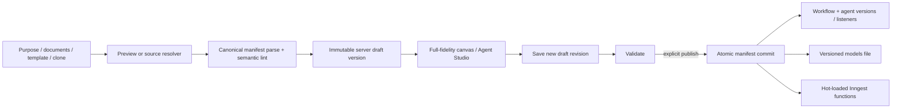

# New Workflow architecture

**Decision date:** 2026-07-16
**Status:** Reviewed and approved for implementation

## 1. Current-state review

The production modal is a prototype: its create button only closes the modal.
Template cards have no manifests, clone and generation do not exist, and the
token page renders an empty constant. More seriously, the canvas reads a
reduced DAG and reconstructs every saved agent with a blank description and a
placeholder action. Publishing a small edit can therefore erase prompts,
actions, tools, I/O, model controls, and extensions.

The old canvas publish route also selects/demotes deployments without filtering
`target='workflow'` and does not use the atomic filesystem/DB/hot-swap service.
The manifest-import commit service is the authoritative publication boundary
and must be generalized rather than duplicated.

## 2. Decisions

### Full-fidelity server drafts

`workflows` is the stable named resource and `workflow_versions` stores immutable
draft/published snapshots. No new mutable manifest column is needed. A save
creates a new `draft-<time>-<hash>` version and requires the latest version id
seen by the editor. The list/detail API derives Draft/Live from workflow-version
and deployment relationships.

The DAG read accepts an optional workflow slug. For drafts it projects nodes
directly from `workflow_versions.manifest_json`, attaching the complete agent
definition and persisted canvas position. Agent rows remain runtime indexes,
not the authoring source of truth.

### One publication service

The manifest-import pipeline accepts an explicit target workflow slug/name.
It validates, writes/fsyncs a temporary manifest, atomically updates SQLite,
renames the file into the tenant models directory, reconciles agents/listeners,
and hot-registers Inngest functions. Only live `target='workflow'` deployments
are superseded. Other deployment lanes remain untouched.

### Generator as preview service

`POST /v1/workflows/generate` performs optional bounded document extraction and
optional configured search, then asks the selected LLM for a structured design.
The service normalizes it into the canonical manifest, applies only registered
tools and configured/default models, evaluates prompt completeness, and runs
schema/semantic validation. It returns a preview. `POST /v1/workflows` is a
separate persistence decision.

Mock-provider generation uses a deterministic, production-shaped blueprint so
local/demo/test operation remains useful and network-free.

### API-owned templates

Template definitions are immutable server constants validated at startup and
served by `GET /v1/workflow-templates`. Summary counts are derived. Blank,
template, clone, generated, and raw-manifest creation all converge on one
`createWorkflowDraft()` service.

### Tenant document boundary

The root is `AGENTIC_WORKFLOW_DOCUMENTS_DIR`, defaulting to
`data/workflow-documents`. All reads resolve under `<root>/<tenant>/`; relative
path validation, realpath containment, symlink refusal, per-file/total limits,
extension allow-listing, and extraction diagnostics are mandatory.

### Configured research boundary

Optional public-web research is selected by
`AGENTIC_WORKFLOW_RESEARCH_PROVIDER` and supports Tavily, Brave, or Serper.
Credentials resolve tenant-first from
`AGENTIC_TENANT_<NORMALIZED_SLUG>_<PROVIDER>_API_KEY`, then from
`TAVILY_API_KEY`, `BRAVE_API_KEY`, or `SERPER_API_KEY`. Queries, results,
response bodies, timeouts, and citation URLs are bounded. A missing credential
or provider failure is returned as a diagnostic; the generator proceeds without
fabricated sources.

### API tokens

The existing `api_tokens` table and bearer hash convention are reused. Because
the table has no safe stored display prefix, list uses the stable product prefix
`ao_live_`; plaintext is returned only by create/rotate. Revoke deletes the hash
so authentication fails immediately. Only the accurately enforced
`workspace:all` scope is issued in this release.

## 3. API surface

```text
GET    /v1/workflow-templates
GET    /v1/workflows
POST   /v1/workflows
GET    /v1/workflows/:slug
PUT    /v1/workflows/:slug
DELETE /v1/workflows/:slug
POST   /v1/workflows/:slug/validate
POST   /v1/workflows/:slug/publish
POST   /v1/workflows/generate
GET    /v1/workflow-document-folders
GET    /v1/workflows/dag?workflow=:slug

GET    /v1/api-tokens
POST   /v1/api-tokens
POST   /v1/api-tokens/:id/rotate
DELETE /v1/api-tokens/:id
```

All resource routes derive tenant identity from authentication. A path/body
tenant value is never trusted.

## 4. Data and request flow



## 5. Generator stages

1. Validate purpose, options, provider/model, and document folder.
2. Extract and bound documents with source diagnostics.
3. Optionally gather configured search results; failure is reported and does
   not fabricate research.
4. Give the model the purpose, untrusted sources, registered tool catalog
   (argument/config/return schemas and examples), allowed model, canonical
   event/action constraints, and strict JSON shape.
5. Parse JSON (one bounded repair attempt for a real model), normalize names and
   event connections, reject undeclared tools/config keys, and compile direct
   tool actions with explicit input/output mappings.
6. Add prompt provenance, safe configuration references, model parameters,
   limits, event input/output bindings, and canvas hints. Prompt ports have a
   deterministic fallback so cron and downstream machine events remain
   executable while an explicitly supplied caller prompt still wins. Canonical
   model output is rebound from its declared port IDs (not assumed
   `payload`/`result` names), tool aliases are merged without losing safe
   configuration, and action-level model overrides are removed so every step
   inherits the operator-selected provider/model policy.
7. Parse the canonical manifest and lint graph/model/concurrency semantics.
8. Score each prompt against the structural quality rubric and return issues,
   assumptions, sources, token usage, and the editable manifest.

## 6. Canvas state

The canvas draft stores per-agent complete definitions plus position. Graph
labels are derived projections. `toManifest()` starts from each complete
definition and patches only fields the canvas changed. Unknown keys and nested
objects survive. Add/connect/move operations are pure reducer helpers with unit
tests; localStorage is only crash recovery and is keyed by tenant + workflow,
while the server draft is the collaborative source of truth.

Canvas dimensions are derived from effective rendered positions, with the
legacy 8×5 RAAS frame retained as the minimum. Topology-packed workflows,
draft additions, and up to 100 agents expand the scrollable surface; defensive
coordinate caps prevent a hostile imported position from allocating an
unbounded browser layer. Stage headers are projected from rendered columns so
stage-99/topology layouts and edited nodes remain aligned.

Optimistic concurrency uses `baseVersionId`. A mismatched latest version returns
`409 workflow_version_conflict` with the current version id; the client keeps
local edits and asks the operator to reload/merge.

Human/manual actions persist the authored `awaiting_role`, `form_schema`, and
prepared upstream context on the durable task. The Tasks portal renders the
supported JSON Schema controls and submits approve/reject/supplement through
the tenant-scoped resolution endpoint, which revalidates the form server-side.
Runtime normalizes all three decisions into one strict resolution envelope;
that same value passes final output validation, artifact persistence, and every
authored output binding.

## 7. Security and failure design

- Purpose, documents, fetched research, and imported manifests are untrusted.
- Search runs only when a tenant/configured credential exists and URLs returned
  as citations are data, never instructions.
- No literal secrets are allowed in generated, edited, or imported tool config;
  environment references must be tenant-prefixed (or explicitly
  operator-allowlisted), named references must be tenant-namespaced, and
  endpoint overrides cannot redirect shared fallback credentials.
- The credential and endpoint policy is applied at every write boundary,
  including the two compatibility live-write routes. Custom RoboHire/GoHire
  endpoints require a populated tenant environment binding and fail closed;
  they never inherit integration or process-global credentials.
- `http.fetch` requires an approved HTTPS base URL and exact host pin. Runtime
  calls are relative to that origin, DNS answers and redirects are revalidated,
  and private/link-local/metadata destinations are rejected.
- Folder selection is relative and tenant-rooted; arbitrary paths and symlinks
  are rejected.
- Every LLM call has request/response size caps and a timeout.
- Token hashes never leave the API/DB boundary; audit metadata excludes them.
- Publish failures keep the draft. The existing reconcile-imports path handles
  a crash between DB commit and filesystem rename.
- Only workflow deployments are superseded; tenant-code, code-agent, and other
  lanes are invariant.
- The New Workflow importer uses a persistence-free `draft_only` validation
  pass and then the normal immutable draft endpoint. The legacy Import action
  is the only wizard path that may explicitly publish to the live lane.

## 8. Design review record

### AI architecture review

Approved the shared draft/version model and generator convergence. Required
canonical manifest preservation, explicit workflow identity, generalizing the
atomic manifest commit rather than using `POST /v1/agents`, tenant-scoped
document roots, and model/tool allow-listing. Rejected a second generator-only
manifest format and client-only drafts.

### Product design review

Required a workflow selector/catalog before multiple creation paths, a guided
AI preview with sources/assumptions, one modal that preserves entered data on
errors, accurate template counts, clone-version selection, and explicit
Draft/Validate/Publish language. Flagged the current fake staging language,
fake repository choices, live-DAG import preview, and unreleased import lock.

### QA/security review

Made full-fidelity round-trip the first release gate; required a fixture that
uses every prompt/action/tool/model/I/O/extension field. Added tenant isolation,
path traversal/symlink, invalid generator output, API-token one-time plaintext,
non-workflow deployment preservation, concurrent draft, custom-port generator,
credential-fallback, SSRF/redirect, legacy live-write, and real publish smoke
tests. Existing permissive “200 or known 500” E2E behavior is not acceptable.

## 9. Known boundary

This release supports multiple authored workflows and one live workflow per
tenant. It does not claim isolated staging execution. Introducing simultaneous
live workflows or staging requires runtime routing keys/environment identity,
deployment uniqueness changes, and an Inngest function-id migration.
