# RAAS-v1 基于 AllmetaOntology 的自动面试邀约流程设计

> 适用范围：RAAS-v1、AllmetaOntology、Agentic Operator 招聘流程  
> 文档状态：方案稿；已完成 `Job_Requisition` DataObject 字段更新，自动邀约 Agent 尚未编码  
> 更新日期：2026-07-16

## 1. 结论

本方案不再让新 Agent 调 RAAS API 查询自动邀约阈值，而采用以下职责边界：

1. HSM 招聘人员在 RAAS 创建或编辑 JD 时，设置该岗位的自动面试邀约分数线。
2. RAAS 将这个值写入 AllmetaOntology 的 `Job_Requisition` 业务实例。
3. `match-resume-agent` 仍负责第一道门槛：匹配分低于 40 分时 `MATCH_FAILED`；大于或等于 40 分时发出 `MATCH_PASSED_NEED_INTERVIEW`。
4. 新增第 7 个 `auto-interview-invitation-agent`，读取对应 `Job_Requisition` 实例中的 `interview_invitation_score_threshold`。
5. 新 Agent 只做确定性数值判断，不使用 LLM 判断分数：
   - `matching_score >= interview_invitation_score_threshold`：进入自动邀约准备流程。
   - `matching_score < interview_invitation_score_threshold`：进入 HSM 人工审核。
   - 阈值缺失、非法或暂时无法读取：禁止自动邀约，重试后降级人工审核。
6. 真正发送邀请仍由现有 `interview-inviter-agent` 完成。

推荐保留 RAAS 作为邀请记录和人工审核的业务权威系统。新 Agent 不应直接调用 GoHire，也不应在 RAAS 尚未创建 `interview_invitation` 记录时直接触发现有 Inviter。

## 2. 已完成的 Ontology 更新

RAAS-v1 的 `Job_Requisition` DataObject 已新增：

```json
{
  "name": "interview_invitation_score_threshold",
  "type": "Integer",
  "description": "由创建该招聘岗位的HSM招聘人员在RAAS平台设置的自动面试邀约简历匹配分数线，取值范围为0至100。候选人的简历匹配分数大于或等于该值时可进入自动邀约；低于该值、未配置或配置无效时进入人工审核。"
}
```

更新结果：

- Ontology 版本：`objects_v0_1_005.json`
- 父版本：v004
- `LATEST`：已指向 v005
- DataObject 数量：44，未新增或删除其他对象
- `Job_Requisition` 属性数：39 → 40
- Objects Builder 校验：通过
- Neo4j 部署：44 个 DataObject 已部署
- Neo4j 核验：`Job_Requisition` 中该字段存在且仅存在一次，版本为 `v0_1_005`

### 2.1 为什么使用 Integer，而不是 String

这个字段参与数值比较，必须使用 `Integer`。若使用 `String`，排序和比较可能按字符处理，产生错误结果，例如字符串语义下 `"100"` 可能排在 `"80"` 之前。

第一版固定采用以下语义：

```text
matching_score >= interview_invitation_score_threshold
```

因此岗位阈值设置为 80 时，80 分属于自动邀约，79.99 分属于人工审核。若未来业务需要“严格大于”，应另加明确的比较操作符字段，不能依赖自然语言解释。

### 2.2 DataObject 定义不等于岗位实例值

本次更新解决的是 schema：Allmeta 现在知道 `Job_Requisition` 可以合法拥有这个字段。

它不会自动给已有或未来的每一个 JD 填入 80。具体值仍需由 RAAS 对目标 `job_requisition_id` 的业务实例执行写入：

```text
DataObject schema
  定义：Job_Requisition 可以有什么字段

Job_Requisition instance
  保存：JR-123 这个岗位的阈值具体是 80
```

新 Agent 必须读取岗位实例，不能读取 `DataObject:Job_Requisition` schema 节点中的 `properties` 定义来获得阈值。

## 3. 两个分数门槛必须分开

| 字段/门槛 | 用途 | 当前语义 | 负责组件 |
|---|---|---|---|
| `resume_match_score_threshold` 或现有 40 分门槛 | 判断简历匹配是否基本通过 | `<40` 失败，`>=40` 继续 | `match-resume-agent` |
| `interview_invitation_score_threshold` | 判断是否可以跳过人工审核 | `<岗位阈值` 人工，`>=岗位阈值` 自动 | 新 Agent |
| `interview_passing_score` | 候选人完成面试后的面试结果门槛 | 与自动邀约无关 | RAAS/面试平台 |

不能用新增字段替换现有 40 分匹配门槛，也不能把两个字段都简写为 `passing_score`。

假设岗位阈值为 80：

| 匹配分 | 结果 |
|---:|---|
| 39 | `MATCH_FAILED`，不进入新 Agent |
| 40 | 进入新 Agent，转人工审核 |
| 79.99 | 转人工审核 |
| 80 | 自动邀约准备 |
| 95 | 自动邀约准备 |

## 4. 目标端到端流程

```mermaid
flowchart TB
    subgraph S0["A. JD 创建、阈值校验与 Allmeta 同步"]
        A1["RAAS/HSM 需求录入"] --> A2["REQUIREMENT_LOGGED / CLARIFICATION_READY"]
        A2 --> A3["Create JD Agent"]
        A3 --> A4["JD_GENERATED"]
        A4 --> A5["HSM 审核、创建或编辑 Job_Requisition"]
        A5 --> A6{"阈值是 Integer 且 40-100?"}
        A6 -->|"否/未设置"| A7["允许保存 JD<br/>auto_invitation_status=CONFIG_INCOMPLETE<br/>只允许人工审核"]
        A6 -->|"是"| A8["RAAS 事务保存阈值<br/>threshold_revision + 1<br/>写同步 Outbox"]
        A8 --> A9["auto_invitation_status=SYNC_PENDING<br/>岗位可保存/开放，但禁止自动邀约"]
        A9 --> A10["Ontology Sync Worker<br/>按 job_requisition_id 串行处理"]
        A10 --> A10B{"Outbox revision<br/>仍是 RAAS 当前 revision?"}
        A10B -->|"否：旧消息"| A10C["丢弃旧 revision<br/>等待/处理最新 Outbox"]
        A10B -->|"是"| A11["PATCH Allmeta<br/>Job_Requisition 实例"]
        A11 --> A12{"同步成功?"}
        A12 -->|"是"| A12B{"写入 revision<br/>仍等于当前 revision?"}
        A12B -->|"是"| A13["RAAS 记录 synced_revision=current_revision<br/>auto_invitation_status=ACTIVE"]
        A12B -->|"否：期间又被修改"| A17["不标记 ACTIVE<br/>保持 SYNC_PENDING，继续同步最新版"]
        A17 --> A10
        A12 -->|"否：可恢复"| A14["按同一 Outbox/Revision 重试"]
        A14 --> A10
        A12 -->|"重试耗尽"| A15["auto_invitation_status=SYNC_FAILED<br/>人工路径 + 运维告警"]
        A11 -->|"成功写入"| A16["AllmetaOntology / Neo4j<br/>Job_Requisition 实例阈值"]
    end

    subgraph S1["B. 简历入口、解析与候选人身份处理"]
        B1["RAAS + MinIO 上传简历"] --> B2["RESUME_DOWNLOADED"]
        B2 --> B3["Resume Parser Agent"]
        B3 --> B4["候选人身份查重 Agent"]
        B4 --> B5{"存在锁冲突?"}
        B5 -->|"是"| B6["RESUME_LOCKED_CONFLICT"]
        B5 -->|"否"| B7["RESUME_PROCESSED"]
    end

    subgraph S2["C. 岗位级真实业务规则闸门"]
        C1["按候选人关联岗位 fan-out"] --> C2["Rule Check Agent"]
        C2 --> C3{"规则执行结果"}
        C3 -->|"业务不通过"| C4["MATCH_RULE_CHECK_FAILED"]
        C3 -->|"业务通过"| C5["MATCH_RULE_CHECK_PASSED"]
        C3 -->|"基础设施异常"| C6["Park / Retry<br/>不拒绝候选人"]
    end

    subgraph S3["D. 简历匹配第一道门槛"]
        D1["Match Resume Agent"] --> D2["RoboHire /match-resume"]
        D2 --> D3["持久化 Candidate Match Result"]
        D3 --> D4{"matching_score >= 40?"}
        D4 -->|"否"| D5["MATCH_FAILED"]
        D4 -->|"是"| D6["MATCH_PASSED_NEED_INTERVIEW"]
        D6 --> D7["事件路由唯一绑定<br/>只允许新决策 Agent 消费"]
        D6 -. "禁止投递" .-> D8["旧 RAAS/HSM 直接消费器<br/>必须下线"]
    end

    subgraph S4["E. 新增自动邀约决策 Agent：失败关闭 + 决策幂等"]
        E1["Auto Interview Invitation Agent"] --> E2{"decision_id 是否已处理?"}
        E2 -->|"是"| E3["返回已有决策 / No-op<br/>不产生第二个业务效果"]
        E2 -->|"否"| E4["ontology.readInstance<br/>按 job_requisition_id 精确读取"]
        E4 --> E5{"Allmeta 读取结果"}
        E5 -->|"429/5xx/timeout"| E6["可恢复重试"]
        E6 --> E7{"重试耗尽?"}
        E7 -->|"否"| E4
        E7 -->|"是"| E8["REVIEW_REQUIRED<br/>ONTOLOGY_UNAVAILABLE + 告警"]
        E5 -->|"404/字段缺失/类型错误"| E9["REVIEW_REQUIRED<br/>禁止默认 80 或 0"]
        E5 -->|"读取成功"| E10{"threshold 是 Integer 且 40-100?"}
        E10 -->|"否"| E9
        E10 -->|"是"| E11{"matching_score >= threshold?"}
        E11 -->|"否"| E12["INTERVIEW_INVITATION_REVIEW_REQUIRED"]
        E11 -->|"是"| E13["INTERVIEW_INVITATION_AUTO_APPROVED<br/>携带 score/threshold/updatedAt"]
        E8 --> E12
        E9 --> E12
    end

    subgraph S5["F. RAAS 最终安全闸门、人工审核与邀请准备"]
        F1["RAAS 消费 AUTO_APPROVED"] --> F2{"invitation 幂等键已存在?"}
        F2 -->|"是"| F3["返回已有 invitation / No-op"]
        F2 -->|"否"| F4{"自动邀约最终闸门全部通过?"}
        F4 -->|"同步状态非 ACTIVE<br/>revision 未同步<br/>事件阈值与 RAAS 当前值不一致"| F5["创建人工审核任务<br/>THRESHOLD_SYNC_PENDING/STALE"]
        F4 -->|"岗位关闭/候选人撤回/申请淘汰"| F6["SKIPPED / 状态冲突<br/>禁止发送"]
        F4 -->|"全部通过"| F7["同一事务创建 interview_invitation<br/>生成 correlation_id + 写 Outbox"]

        F8["RAAS 消费 REVIEW_REQUIRED"] --> F9["按 decision_id 幂等创建 HSM 审核任务"]
        F9 --> F10{"HSM 决定"}
        F10 -->|"批准"| F11{"岗位状态正常且无重复邀请?"}
        F11 -->|"是"| F7
        F11 -->|"否"| F6
        F10 -->|"拒绝"| F12["INTERVIEW_INVITATION_REJECTED"]

        F7 --> F13["INTERVIEW_INVITATION_REQUESTED<br/>只由 RAAS Outbox 发布"]
    end

    subgraph S6["G. 现有 Interview Inviter Agent 与真实发送"]
        G1["Interview Inviter Agent"] --> G2{"correlation_id / invitation 状态<br/>是否已处理?"}
        G2 -->|"已发送"| G3["No-op，返回已有回执"]
        G2 -->|"未发送"| G4["GoHire / RoboHire 发送邀请"]
        G4 --> G5{"发送结果"}
        G5 -->|"成功"| G6["INTERVIEW_INVITATION_SENT"]
        G5 -->|"失败"| G7["INTERVIEW_INVITATION_FAILED"]
        G6 --> G8["RAAS UI / 候选人后续流程"]
        G7 --> G8
    end

    A7 --> B1
    A9 --> B1
    A13 --> B1
    A15 --> B1
    B7 --> C1
    C5 --> D1
    D7 --> E1
    A16 -. "读取当前实例阈值" .-> E4
    E13 --> F1
    E12 --> F8
    A13 -. "ACTIVE、revision、当前阈值" .-> F4
    F13 --> G1

    classDef agent fill:#edf3ff,stroke:#2563eb,color:#172033,stroke-width:1.5px;
    classDef event fill:#e8fbff,stroke:#0891b2,color:#17313a,stroke-width:1.3px;
    classDef data fill:#effcf3,stroke:#16a34a,color:#17351f,stroke-width:1.3px;
    classDef manual fill:#fff8e6,stroke:#d97706,color:#3c2a10,stroke-width:1.3px;
    classDef blocked fill:#fff0f0,stroke:#dc2626,color:#471818,stroke-width:1.5px;

    class A3,B3,B4,C2,D1,E1,G1 agent;
    class A2,A4,B2,B6,B7,C4,C5,D5,D6,E12,E13,F12,F13,G6,G7 event;
    class A8,A9,A10,A11,A13,A16,D3,F7 data;
    class A7,A15,E8,E9,F5,F8,F9,F10 manual;
    class D8,F6 blocked;
```



### 4.1 RAAS 自动邀约运行状态

RAAS 应维护一个运行状态，而不是仅凭“字段有值”就认为可以自动邀约：

| 状态 | 触发条件 | 是否允许自动邀约 |
|---|---|---:|
| `CONFIG_INCOMPLETE` | 阈值未配置或不满足 40–100 Integer | 否 |
| `SYNC_PENDING` | RAAS 已保存新 revision，Allmeta 尚未确认 | 否 |
| `ACTIVE` | `synced_revision == threshold_revision` 且最后同步成功 | 是 |
| `SYNC_FAILED` | 同步重试耗尽 | 否 |

即使 Agent 从 Allmeta 读到了一个合法但陈旧的阈值，RAAS 在创建真实 invitation 前仍要再次核对 `ACTIVE`、revision 和事件中携带的阈值快照。该二次闸门可以阻止“RAAS 已改成 90，但 Allmeta 仍是旧值 80”时误发邀请。

## 5. RAAS 创建和编辑 JD 时需要做什么

### 5.1 前端表单

由创建该 JD 的 HSM 招聘人员设置：

- 字段名：自动面试邀约分数线
- 输入类型：整数
- Ontology 基础范围：0–100
- RAAS 自动邀约业务范围：40–100
- 示例值：80
- 帮助文案：候选人简历匹配分达到或超过该值时，可自动发送面试邀约；否则进入人工审核。

权限建议：

- 岗位创建人可设置和修改。
- 具有岗位管理权限的 HSM 主管可修改。
- 普通招聘人员只读。
- 所有修改必须记录修改前值、修改后值、操作人、岗位和时间。

### 5.2 RAAS 数据库

RAAS 自身的 `job_requisition` 记录也应保存该字段，以支持界面展示、审计和失败重试：

```sql
interview_invitation_score_threshold INTEGER NULL
CHECK (interview_invitation_score_threshold BETWEEN 40 AND 100)
```

第一阶段建议数据库允许 `NULL`。JD 可以保存，但阈值未配置、非法或尚未同步成功时，`auto_invitation_status` 必须保持非 `ACTIVE`，所有候选人一律进入人工审核。

完成历史数据回填后，再考虑在 RAAS 数据库和 Ontology schema 中提升为 required。

### 5.3 不要直接做不可靠的双写

不建议在同一个前端请求中依次写 RAAS 数据库和 Allmeta，并假设两次都必然成功。推荐流程：

1. RAAS 数据库事务保存岗位和阈值。
2. 同一事务写入 `JOB_REQUISITION_ONTOLOGY_SYNC_REQUESTED` outbox。
3. 同步 Worker 按 `job_requisition_id` 串行消费 outbox；写入前再次检查消息 revision，旧 revision 直接丢弃，防止旧值覆盖新值。
4. 成功后再次确认写入 revision 仍是 RAAS 当前 revision；只有相等时才记录 `synced_revision=threshold_revision`、同步时间，并把 `auto_invitation_status` 改为 `ACTIVE`。
5. 失败时重试并告警；同步完成前不得把该岗位当成可自动邀约。

### 5.4 RAAS 写入 Allmeta 实例

Allmeta 已有实例写接口。编辑现有岗位时推荐使用：

```http
PATCH /api/v1/ontology/instances/Job_Requisition/{job_requisition_id}?domain=RAAS-v1&validate=strict
Authorization: Bearer <ONTOLOGY_API_TOKEN>
Content-Type: application/json
```

```json
{
  "domainId": "RAAS-v1",
  "interview_invitation_score_threshold": 80
}
```

创建新岗位时，RAAS 应使用 POST/PUT 写完整 `Job_Requisition` 实例。PATCH 对不存在的实例会返回 404，不能把 404 当成成功。

使用 `validate=strict` 的原因：

- 确认 80 是数字而不是字符串。
- 阻止未声明字段写入。
- 让 schema 漂移尽早暴露，而不是到 Agent 判断阶段才发现。

## 6. 新 Agent 如何读取阈值

### 6.1 Agent 定位

建议名称：

```text
id: auto-interview-invitation-agent
action: decideAutoInterviewInvitation
trigger: MATCH_PASSED_NEED_INTERVIEW
```

职责仅包括：

1. 校验上游事件及匹配分。
2. 按 `job_requisition_id` 精确读取 Allmeta 的岗位实例。
3. 校验阈值。
4. 做 `score >= threshold` 的确定性比较。
5. 写决策审计并发出一个结果事件。

不负责：

- 重新调用简历匹配 API。
- 用 LLM 解释分数或阈值。
- 直接调用 GoHire 发送邀请。
- 修改岗位阈值。
- 在 RAAS 没有邀请主记录时直接发 `INTERVIEW_INVITATION_REQUESTED`。

### 6.2 Allmeta 精确读取

Agent 所需的读取契约为：

```http
GET /api/v1/ontology/instances/Job_Requisition/{job_requisition_id}?domain=RAAS-v1
Authorization: Bearer <ONTOLOGY_API_TOKEN>
```

只接受主键精确命中的岗位，不允许按岗位名称模糊选择。

期望响应片段：

```json
{
  "job_requisition_id": "JR-123",
  "domainId": "RAAS-v1",
  "interview_invitation_score_threshold": 80,
  "updatedAt": "2026-07-16T11:00:00+08:00"
}
```

Agentic Operator 当前应新增一个严格的 `ontology.readInstance` 工具封装该接口。不要把规则查询工具 `ontology.fetchActionRules` 用作实例读取，也不要让 Agent 生成任意 Cypher。

### 6.3 判定算法

```text
输入：matching_score、job_requisition_id

1. matching_score 必须是 0-100 的有限数字。
2. 精确读取 Job_Requisition 实例。
3. threshold 必须是 40-100 的整数；Ontology 虽允许 0-100，自动邀约业务闸门采用更严格范围。
4. 若 score >= threshold：AUTO_APPROVED。
5. 若 score < threshold：REVIEW_REQUIRED。
6. 岗位不存在或阈值缺失/非法：REVIEW_REQUIRED，禁止默认自动。
7. Allmeta 网络故障：按可恢复错误重试；重试耗尽后转人工并告警。
```

### 6.4 阈值修改的生效时间

建议采用“决策时读取当前值”的规则：

- 新 Agent 每次处理匹配结果时读取岗位当前阈值。
- 决策记录保存当时使用的 score、threshold 和实例 `updatedAt`。
- HSM 之后修改阈值，不追溯改变已经完成的自动/人工决策。
- 如需重新判断，必须由 HSM 发起显式的“重新评估”，不能因为事件重放重复发送邀请。

## 7. 为什么不能让新 Agent 直接触发现有 Inviter

现有 `interview-inviter-agent` 发送成功后，会使用 `correlation_id` 回写 RAAS 的 `interview_invitation` 记录。如果新 Agent 绕过 RAAS 直接发出 `INTERVIEW_INVITATION_REQUESTED`，可能出现：

- RAAS 中没有对应 invitation 主记录。
- Inviter 已经发出邀请，但 RAAS 回写失败。
- 事件重放时重复邀请候选人。
- 自动和人工两条路径同时创建邀请。

因此自动分支应先发出“决策已批准”事件，由 RAAS 幂等创建 invitation 和 outbox，再由 RAAS 发布现有 `INTERVIEW_INVITATION_REQUESTED`。

推荐链路：

```text
Auto Agent
  → INTERVIEW_INVITATION_AUTO_APPROVED
  → RAAS 创建 interview_invitation(status=requested, correlation_id)
  → RAAS outbox 发布 INTERVIEW_INVITATION_REQUESTED
  → Existing Interview Inviter Agent
  → GoHire
```

过渡期若 RAAS 暂时不能消费 `AUTO_APPROVED` 事件，也可以让新 Agent 调用一个幂等的 RAAS invitation prepare API；但阈值仍从 Allmeta 读取，且 `INTERVIEW_INVITATION_REQUESTED` 仍应由 RAAS outbox 单点发布。

## 8. 需要新增或调整的事件

### 8.1 核心事件表

| Event | 是否新增 | Producer | Consumer | 用途 |
|---|---|---|---|---|
| `MATCH_PASSED_NEED_INTERVIEW` | 已有 | `match-resume-agent` | 新 Agent | 匹配分达到第一道门槛 |
| `MATCH_FAILED` | 已有 | `match-resume-agent` | RAAS/后续恢复 | 匹配分低于第一道门槛 |
| `INTERVIEW_INVITATION_AUTO_APPROVED` | 新增 | 新 Agent | RAAS | 达到岗位自动邀约阈值 |
| `INTERVIEW_INVITATION_REVIEW_REQUIRED` | 新增 | 新 Agent | RAAS/HSM | 低于阈值或安全降级人工 |
| `INTERVIEW_INVITATION_REQUESTED` | 已有，扩展字段 | RAAS outbox | 现有 Inviter | RAAS 已准备好 invitation，可真实发送 |
| `INTERVIEW_INVITATION_SENT` | 已有 | 现有 Inviter | RAAS | 真实邀请发送成功 |
| `INTERVIEW_INVITATION_FAILED` | 已有 | 现有 Inviter | RAAS/HSM | 真实发送失败 |
| `INTERVIEW_INVITATION_REJECTED` | 建议新增 | RAAS/HSM | 审计/流程 | 人工明确拒绝邀约 |
| `INTERVIEW_INVITATION_DECISION_FAILED` | 建议新增 | 新 Agent | RAAS/运维 | 上游契约错误等不能形成正常决策 |
| `JOB_REQUISITION_ONTOLOGY_SYNCED/FAILED` | RAAS 内部建议新增 | 同步 Worker | RAAS/运维 | 监控岗位实例是否已同步 |

### 8.2 `MATCH_PASSED_NEED_INTERVIEW` 最小输入

新 Agent 至少需要：

```json
{
  "event_id": "evt-match-001",
  "candidate_id": "C-1001",
  "job_requisition_id": "JR-123",
  "resume_id": "R-1001",
  "candidate_match_result_id": "CMR-1001",
  "matching_score": 86,
  "matched_at": "2026-07-16T11:20:00+08:00",
  "trace_id": "trace-001"
}
```

### 8.3 自动批准事件

```json
{
  "event_id": "evt-auto-approved-001",
  "decision_id": "decision-CMR-1001",
  "source_event_id": "evt-match-001",
  "candidate_id": "C-1001",
  "job_requisition_id": "JR-123",
  "resume_id": "R-1001",
  "candidate_match_result_id": "CMR-1001",
  "matching_score": 86,
  "interview_invitation_score_threshold": 80,
  "comparison_operator": "gte",
  "decision": "auto_approved",
  "policy_source": "AllmetaOntology.Job_Requisition",
  "ontology_instance_updated_at": "2026-07-16T11:00:00+08:00",
  "decided_at": "2026-07-16T11:20:01+08:00",
  "trace_id": "trace-001"
}
```

### 8.4 人工审核事件

```json
{
  "event_id": "evt-review-required-001",
  "decision_id": "decision-CMR-1002",
  "source_event_id": "evt-match-002",
  "candidate_id": "C-1002",
  "job_requisition_id": "JR-123",
  "candidate_match_result_id": "CMR-1002",
  "matching_score": 72,
  "interview_invitation_score_threshold": 80,
  "comparison_operator": "gte",
  "decision": "manual_review",
  "reason_code": "BELOW_AUTO_INVITATION_THRESHOLD",
  "review_owner_hsm_employee_id": "HSM-9001",
  "decided_at": "2026-07-16T11:21:01+08:00",
  "trace_id": "trace-002"
}
```

建议 reason code：

```text
BELOW_AUTO_INVITATION_THRESHOLD
THRESHOLD_NOT_CONFIGURED
THRESHOLD_INVALID
THRESHOLD_SYNC_PENDING
THRESHOLD_SYNC_FAILED
THRESHOLD_SNAPSHOT_STALE
JOB_REQUISITION_NOT_FOUND
ONTOLOGY_TEMPORARILY_UNAVAILABLE
MANUAL_REVIEW_FORCED
```

## 9. RAAS 收到决策事件后的处理

### 9.1 自动批准

RAAS 在同一个数据库事务中：

1. 根据 `decision_id` 或 `candidate_match_result_id` 做幂等检查。
2. 校验岗位仍开放、候选人未撤回、Application 未淘汰。
3. 检查同一候选人和岗位是否已有 requested/sent 邀请。
4. 创建 `interview_invitation(status=requested)`。
5. 创建稳定且唯一的 `correlation_id`。
6. 保存 score、threshold、decision 和 Ontology 实例时间快照。
7. 在同一事务写 `INTERVIEW_INVITATION_REQUESTED` outbox。
8. outbox publisher 发布现有事件。

同一业务事件只能由 RAAS outbox 发布一次。新 Agent 和 RAAS 不能同时发布 `INTERVIEW_INVITATION_REQUESTED`。

### 9.2 人工审核

RAAS 以 `decision_id` 幂等创建 HSM 审核任务，默认分配给创建该 JD 的 HSM 招聘人员：

- 展示候选人、岗位、匹配分、阈值和匹配摘要。
- 提供“批准邀约”和“拒绝邀约”。
- 批准时复用与自动分支相同的 invitation preparation service。
- 拒绝时保存审核人、原因和时间，并发出 `INTERVIEW_INVITATION_REJECTED`。

人工可以覆盖“低于自动阈值”，但不能覆盖岗位已关闭、候选人已撤回、已存在 sent 邀请等硬状态约束。

## 10. 幂等、并发和失败策略

### 10.1 幂等键

推荐：

```text
decision_id = auto-invite-decision:{candidate_match_result_id}
invitation idempotency key = interview-invitation:{candidate_match_result_id}
```

事件重试必须复用原 `decision_id`、`event_id` 和 `correlation_id`，不能每次生成新值。

### 10.2 Fail-closed 原则

以下情况都不能自动发邀请：

- 阈值不存在。
- 阈值不是整数或不在 RAAS 自动邀约业务范围 40–100。
- 匹配分不存在或不在 0–100。
- 岗位实例不存在。
- Allmeta 鉴权失败。
- Allmeta 读取持续超时。
- RAAS 岗位实例尚未完成 Ontology 同步。
- 岗位关闭、候选人撤回或已有邀请。

网络超时先重试；重试耗尽后转人工并告警，不得把读取失败解释为阈值为 0。

### 10.3 阈值并发修改

决策事件必须保存：

- `matching_score`
- `interview_invitation_score_threshold`
- `ontology_instance_updated_at`
- `source_event_id`
- `decided_at`

RAAS 在准备邀请前若发现岗位已关闭或策略同步状态异常，应终止自动路径。阈值后来修改不自动撤销已完成的发送，也不自动重放旧候选人。

此外，RAAS 必须执行最后一次安全核对：

```text
auto_invitation_status == ACTIVE
synced_revision == threshold_revision
decision.threshold == RAAS.current_threshold
decision.matching_score >= RAAS.current_threshold
job/application/candidate 状态仍允许邀请
不存在相同 candidate_match_result_id 的有效 invitation
```

任一条件不满足都不能发布 `INTERVIEW_INVITATION_REQUESTED`。同步 pending、failed 或阈值快照不一致时转人工；岗位关闭、候选人撤回等状态冲突则进入 skipped/终止。

## 11. 建议的决策审计记录

RAAS 建议增加 `interview_invitation_decision` 表，至少保存：

```text
decision_id
source_event_id
candidate_id
job_requisition_id
candidate_match_result_id
matching_score
threshold
comparison_operator
decision
reason_code
ontology_instance_updated_at
reviewer_id
reviewed_at
interview_invitation_id
created_at
```

第一版可以只在 RAAS 数据库保存该审计对象。若以后希望在 Allmeta 中统一推理和查询，再单独评审是否新增 `Interview_Invitation_Decision` DataObject；本次没有擅自新增该对象。

## 12. 实施顺序

### 阶段 1：数据和 RAAS 配置

- [x] 在 AllmetaOntology 的 `Job_Requisition` DataObject 增加阈值字段。
- [x] 校验并部署 DataObject v005 到 Neo4j。
- [ ] RAAS 数据库增加 Integer 字段和 40–100 业务约束。
- [ ] RAAS JD 创建/编辑页增加 HSM 阈值输入。
- [ ] RAAS 增加岗位 → Allmeta 实例同步 outbox/worker。
- [ ] 为历史开放岗位回填阈值；未回填保持人工路径。

### 阶段 2：事件和人工审核

- [ ] 在 AllmetaOntology 定义新增事件及 producer/consumer。
- [ ] RAAS 消费 `AUTO_APPROVED` 和 `REVIEW_REQUIRED`。
- [ ] RAAS 实现 invitation preparation、outbox 和人工审核任务。
- [ ] 确认现有 `INTERVIEW_INVITATION_REQUESTED` payload 满足 Inviter 要求。

### 阶段 3：第 7 个 Agent

- [ ] 在 Agentic Operator 新增严格的 `ontology.readInstance` 工具。
- [ ] 在 Ontology 定义 `decideAutoInterviewInvitation` Action。
- [ ] 生成/实现 `auto-interview-invitation-agent`。
- [ ] 接入决策审计、重试、指标和告警。
- [ ] 确保旧的 RAAS/HSM 路径不再直接消费 `MATCH_PASSED_NEED_INTERVIEW` 创建邀请。

### 阶段 4：灰度上线

- [ ] 影子模式：只计算 auto/manual 结果，不发送邀请。
- [ ] 对比 HSM 实际审核结果，确认阈值合理。
- [ ] 小范围岗位开启真实自动邀约。
- [ ] 监控重复邀约、人工回退、Ontology 读取失败和发送失败。
- [ ] 全量开启。

## 13. 验收用例

| 场景 | score | threshold | 预期 |
|---|---:|---:|---|
| 匹配失败 | 39 | 80 | `MATCH_FAILED` |
| 最低通过 | 40 | 80 | `REVIEW_REQUIRED` |
| 低于自动线 | 79 | 80 | `REVIEW_REQUIRED` |
| 等于自动线 | 80 | 80 | `AUTO_APPROVED` |
| 高于自动线 | 95 | 80 | `AUTO_APPROVED` |
| 阈值缺失 | 90 | null | 人工审核，不自动 |
| 阈值字符串 | 90 | `"80"` | strict 写入拒绝；运行时人工降级 |
| 阈值越界 | 90 | 101 | 写入拒绝；运行时人工降级 |
| 阈值低于匹配门槛 | 90 | 39 | RAAS 写入拒绝；人工路径 |
| Allmeta 同步 pending | 90 | 80 | RAAS 最终闸门转人工，不发布 REQUESTED |
| Allmeta 保存旧阈值 | 85 | 旧值 80 / RAAS 新值 90 | Agent 即使 AUTO_APPROVED，RAAS 仍因快照不一致转人工 |
| 岗位实例不存在 | 90 | - | 人工审核 + 告警 |
| Allmeta 超时 | 90 | 未知 | 重试，耗尽后人工 |
| 同一 MATCH 事件重放 | 90 | 80 | 复用 decision_id，只产生一条 decision/invitation |
| 同一 REQUESTED 事件重放 | 90 | 80 | Inviter 根据 correlation_id/status No-op，不重复调用发送 |
| 人工批准 | 70 | 80 | RAAS 创建 REQUESTED，Inviter 发送 |
| 人工拒绝 | 70 | 80 | REJECTED，不触发 Inviter |
| 岗位已关闭 | 90 | 80 | 不发送，记录 skipped/conflict |

## 14. 最终职责总结

```text
HSM/RAAS：设置阈值、写入岗位实例、拥有人工审核和邀请主记录
AllmetaOntology：保存 Job_Requisition schema 与每个岗位实例的阈值
Match Resume Agent：只负责 40 分匹配门槛
Auto Interview Invitation Agent：读取实例阈值并做确定性 auto/manual 决策
RAAS Outbox：把已准备好的邀请可靠转换为 REQUESTED 事件
Interview Inviter Agent：调用 GoHire 真实发送并返回 SENT/FAILED
```

这个拆分让阈值归岗位和 HSM 管理，Agent 不硬编码 80，也不会因为 Ontology 或 RAAS 暂时异常而误发面试邀请。
