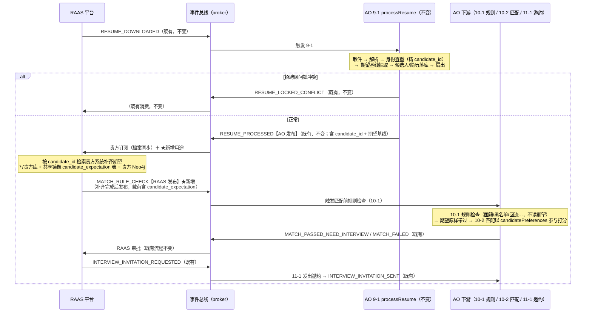

# RAAS-v1 候选人期望补齐 — 事件对接设计（AO ⇄ RAAS）

- **版本**: v0.5（提案，待 RAAS 平台确认后冻结）
  - v0.5: 最简版定稿。两事件方向明确：`RESUME_PROCESSED` = **AO 发布 / RAAS 消费**（既有）；`MATCH_RULE_CHECK` = **RAAS 发布 / AO 消费**（新增）。核对活库后确认：候选人期望**只服务于简历匹配**（作 RoboHire 的 candidatePreferences），不参与 AO 的规则检查；补齐后期望的持久化（RAAS 库 + 共享镜像库 `candidate_expectation` 表 + Neo4j）**归 RAAS**，AO 不写。
  - v0.4 及更早: 演化过程（RESUME_PARSED 请求式、9-2 独立 agent、AO 侧持久化步骤等，均已简化，见 §8）。
- **日期**: 2026-07-17
- **发起方**: Agentic Operator（AO，招聘-v1 / RAAS-v1 域）
- **对接方**: RAAS 平台
- **状态**: 设计评审中 — AO 侧代码尚未改动

---

## 1. 背景与目标

AO 的简历匹配（RoboHire `/match-resume`）已支持传入候选人本人的求职期望（`candidatePreferences`），本体与镜像库都有 `Candidate_Expectation` / `candidate_expectation`。AO 目前只能从简历文本**尽力抽取**期望基线（很多简历不写期望城市），而贵方握有权威数据：顾问与候选人的沟通记录、候选人库中的求职意向。

本设计新增一个**补齐环**：贵方消费既有的 `RESUME_PROCESSED`（载荷含 `candidate_id` 与期望基线）后，按 `candidate_id` 在贵方系统补齐 `expected_location`（期望城市）等字段、**持久化到贵方库 + 共享镜像 `candidate_expectation` 表 + 贵方 Neo4j 同步**，补齐完成后发布 `MATCH_RULE_CHECK` 给 AO；AO 消费它触发匹配前规则检查与匹配（期望作 candidatePreferences 参与 RoboHire 打分）。

## 2. 两个事件的方向（本设计核心）

| 事件 | 发布方 | 消费方 | 说明 |
|---|---|---|---|
| `RESUME_PROCESSED` | **AO 发布** | **RAAS 消费** | 既有事件，契约不变。贵方已订阅（档案状态同步）；★新增用途：拿载荷中的 `candidate_id` 补齐并持久化候选人期望 |
| `MATCH_RULE_CHECK` | **RAAS 发布** | **AO 消费** | ★唯一新增事件。贵方补齐+持久化完成后发布（载荷含补齐后的 `candidate_expectation`）；AO 消费它触发规则检查（10-1）→ 匹配（10-2） |

> 对贵方而言本次对接的全部工作 = ①在已有的 `RESUME_PROCESSED` 消费里，按 `candidate_id` 补齐期望并写入贵方库/共享镜像 `candidate_expectation` 表/贵方 Neo4j；②补齐完成后发布 `MATCH_RULE_CHECK`。其余全部事件契约不变。

## 3. 整体事件流程



文字版（正常路径）：

1. `RESUME_DOWNLOADED`（RAAS → AO，**不变**）。
2. **9-1 processResume**（AO，**与现状完全一致**）：取件 → 解析 → 三级身份查重（铸出 `candidate_id`；锁冲突则发既有 `RESUME_LOCKED_CONFLICT` 终止，贵方不会为锁死候选人收到后续流转）→ 期望基线抽取 → 候选人/简历落库 → **AO 发布 `RESUME_PROCESSED`**。
3. **RAAS 消费与补齐+持久化**（★新增用途）：贵方在既有 `RESUME_PROCESSED` 消费中，以载荷 `candidate_id` 为键检索贵方系统补齐 `expected_location` 等字段，**写入贵方库 + 共享镜像 `candidate_expectation` 表 + 贵方 Neo4j 同步**；**补齐完成后（无论是否查到）发布 `MATCH_RULE_CHECK`**，载荷携带 `candidate_expectation` 完整对象。
4. 下游（**全部不变**）：AO 消费 `MATCH_RULE_CHECK` 触发匹配前规则检查（10-1，规则检查本身不读期望）→ 期望随事件流转到匹配（10-2，作 `candidatePreferences` 参与 RoboHire 打分）→ `MATCH_PASSED_NEED_INTERVIEW` → 贵方审批 → `INTERVIEW_INVITATION_REQUESTED` → 邀约 → `INTERVIEW_INVITATION_SENT`。

## 4. 事件契约

事件走既有 broker 信封格式：

```json
{
  "entity_type": "...",
  "entity_id": "...",
  "event_id": "evt-xxxxxxxxxxxx",
  "payload": { },
  "source_action": "...",
  "trace": { "trace_id": "…", "request_id": "…", "workflow_id": null, "parent_trace_id": null, "event_name": "…" }
}
```

### 4.1 `RESUME_PROCESSED`（AO 发布 / RAAS 消费，既有——契约不变）

贵方补齐所需字段**已经在**该事件载荷中：

| 字段 | 说明 |
|---|---|
| `candidate_id` | **补齐检索主键**（查重后稳定） |
| `upload_id` | 贵方上传编号（`MATCH_RULE_CHECK` 需原样回传） |
| `resume_id` / `job_requisition_id` / `job_requisition_ids` | 链路上下文（`MATCH_RULE_CHECK` 需原样回传） |
| `candidate` | 候选人摘要（姓名/联系方式等，辅助核对） |
| `candidate_expectation` | AO 从简历文本抽取的**期望基线**（可为 `{}`），供贵方参考与合并 |

### 4.2 `MATCH_RULE_CHECK`（RAAS 发布 / AO 消费，★新增）

- **发布时机**: 贵方消费 `RESUME_PROCESSED`、完成期望补齐**且持久化**之后（自动查库或顾问人工确认均可）。
- **发布方**: RAAS。**消费方**: AO 匹配前规则检查（10-1）。
- **信封**: `entity_type = "Candidate_Expectation"`，**`entity_id = candidate_id`（必填——AO 的并发/路由键）**。

**RAAS 侧三条义务（对接成立的关键）**：

1. **补齐完成必发布**：无论是否查到补充数据都必须发布 `MATCH_RULE_CHECK`，**载荷携带 `candidate_expectation` 完整对象**。查不到就把收到的基线原样回传并标 `enrichment_status: "none"`。不发布会使该候选人的流程停在补齐环（AO 侧有人工兜底，但不应作为常态）。
2. **锚点回传**：`candidate_id`（同时置入信封 `entity_id`）、`upload_id`、`resume_id`、`job_requisition_id(s)` 原样回传。
3. **回传完整对象**：`candidate_expectation` 回传**合并后的完整对象**（在 AO 基线之上覆盖贵方权威值），而不是只回增量字段。

**payload 字段**：

| 字段 | 类型 | 必填 | 说明 |
|---|---|---|---|
| `candidate_id` | string | 是 | 主锚点，原样回传（同时置入信封 `entity_id`） |
| `upload_id` | string | 是 | 原样回传（幂等兜底键） |
| `resume_id` | string | 是 | 原样回传 |
| `job_requisition_id` | string | 是 | 原样回传 |
| `job_requisition_ids` | string[] | 是 | 原样回传 |
| `candidate_expectation` | object | 是 | 合并后的完整期望对象（§5） |
| `enrichment_status` | string | 是 | `filled`（补到了）/ `none`（没查到，基线原样回）/ `bypassed`（预留给 AO 过渡期自答） |
| `enriched_fields` | string[] | 否 | 本次实际补齐的字段名（如 `["expected_location"]`），便于审计 |

**payload 示例**：

```json
{
  "candidate_id": "cand-2652257aaa9b",
  "upload_id": "upl-20260717-000123",
  "resume_id": "res-8f31c02d",
  "job_requisition_id": "JRQ-e2bf…-R2026040143",
  "job_requisition_ids": ["JRQ-e2bf…-R2026040143"],
  "enrichment_status": "filled",
  "enriched_fields": ["expected_location", "expected_salary_range"],
  "candidate_expectation": {
    "expected_location": "深圳、广州",
    "expected_position": "资深平台工程师",
    "expected_salary_range": "35K-45K",
    "expected_industry": "",
    "expected_company_size": "",
    "expected_work_mode": "远程",
    "outsourcing_acceptance_level": "接受",
    "constraints": [],
    "available_from": null
  }
}
```

## 5. `candidate_expectation` 字段字典

与本体对象 `Candidate_Expectation`（候选人求职期望）及贵我双方数据库列名一致（AO 侧字段名以镜像库 `candidate_expectation` 表为准）：

| 字段 | 类型 | 中文 | 说明 |
|---|---|---|---|
| **`expected_location`** | string | **期望城市** | **本次补齐的核心字段**。多值用顿号/逗号分隔（"深圳、广州"）。（本体对象里对应字段名为 `expected_locations`，语义一致） |
| `expected_position` | string | 期望职位 | 多值同上 |
| `expected_salary_range` | string | 期望薪资 | 自由文本区间（"35K-45K" / "1.5万-2万"），AO 侧解析为月薪数值 |
| `expected_industry` | string | 期望行业 | |
| `expected_company_size` | string | 期望公司规模 | |
| `expected_work_mode` | string | 工作模式 | 远程 / 现场 / 混合 |
| `outsourcing_acceptance_level` | string | 外包接受度 | |
| `constraints` | string[] | 约束条件 | 夜班 / 出差 / 群面接受度等 |
| `available_from` | string(ISO) \| null | 可到岗时间 | |

约定：**查不到的字段回空串/空数组/null，不要省略键**；AO 侧空值不会覆盖已有基线。

## 6. 幂等、重试与异常语义

| 场景 | 约定 |
|---|---|
| **去重键** | AO 入站幂等以 `event_id`（贵方信封）为主键，`candidate_id`/`upload_id` 为兜底。同键重发返回首个受理结果 |
| **重复 `MATCH_RULE_CHECK`** | 幂等安全：同一 `candidate_id` 的重复发布，AO 侧下游不会重复推进 |
| **`RESUME_PROCESSED` 重发** | AO 重试/重启可能重发（同 `upload_id`）。贵方按 `upload_id`/`candidate_id` 幂等处理，重复到达时重新发布一次 `MATCH_RULE_CHECK` 即可 |
| **RAAS 暂时无法处理** | 链路停等在补齐环（AO 侧无任何在途任务挂起，纯事件等待）。恢复后补发 `MATCH_RULE_CHECK` 即续链；AO 运营可人工代发（`enrichment_status: none`）放行 |
| **建议时限** | `MATCH_RULE_CHECK` 在 `RESUME_PROCESSED` 后 **24h 内**发布（软约定，用于双方监控告警，非硬超时） |
| **锁冲突** | 锁死候选人在 9-1 即终止（`RESUME_LOCKED_CONFLICT`），**不会发出 `RESUME_PROCESSED`**——贵方不会为其收到补齐场景 |

## 7. 分阶段上线

| 阶段 | 内容 | RAAS 工作量 |
|---|---|---|
| **Phase 1** | AO 完成 10-1 触发器切换 + 过渡开关：开关开启时 AO 在发 `RESUME_PROCESSED` 的同时**自答**一条 `MATCH_RULE_CHECK`（`enrichment_status: bypassed`，期望=基线）。全链行为与今天等价，贵方可先在测试环境观察 `RESUME_PROCESSED` 载荷中的 `candidate_id` 与期望基线 | 0（只读观察） |
| **Phase 2** | 贵方在既有消费中上线"补齐 + 持久化 + 发布 `MATCH_RULE_CHECK`"；关闭 AO 自答开关。补齐生效 | 消费扩展 + 持久化 + 发布 |
| **Phase 3** | 稳定后收紧：退役自答通道；可选增加超时未发布的自动降级放行与双方对账报表 | 对账接口（可选） |

## 8. 附录 — 改造后 AO 侧 agent 清单（保持 6 个）

| # | Agent | 触发 | 发出 | 变化 |
|---|---|---|---|---|
| 4 | createJD | REQUIREMENT_LOGGED / CLARIFICATION_READY / JD_REJECTED | JD_GENERATED | 不变 |
| 9-1 | processResume | RESUME_DOWNLOADED | **RESUME_PROCESSED** / RESUME_LOCKED_CONFLICT | 不变（不再自触发 10-1） |
| 10-3 | ruleCheckForCandidateIdentity | （9-1 同步调用 / CANDIDATE_IDENTITY_REQUESTED） | CANDIDATE_IDENTITY_CHECKED | 不变 |
| 10-1 | ruleCheckForMatchResume | **MATCH_RULE_CHECK**（原 RESUME_PROCESSED） | MATCH_RULE_CHECK_PASSED / FAILED | **仅触发器改变**（规则检查不读期望，期望原样带过至匹配） |
| 10-2 | matchResume | MATCH_RULE_CHECK_PASSED | MATCH_PASSED_NEED_INTERVIEW / MATCH_FAILED | 不变（消费期望作 candidatePreferences） |
| 11-1 | inviteInternalInterview | INTERVIEW_INVITATION_REQUESTED | INTERVIEW_INVITATION_SENT / FAILED | 不变 |

---

*联系人：AO 侧（本文档发起方）。评审通过后 AO 按 Phase 1 实施并提供联调环境；贵方可用现有 `RESUME_PROCESSED` 订阅直接观察真实载荷。*
