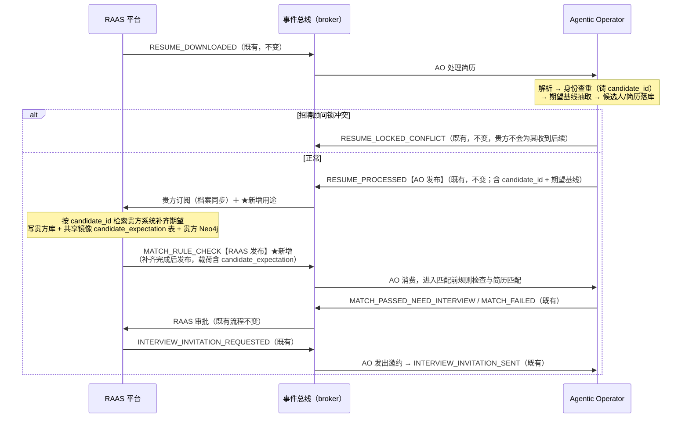

# RAAS-v1 对接规格 — 候选人期望补齐 + 手机号规范化（AO ⇄ RAAS）

- **版本**: v1.0（提案，待 RAAS 平台确认后冻结）
- **日期**: 2026-07-17
- **发起方**: Agentic Operator（AO，招聘-v1 / RAAS-v1 域）
- **对接方**: RAAS 平台
- **状态**: 设计评审中 — AO 侧代码尚未改动
- **说明**: 本文档是发给 RAAS 的对外对接规格，含两个相互独立的工作项：**A. 候选人期望补齐**（事件对接）、**B. 手机号规范化**（共享数据契约）。两项可分别评审、分别上线。

---

## 0. 摘要 — RAAS 需要做什么（一页看全）

| 工作项 | RAAS 必做 | RAAS 建议（择期） | RAAS 无需 |
|---|---|---|---|
| **A. 候选人期望补齐** | ① 在既有的 `RESUME_PROCESSED` 消费里，按 `candidate_id` 补齐候选人期望并持久化（贵方库 + 共享镜像 `candidate_expectation` 表 + 贵方 Neo4j）；② 补齐完成后发布新事件 `MATCH_RULE_CHECK`（载荷含期望） | — | 订阅任何新事件（复用既有 `RESUME_PROCESSED` 订阅） |
| **B. 手机号规范化** | 在共享镜像 `candidate` 表新增（或批准 AO 新增）一个可空列 `mobile_e164` | 把 `mobile_e164` 作为贵方系统的手机号规范键；择期把 `mobile` 列也统一为国际标准形 | 改动任何现有读 `candidate.mobile` 的界面/短信/查询（完全不受影响） |

---

## 1. 事件方向总表（两个事件，一进一出）

| 事件 | 发布方 | 消费方 | 说明 |
|---|---|---|---|
| `RESUME_PROCESSED` | **AO 发布** | **RAAS 消费** | 既有事件，契约不变。贵方已订阅（档案状态同步）；本次★新增用途：拿载荷中的 `candidate_id` 补齐并持久化候选人期望 |
| `MATCH_RULE_CHECK` | **RAAS 发布** | **AO 消费** | ★唯一新增事件。贵方补齐+持久化完成后发布（载荷含补齐后的 `candidate_expectation`）；AO 消费它触发后续匹配 |

闭环：**AO 发 `RESUME_PROCESSED` → RAAS 消费并补齐+持久化 → RAAS 发 `MATCH_RULE_CHECK` → AO 消费并进入匹配**。

---

## 2. Part A — 候选人期望补齐

### 2.1 背景

AO 的简历匹配（RoboHire `/match-resume`）支持传入候选人本人的求职期望作为匹配参数。AO 目前只能从简历文本**尽力抽取**期望基线（很多简历不写期望城市），而贵方握有权威数据：顾问与候选人的沟通记录、候选人库中的求职意向。本项由贵方在既有 `RESUME_PROCESSED` 消费上补齐权威期望，回流给 AO 参与匹配。

### 2.2 事件流程



### 2.3 `RESUME_PROCESSED`（AO 发布 / RAAS 消费，既有——契约不变）

贵方补齐所需字段**已经在**该事件载荷中：

| 字段 | 说明 |
|---|---|
| `candidate_id` | **补齐检索主键**（AO 查重后稳定的候选人 ID） |
| `upload_id` | 贵方上传编号（`MATCH_RULE_CHECK` 需原样回传） |
| `resume_id` / `job_requisition_id` / `job_requisition_ids` | 链路上下文（`MATCH_RULE_CHECK` 需原样回传） |
| `candidate` | 候选人摘要（姓名/联系方式等，辅助核对） |
| `candidate_expectation` | AO 从简历文本抽取的**期望基线**（可为 `{}`），供贵方参考与合并 |

### 2.4 `MATCH_RULE_CHECK`（RAAS 发布 / AO 消费，★新增）

- **发布时机**: 贵方消费 `RESUME_PROCESSED`、完成期望补齐**且持久化**之后。
- **信封**: `entity_type = "Candidate_Expectation"`，**`entity_id = candidate_id`（必填）**。

**RAAS 侧三条义务**：

1. **补齐完成必发布**：无论是否查到补充数据都必须发布 `MATCH_RULE_CHECK`，**载荷携带 `candidate_expectation` 完整对象**。查不到就把收到的基线原样回传并标 `enrichment_status: "none"`。不发布会使该候选人流程停在补齐环。
2. **锚点回传**：`candidate_id`（同时置入信封 `entity_id`）、`upload_id`、`resume_id`、`job_requisition_id(s)` 原样回传。
3. **回传完整对象**：`candidate_expectation` 回传**合并后的完整对象**（在 AO 基线之上覆盖贵方权威值），而非只回增量字段。

**payload 字段**：

| 字段 | 类型 | 必填 | 说明 |
|---|---|---|---|
| `candidate_id` | string | 是 | 主锚点，原样回传（同时置入信封 `entity_id`） |
| `upload_id` | string | 是 | 原样回传（幂等兜底键） |
| `resume_id` | string | 是 | 原样回传 |
| `job_requisition_id` | string | 是 | 原样回传 |
| `job_requisition_ids` | string[] | 是 | 原样回传 |
| `candidate_expectation` | object | 是 | 合并后的完整期望对象（§4.1 字典） |
| `enrichment_status` | string | 是 | `filled`（补到了）/ `none`（没查到，基线原样回）/ `bypassed`（预留给 AO 过渡期自答） |
| `enriched_fields` | string[] | 否 | 本次实际补齐的字段名（如 `["expected_location"]`），便于审计 |

**payload 示例**：

```json
{
  "candidate_id": "cand-2652257aaa9b",
  "upload_id": "upl-20260717-000123",
  "resume_id": "res-8f31c02d",
  "job_requisition_id": "JRQ-e2bf…-R2026040143",
  "job_requisition_ids": ["JRQ-e2bf…-R2026040143"],
  "enrichment_status": "filled",
  "enriched_fields": ["expected_location", "expected_salary_range"],
  "candidate_expectation": {
    "expected_location": "深圳、广州",
    "expected_position": "资深平台工程师",
    "expected_salary_range": "35K-45K",
    "expected_industry": "",
    "expected_company_size": "",
    "expected_work_mode": "远程",
    "outsourcing_acceptance_level": "接受",
    "constraints": [],
    "available_from": null
  }
}
```

### 2.5 持久化归属

补齐后期望的持久化 = **RAAS 的职责**：由贵方写①贵方库、②共享镜像 `candidate_expectation` 表、③贵方 Neo4j 候选人节点同步。AO 侧不写该表——避免双写同一张表造成漂移。

---

## 3. Part B — 手机号规范化

### 3.1 问题

简历里既有中国手机号也有其它国家的号。今天手机号在跨系统只做"去非数字取后 11 位"这类中国专用处理，导致：中国号 `+86…` 与某些国家号尾数相同会**误判为同一人**；同一人两种写法（`13800000000` vs `+86 138 0000 0000`）会**被拆成两人**。国际候选人的手机号匹配不可靠。

### 3.2 AO 侧改动（供你了解）

- AO 解析简历后，把每个手机号规范化为 **E.164 国际标准形**（`+` + 国家码 + 国内号，如 `+8613800000000`、`+14155552671`），按各国 trunk 前缀/长度规则处理。
- 共享镜像 `candidate` 表：AO 继续把原始号写入 `mobile`（**不变**），并新增把规范形写入 `mobile_e164`。无法解析/无效的号 `mobile_e164 = NULL`，并置位既有的 `needs_mobile_review` 标记（该列贵方 schema 已存在，AO 开始写它）。
- AO 发布的 `RESUME_PROCESSED` 载荷中，候选人手机号将同时携带**原始形**与 **E.164 形**（过渡期再带一个**裸国内形**，便于贵方按现存格式匹配）。

### 3.3 RAAS 需要做什么

| 类别 | 内容 |
|---|---|
| **必做（很小）** | 在共享镜像 `candidate` 表**新增一个可空列 `mobile_e164 TEXT NULL`**（贵方 Prisma 管理该 schema，需贵方加列或批准 AO 迁移）。可选再加 `mobile_valid BOOLEAN`。`needs_mobile_review` 列已存在无需新增 |
| **建议（择期）** | 把 `mobile_e164` 作为贵方系统里手机号的**规范联接/去重键**；并择期把贵方 `mobile` 列也统一为 E.164。这样国际号在贵方侧（含期望补齐若用手机号辅助核对、候选人去重）才可靠 |
| **无需** | 其它一切照旧——贵方现有读 `candidate.mobile`（原始形）的界面/短信/查询完全不受影响；过渡期 AO 双形发送，贵方按现存形匹配即可，零中断 |

### 3.4 为什么与你相关

- 期望补齐的检索主键是 `candidate_id`（**不受手机号改动影响**）。
- 但若贵方在自家库里按**手机号**去重/匹配候选人（或在期望补齐时用手机号做辅助核对），今天的"中国号后 11 位"规则对国际号会**静默失配**。统一到 E.164 后消除。
- 过渡期 AO 双形发送 → 贵方随时切换、零中断。贵方完成 E.164 统一后，AO 收掉裸国内形，双方共享唯一规范键。

---

## 4. 字段字典

### 4.1 `candidate_expectation`（Part A）

以共享镜像 `candidate_expectation` 表列名为准：

| 字段 | 类型 | 中文 | 说明 |
|---|---|---|---|
| **`expected_location`** | string | **期望城市** | **补齐核心字段**。多值用顿号/逗号分隔（"深圳、广州"） |
| `expected_position` | string | 期望职位 | 多值同上 |
| `expected_salary_range` | string | 期望薪资 | 自由文本区间（"35K-45K" / "1.5万-2万"） |
| `expected_industry` | string | 期望行业 | |
| `expected_company_size` | string | 期望公司规模 | |
| `expected_work_mode` | string | 工作模式 | 远程 / 现场 / 混合 |
| `outsourcing_acceptance_level` | string | 外包接受度 | |
| `constraints` | string[] | 约束条件 | 夜班 / 出差 / 群面接受度等 |
| `available_from` | string(ISO) \| null | 可到岗时间 | |

约定：**查不到的字段回空串/空数组/null，不要省略键**；AO 侧空值不会覆盖已有基线。

### 4.2 手机号字段（Part B，共享 `candidate` 表 + 事件载荷）

| 字段 | 位置 | 说明 |
|---|---|---|
| `mobile` | candidate 表 / 事件 | **原始号**（简历原文，审计/展示，不变） |
| `mobile_e164` | candidate 表（新增）/ 事件 | **E.164 规范形**（跨系统联接/去重键；无效时 NULL） |
| `mobile_national`（过渡期） | 事件 | 裸国内形（便于贵方按现存 11 位格式匹配；贵方 E.164 统一后收掉） |
| `mobile_valid` | candidate 表（可选新增） | 是否为有效可拨号码 |
| `needs_mobile_review` | candidate 表（已存在） | 无效/待人工复核标记，AO 开始写 |

---

## 5. 幂等、重试与异常语义（Part A）

| 场景 | 约定 |
|---|---|
| **去重键** | AO 入站幂等以 `event_id`（贵方信封）为主键，`candidate_id`/`upload_id` 为兜底 |
| **重复 `MATCH_RULE_CHECK`** | 幂等安全：同一 `candidate_id` 重复发布，AO 侧下游不会重复推进 |
| **`RESUME_PROCESSED` 重发** | AO 重试/重启可能重发（同 `upload_id`）。贵方按 `candidate_id`/`upload_id` 幂等处理，重复到达时重新发布一次 `MATCH_RULE_CHECK` 即可 |
| **RAAS 暂时无法处理** | 链路停等在补齐环（AO 侧无在途任务挂起，纯事件等待）。恢复后补发 `MATCH_RULE_CHECK` 即续链 |
| **建议时限** | `MATCH_RULE_CHECK` 在 `RESUME_PROCESSED` 后 **24h 内**发布（软约定，监控告警用，非硬超时） |
| **锁冲突** | 锁死候选人在 AO 侧即终止（`RESUME_LOCKED_CONFLICT`），**不会发出 `RESUME_PROCESSED`**——贵方不会为其收到补齐场景 |

---

## 6. 分阶段上线

| 阶段 | Part A（期望补齐） | Part B（手机号） | RAAS 工作量 |
|---|---|---|---|
| **Phase 1** | AO 完成事件切换 + 过渡开关（未上线前 AO 自答 `MATCH_RULE_CHECK`，全链等价于今天）；贵方可先观察 `RESUME_PROCESSED` 真实载荷 | AO 与贵方协调新增 `mobile_e164` 列；AO 开始双写与双形发送 | 加 1 个可空列 |
| **Phase 2** | 贵方上线"补齐 + 持久化 + 发布 `MATCH_RULE_CHECK`"；AO 关闭自答开关 | 贵方择期采纳 `mobile_e164` 为规范键 | 消费扩展 + 持久化 + 发布 |
| **Phase 3** | 稳定后收紧：可选对账报表 | 贵方 `mobile` 列统一 E.164 后，AO 收掉裸国内形 | 可选 |

---

## 7. 附录 — 改造后 AO 侧 agent 清单（保持 6 个，供你了解全貌）

| Agent | 触发 | 发出 | 变化 |
|---|---|---|---|
| createJD | REQUIREMENT_LOGGED / CLARIFICATION_READY / JD_REJECTED | JD_GENERATED | 不变 |
| processResume | RESUME_DOWNLOADED | **RESUME_PROCESSED** / RESUME_LOCKED_CONFLICT | 不变（+手机号 E.164 双写） |
| ruleCheckForCandidateIdentity | （processResume 同步调用 / CANDIDATE_IDENTITY_REQUESTED） | CANDIDATE_IDENTITY_CHECKED | 不变 |
| ruleCheckForMatchResume | **MATCH_RULE_CHECK**（原 RESUME_PROCESSED） | MATCH_RULE_CHECK_PASSED / FAILED | 仅触发器改变 |
| matchResume | MATCH_RULE_CHECK_PASSED | MATCH_PASSED_NEED_INTERVIEW / MATCH_FAILED | 不变（消费补齐后期望） |
| inviteInternalInterview | INTERVIEW_INVITATION_REQUESTED | INTERVIEW_INVITATION_SENT / FAILED | 不变 |

---

*联系人：AO 侧（本文档发起方）。评审通过后 AO 按 Phase 1 实施并提供联调环境；贵方可用现有 `RESUME_PROCESSED` 订阅直接观察真实载荷。*
