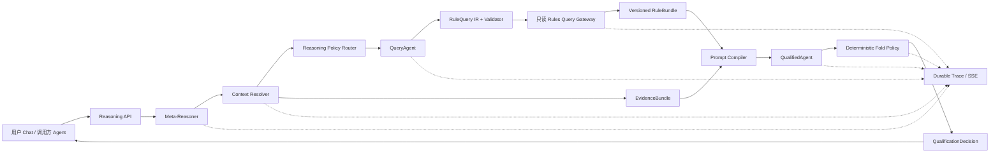
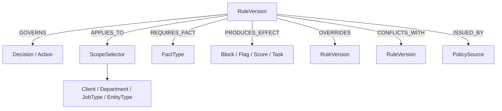
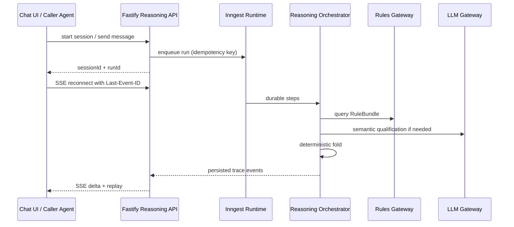

# 推理 Agent：技术可行性与前后端实施方案

> 状态：Implemented link-only V2 · 2026-07-14  
> 适用系统：Agentic Operator / RAAS / 招聘（zhaopin）  
> 目标：覆盖整个招聘生命周期，以可审计、可回放、可控成本的 AI 推理编排，按不同场景输入动态筛选适用规则并完成资格检查。

## 0. 结论

方案可行，综合可行性评估为 **8.5/10（高）**。`rules-test` 已提供可运行的 stage-less 规则基线，因此规则迁移不再是首个切片的阻塞项。

项目已经具备约 60% 的底座：多租户运行时、真实 LLM Gateway、工具调用循环、Inngest 持久执行、`runs / steps / llm_turns`、SSE、Rule Audit 页面，以及招聘链路现成的“加载业务上下文 → 获取规则 → 评估 → 确定性折叠”。需要新增的不是一个孤立 Agent，而是五个生产级能力：

1. 面向用户和内部 Agent 的统一推理入口；
2. Stage-less Rule Graph 与规则版本快照；
3. 受约束的 QueryAgent / Cypher 查询网关；
4. 动态 Prompt Compiler + QualifiedAgent；
5. 结构化 Trace、评测集、预算与安全 Harness。

建议采用 **“受约束的 ReAct 编排 + 符号化查询中间层 + 语义判读 + 确定性最终折叠”**，而不是让一个大模型同时自由生成 Cypher、解释规则并决定候选人是否通过。

通用 V2 已不再局限于 `/actions/{action}/rules`，也不再扫描 Rule 的 stage/client/department 属性来决定召回。Allmeta `/rule-evaluation/select` 会把 Query IR 编译为两段真实、参数化、只读且域锁定的 Cypher：第一段只沿 `Rule-[:SCOPED_TO]->PolicyScope` 与 `GOVERNS/APPLIES_TO/RELEVANT_TO` 语义路径召回规则，第二段检查适用 mandatory Rule 是否缺失作用域或执行语义 Link。任何 fallback、缺失 Link 路径、非零 mandatory coverage 缺口或缺失 Cypher receipt 都会 fail closed。

### 0.1 2026-07-14 已实现范围

- `rules-test` 已部署 262 条无 stage Rule（64 mandatory、198 optional）与 2,475 条 Allmeta links；Neo4j 实库中 Rule 的 `stage/specificScenarioStage` 属性计数为 0。
- Allmeta 为全部 Rule 生成 `SCOPED_TO` 作用域关系，并补充 `GOVERNS`、`APPLIES_TO` 与经审核的 `RELEVANT_TO` 语义关系；Studio `/api/v1/ontology/rule-evaluation/select` 返回完整三元组路径及两段执行 Cypher receipt。
- Agentic Operator 注册通用 `reasoningAgent`：domain 由独立的租户 Reasoning 配置锁定，action 必须存在于该 Allmeta domain 的真实 Action 列表；scenario/inputs 由受信调用方提供。系统强制先运行 Rule Selector，再运行 Prompt Compiler，最后执行 QualifiedAgent assessment。
- Reasoning Harness 根据当前 prompt 与不可变业务证据公开提交方法、能力/对象/证据锚点和停止条件；它不暴露或依赖模型私有思维链。
- Prompt Compiler 根据任意招聘场景的实际 evidence keys、RuleQuery IR、语义 Link 路径和不可变 RuleBundle 动态编译提示，并持久化 prompt SHA-256；没有简历匹配规则 ID 或阶段标签硬编码。
- QualifiedAgent 作为真实隔离 child run 执行，父子 run 必须具有相同 tenant/correlation，并用 `parent_run_id`、RuleBundle hash、compiler id 与 prompt hash 交叉验证；它不注册到 Agent Factory。
- 后端确定性折叠：mandatory 违反即 `ineligible`，mandatory 缺证据即 `review_required`，optional 未满足只产生 flag；模型漏评 mandatory 时自动 fail-closed。
- `zhaopin` 工作流的 `ruleCheckForMatchResume` 已从“固定 11 条 + 硬编码 evaluator”切换为 `reasoning.evaluateRules`；同一工具可由其他招聘 Action 仅通过配置不同 scenario/input/objectTypes/keywords 复用。旧工具仅保留给历史部署回放。
- Portal 左侧“推理 Agent”支持 Chat；业务配置和 Candidate/Resume/Job Requisition/JD/通用 Inputs 已移动到右侧栏。右栏提供 Input、Flow、Rules、Log 四个 tab，展示动态 SVG DAG、公开 Harness、完整 Cypher/参数/指纹、三元组 Links、动态 prompt、父子 run I/O 与逐规则 assessment。
- 真实腾讯 IEG 联调已通过：两段 Cypher 从 Allmeta 返回 22 条适配规则（10 mandatory、12 optional）及 175 条本轮 Link 路径，独立 QualifiedAgent child run 完成 22 条逐规则判定，确定性折叠为 `ineligible`。
- Reasoning 已从 Agent Factory 完全解耦：租户包通过 `TenantRegistry.reasoning` 声明独立规则域；API 使用 `/v1/reasoning-agent/context` 和专用 Allmeta client；Portal 使用独立 query hook。Reasoning 不读取、不创建、不更新 `factory_domain_bindings`，Factory 可继续绑定自己的生成本体。

---

## 1. 现有代码与目标的契合度

### 1.1 可以直接复用

| 现有能力 | 代码位置 | 在新方案中的用途 |
|---|---|---|
| 左侧导航与现有设计系统 | `apps/web/app/portal/components/shell/sidebar.tsx`、`styles/tokens.css` | 增加“推理 Agent”入口，保持 232px 左栏和现有 token |
| AI 洞察 / 规则审计 | `apps/web/app/portal/[tenant]/(views)/reasoning/page.tsx` | 保留为跨运行审计，不承担交互式推理 |
| LLM 工具循环 | `packages/runtime/src/step-engine.ts` | 实现受限 ReAct：模型规划、工具取证、观察结果、继续或结束 |
| 运行、步骤、LLM turn | `packages/db/src/schema.ts` | 统一运行身份、耗时、token、模型和回放 |
| SSE / 日志回填 | `apps/api/src/routes/v1/stream.ts`、`runs-logs.ts` | 运行时侧栏实时更新与断线重连 |
| 招聘规则上下文 | `tenants/zhaopin/src/tools/raas-rule-context.ts` | 解析 Candidate / Resume / Requisition / JD 的可信事实 |
| 现行规则读取 | Allmeta `/api/v1/ontology/rule-evaluation/select` | 通用 Rule Selector；Query IR → 固定只读 Cypher → compact RuleBundle |
| 规则评估与折叠 | `packages/agents/src/system/prompt-compiler.ts`、`reasoning-agent.ts` | 动态 QualifiedAgent harness + mandatory/optional 确定性最终裁决 |
| Agent/Tool 可观测性 | Logs、Agent Calls、Trace Tree | 运行图节点、调用边和失败定位的数据来源 |

### 1.2 必须补齐

- 当前“AI 洞察”是跨运行、轮询式审计页，不是 Chat Session，也不能安全地承载用户多轮输入。
- 当前 `llm_turns.reasoning` 会保存并展示 provider 暴露的原始 thinking；它不应成为新页面的业务解释或合规证据。
- 当前 Neo4j 凭据仍只在 Allmeta；Agentic Operator 通过域锁定 HTTP 边界访问。V1 已使用固定 read-only Cypher 与 2,000 行/100 返回规则上限，但生产数据库账户的细粒度 read privilege、查询计划预算和超时仍需部署侧核验。
- `rules-test` 已完成 stage-less 迁移，但其他旧 domain 仍可能保留 stage 字段；推理 Agent 只接受 `rules-test` 的 `mandatory|optional` 契约，跨 domain 推广前仍需逐域迁移与契约测试。
- 当前最终事件只有 PASS / FAILED，无法区分“明确违反”“必填证据不足”“可选项未达成”。新方案必须把这三类结果分开。

---

## 2. 目标系统架构



核心边界：

- **LLM 负责**：理解意图、指出需要哪些事实、语义匹配、对非结构化简历/JD 进行证据定位、生成面向用户的解释。
- **Harness 负责**：选择允许的推理模式、限制工具、编译/校验查询、预算、重试、数据权限、快照、最终状态机。
- **确定性代码负责**：强规则计算、必选/可选语义折叠、冲突优先级、事件路由、是否允许自动进入简历匹配。
- **控制面隔离**：Agent Factory 负责“生成/部署 Agent”，Reasoning Runtime 负责“运行期规则判断”。二者拥有不同配置、API、前端数据源和持久化边界，禁止用 Factory domain binding 作为 Reasoning 授权依据。

### 2.1 推荐 Agent 拆分

| 组件 | 责任 | 是否能决定最终放行 |
|---|---|---:|
| Meta-Reasoner | 从 prompt 和 input refs 提取意图、决策类型、缺失事实、风险级别 | 否 |
| Context Resolver | 读取 Candidate、Resume、Job Requisition、JD、申请/面试/黑名单历史，生成带来源的 EvidenceBundle | 否 |
| Reasoning Policy Router | 根据风险和证据状态选择 direct / ReAct / semantic-judge / reviewer | 否 |
| QueryAgent | 把检索意图转为 RuleQuery IR；必要时生成候选 Cypher | 否 |
| RuleRetriever | 只读执行参数化 Cypher，返回完整 RuleBundle 与 override/conflict closure | 否 |
| QualifiedAgent | 逐条判读规则，必须引用 rule_id 和 evidence_id | 否 |
| Fold Policy | 按 enforcement、优先级、证据状态和冲突关系生成最终状态 | **是，且必须为代码** |

不建议把它们部署成七个始终独立调用模型的 Agent。生产形态应是一个 Reasoning Orchestrator，内部只有在语义判读或 fresh-review 必要时才额外调用模型。这样能减少延迟、token 和跨 Agent 上下文漂移。

---

## 3. 推理策略：组合，而不是让模型随意“选流派”

ReAct 适合本任务，因为它允许模型在推理过程中调用上下文和规则工具，再根据观察结果调整计划。[ReAct 论文](https://arxiv.org/abs/2210.03629)明确研究了 reasoning 与 action 的交错协同。CoT 对复杂推理有效，[NeurIPS 2022 论文](https://proceedings.neurips.cc/paper_files/paper/2022/hash/9d5609613524ecf4f15af0f7b31abca4-Abstract-Conference.html)给出了多类任务增益，但不应被等同于可靠审计证据；研究发现 CoT 可能为受偏置影响的答案生成看似合理但不忠实的解释。[Turpin 等，2023](https://arxiv.org/abs/2305.04388)

因此不让 Meta-Reasoner自由输出“我决定用 ReAct + ToT”。它只输出任务特征，Harness 用可测试的策略表选择路径：

| 情形 | 路径 | 说明 |
|---|---|---|
| 事实完整，规则为可执行 DSL | `direct` | 不调用语义模型，规则引擎直接判定 |
| 需要查询 Candidate/JD/历史/规则图 | `react` | 最多 N 轮“计划 → 工具 → 观察” |
| 多个互不依赖的规则簇 | `decompose-map` | 按规则簇并行判读，再确定性汇总 |
| 强制规则存在高歧义语义证据 | `semantic-judge + self-consistency` | 仅对该规则做 3 次独立判读；自一致性论文显示多路径聚合可提升复杂推理，但成本高，不能默认开启。[Wang 等，2022](https://arxiv.org/abs/2203.11171) |
| 规则冲突、置信度低、证据互斥 | `fresh-review` | 新上下文 reviewer 或人工任务，不让原 Agent 自评 |
| 图查询失败、规则包为空、版本不明 | `fail-closed` | 禁止自动进入匹配，状态为 `review_required`，不是误判 `ineligible` |

推荐默认预算：`max_turns=8`、`max_tool_calls=12`、结构化输出修复最多 2 次、Query 修复最多 1 次。预算必须由服务端配置，prompt 无权修改。

### 3.1 Meta-Reasoner 输出契约

```json
{
  "intent": "pre_match_qualification",
  "decision_key": "resume_match_eligibility",
  "risk_tier": "high",
  "subjects": {
    "candidate_id": "cand-...",
    "resume_id": "res-...",
    "job_requisition_id": "req-...",
    "jd_id": "jd-..."
  },
  "required_fact_types": [
    "candidate.employment_history",
    "candidate.nationality",
    "job.client",
    "job.department",
    "application.history"
  ],
  "uncertainties": [],
  "suggested_operations": ["resolve_context", "retrieve_rules", "qualify"]
}
```

模型不能在这里注入工具名、Cypher、最终 verdict 或自行提高预算。

---

## 4. Stage-less Rules：从“流程阶段标签”改为“决策与适用性”

### 4.1 设计原则

“规则不再标 stage”不代表 Candidate/Application 的业务状态字段必须删除。业务对象仍可保留 stage/status；需要消除的是 **规则检索对 stage 标签的依赖**。

规则应回答五件事：

1. 它治理哪个 `Decision / Action / Capability`；
2. 对哪些 Entity / Client / Department / Job Type 适用；
3. 判定需要哪些事实；
4. 它是 mandatory、optional 还是 advisory；
5. 命中、未达成、证据不足时产生什么 effect。

### 4.2 推荐图模型



`RuleVersion` 最小字段：

```ts
interface RuleVersion {
  ruleId: string;
  version: string;
  status: "draft" | "active" | "retired";
  effectiveFrom: string;
  effectiveTo?: string;
  governs: { decisionKey: string; actionKeys?: string[] };
  enforcement: "mandatory" | "optional" | "advisory";
  modality: "obligation" | "prohibition" | "eligibility" | "scoring";
  scopeSelector: Record<string, unknown>;
  requiredFacts: Array<{ type: string; required: boolean }>;
  evaluationMode: "deterministic" | "semantic" | "hybrid";
  predicateDsl?: unknown;
  semanticRubric?: string;
  effects: Array<"block" | "flag" | "score" | "tag" | "create_task">;
  priority: number;
  sourceRef: string;
  owner: string;
  contentHash: string;
}
```

必须把 `not_applicable` 与 `pass` 分开；不适用不等于满足。V2 在线 Rule 契约不接受 `specificScenarioStage` 或 Rule `stage`。Candidate/Application 等业务对象仍可拥有自己的流程状态字段，但这些字段只是待判定证据，不能成为规则召回条件。

### 4.3 迁移步骤

1. 将现有 `specificScenarioStage + submissionCriteria + relatedEntities` 离线映射为 `governs + scopeSelector + requiredFacts`；映射结果必须人工抽检。
2. 给每条规则补 `enforcement / evaluationMode / effects / effective time / version / sourceRef`。
3. 新旧读取双跑，比较每个历史 case 的规则集合差异；规则召回缺失必须为阻断项。
4. 新引擎 shadow 运行，不影响真实匹配；记录旧结论、新结论和人工 gold。
5. 覆盖率达到门槛后，切换为 link-only 图查询；旧 domain 在迁移完成前不得绑定 V2 Reasoning 配置。
6. 删除 Rule 的 stage 属性并用契约测试、Neo4j 回读与 mandatory-link-coverage 查询持续证明其未被重新引入。

---

## 5. QueryAgent 与 Cypher：推荐 Query IR，而不是自由文本直通数据库

Text2Cypher 是可行方向，但现有研究也指出 LLM 容易在复杂图语义下生成不完整或错误查询，领域数据和 schema grounding 很关键。[Text2Cypher, GenAIK 2025](https://aclanthology.org/2025.genaik-1.11/) 因此推荐两级设计：

### 5.1 Level 1（已实现）：QueryAgent 只生成 RuleQuery IR

```json
{
  "version": "rule-link-query-ir/v2",
  "domainId": "rules-test",
  "actionHint": "ruleCheckForMatchResume",
  "capabilityAnchors": ["ruleCheckForMatchResume", "matchResume"],
  "objectAnchors": ["Candidate", "Resume", "Job_Requisition"],
  "applicableClient": "腾讯",
  "applicableDepartment": "IEG",
  "enforcementLevels": ["mandatory", "optional"],
  "allowedRelationships": ["SCOPED_TO", "GOVERNS", "APPLIES_TO", "RELEVANT_TO"],
  "maxHops": 2,
  "limit": 40
}
```

由纯代码编译为参数化 Cypher。Neo4j 官方文档建议用参数而不是字符串拼接，参数也有利于执行计划缓存。[Cypher Parameters](https://neo4j.com/docs/cypher-manual/current/syntax/parameters/)

```cypher
MATCH (r:Rule {domainId: $domain})-[scopeRel:SCOPED_TO]->
      (scope:PolicyScope {domainId: $domain})
WHERE scopeRel.allmetaLink = true
  AND scopeRel.status = 'approved'
  AND scope.normalizedKey IN $acceptedScopeKeys
  AND r.enforcementLevel IN $enforcementLevels
OPTIONAL MATCH (r)-[semanticRel:APPLIES_TO|GOVERNS|RELEVANT_TO]->(target)
WHERE target.domainId = $domain
  AND semanticRel.allmetaLink = true
RETURN r, scope, semanticRel, target
ORDER BY r.id
LIMIT toInteger($candidateLimit)
```

生产查询还会验证 capability/object/intent anchors，并返回每条 Link 的 id、status、confidence、自然语言关系和证据来源。第二段 `mandatory-link-coverage` Cypher 独立证明当前适用的 mandatory Rule 没有 scope/semantic Link 缺口；其返回行数必须为 0。

### 5.2 Level 2：仅为无法由 IR 表达的探索查询开放候选 Cypher

执行前必须通过：

- Cypher AST/关键字 allowlist：只允许 `MATCH / OPTIONAL MATCH / WHERE / WITH / RETURN / ORDER BY / LIMIT`；
- 禁止 `CREATE / MERGE / SET / DELETE / REMOVE / LOAD CSV / CALL / APOC / subquery write`；
- 数据库账户只有目标 label/property 的 `TRAVERSE + READ`，禁止写权限；Neo4j 支持细粒度 read privilege。[Neo4j Read Privileges](https://neo4j.com/docs/operations-manual/current/authentication-authorization/privileges-reads/)
- 所有值参数化，禁止把 Resume/JD 字符串拼进查询；
- 先 `EXPLAIN` 不执行，拒绝 AllNodesScan、无界 variable path 或估算行数超限；`EXPLAIN` 只生成计划而不执行。[Neo4j Execution Plans](https://neo4j.com/docs/cypher-manual/current/planning-and-tuning/execution-plans/)
- 事务超时、最大行数、最大 bytes、最大路径深度；
- schema version、query hash、parameters hash 和 plan 摘要全部入 Trace；
- 查询修复最多一次，第二次失败直接 `review_required`。

### 5.3 服务边界

当前代码只调用 Allmeta REST，并无 Neo4j 依赖。推荐新增 **Rules Query Gateway**，由它持有图数据库凭据和只读权限；Agentic Operator 通过工具调用 Gateway，不直接携带数据库管理员凭据。若 Allmeta 已拥有图存储，优先在 Allmeta 内提供 Query IR API：

```http
POST /api/v1/ontology/rule-evaluation/select
Content-Type: application/json

{ "domainId": "rules-test", "action": "...", "query": "...", "keywords": [], "objectTypes": [], "applicableClient": "...", "applicableDepartment": "...", "limit": 40 }
```

这也避免每个租户/Agent 各自维护 Neo4j driver、连接池与授权策略。

---

## 6. EvidenceBundle、RuleBundle 与动态 Prompt

### 6.1 EvidenceBundle

不要把 Resume、Candidate、JD 和历史记录作为一坨 JSON 直接拼进 prompt。Context Resolver 应输出可引用、可裁剪的事实索引：

```json
{
  "snapshot_id": "evs-...",
  "subject": "candidate:req",
  "facts": [
    {
      "evidence_id": "ev-001",
      "fact_type": "candidate.employment",
      "value": { "company": "...", "from": "...", "to": "..." },
      "source": { "system": "raas-postgres", "record_id": "..." },
      "trust": "server_verified",
      "observed_at": "..."
    }
  ],
  "missing_fact_types": [],
  "content_hash": "sha256:..."
}
```

候选人上传文本属于 untrusted data，必须作为 data block 传入，不能影响 system instruction。PII 默认在 UI 和日志中脱敏，按权限展开。

### 6.2 RuleBundle

RuleRetriever 返回的不是临时 top-k 文本，而是可复现快照：

```json
{
  "bundle_id": "rb-...",
  "schema_version": "rules-v2",
  "as_of": "...",
  "query_hash": "sha256:...",
  "rules": [],
  "override_edges": [],
  "conflict_edges": [],
  "missing_required_fact_types": [],
  "source": "allmeta-rules-gateway",
  "content_hash": "sha256:..."
}
```

必须快照 RuleBundle；否则规则更新后无法解释“为什么昨天通过、今天不通过”。

### 6.3 Prompt Compiler

Prompt 不由 Meta-Reasoner自由拼接，而由版本化模板编译：

1. 固定 system policy：只按给定规则、不得补造证据、不得改变 enforcement、输出必须引用 ID；
2. task context：decision key、调用方、风险级别；
3. EvidenceBundle 的最小相关事实；
4. RuleBundle 的适用规则、优先级和冲突关系；
5. 输出 JSON Schema；
6. prompt version、rule hash、evidence hash。

若 token 超限，先按 `requiredFacts` 裁剪证据，再按规则 scope 排序；mandatory 规则、override/conflict closure 永远不可被截断。

---

## 7. QualifiedAgent 与最终 Fold

### 7.1 QualifiedAgent 输出

```ts
type RuleStatus =
  | "satisfied"
  | "violated"
  | "not_applicable"
  | "insufficient_evidence"
  | "optional_unmet"
  | "evaluation_error";

interface RuleAssessment {
  ruleId: string;
  ruleVersion: string;
  enforcement: "mandatory" | "optional" | "advisory";
  status: RuleStatus;
  evidenceIds: string[];
  explanation: string;
  confidence: number;
}
```

`confidence` 只能用于路由到 review，不能把 mandatory violation 通过加权平均“冲淡”。

### 7.2 确定性 Fold Policy

| 条件 | 最终状态 | 是否允许自动进入简历匹配 |
|---|---|---:|
| 任一适用 mandatory = `violated` | `ineligible` | 否 |
| mandatory = `insufficient_evidence / evaluation_error` | `review_required` | 否 |
| 规则冲突且无法按 priority/override 消解 | `review_required` | 否 |
| mandatory 全满足，optional 有 `optional_unmet` | `eligible_with_flags` | 是，附 flags |
| mandatory 全满足，optional 无缺口 | `eligible` | 是 |
| RuleBundle 为空/过期/来源失败 | `system_error` | 否 |

对应事件建议改为：

- `QUALIFICATION_ELIGIBLE`
- `QUALIFICATION_ELIGIBLE_WITH_FLAGS`
- `QUALIFICATION_INELIGIBLE`
- `QUALIFICATION_REVIEW_REQUIRED`
- `QUALIFICATION_SYSTEM_ERROR`

旧 `MATCH_RULE_CHECK_PASSED / FAILED` 可在兼容层映射，但内部不能继续用一个 FAILED 同时表示明确违规和证据不足。

---

## 8. 前端：Chat 主工作区 + 运行时右侧栏

### 8.1 信息架构

左侧在“运行”组增加：

- **推理 Agent** → `/portal/[tenant]/reasoning-agent`

保留“观察”组中的：

- **AI 洞察** → 现有 `/reasoning`，用于跨运行 reasoning summary 与规则审计。

这样用户心智很清楚：推理 Agent 是“发起和操作”，AI 洞察是“复盘和审计”。

### 8.2 桌面布局

```text
┌──────────────┬────────────────────────────────┬────────────────────────┐
│ 现有左侧导航 │ Chat / 当前推理会话             │ Input / Flow / Rules / Log │
│ 232px        │ min 640px · flex                │ 400–480px 可收起       │
│              │                                │                        │
│ 推理 Agent ● │ 用户 prompt + 业务结论          │ 业务配置与实例 JSON     │
│ AI 洞察      │ Composer                       │ DAG/Cypher/Links/Prompt │
│              │                                │ 父子 Run 与逐规则日志   │
└──────────────┴────────────────────────────────┴────────────────────────┘
```

沿用当前 `--bg / --panel / --panel-2 / --border / --text / --signal`，不引入另一套视觉语言。

### 8.3 Chat 主区

- Composer 支持自然语言和 Input Chips：`Candidate`、`Resume`、`Job Requisition`、`JD`；优先传 ID/ref，不从浏览器重复上传完整敏感文本。
- 每个 assistant 回合先显示业务结论：`可进入匹配 / 带 2 个可选项 flag / 需要人工复核 / 被强制规则拦截`。
- 下面是可展开的结构化卡：意图、所需事实、规则检索、规则判读、最终 Fold。
- Chat 中不显示完整原始 CoT；只显示服务端生成的 `decision_summary`、证据引用和工具结果。
- 支持“停止”“重试失败步骤”“复制审计摘要”“查看完整 Run”。重试必须生成新 attempt 并保留旧记录。

### 8.4 Runtime Inspector

已实现四个 tab：

1. **Input**：选择只读 Reasoning domain、规范 Action、场景与测试样例；编辑 Candidate、Resume、Job Requisition、JD 和通用 Inputs JSON。
2. **Flow**：动态 SVG/DAG 与顺序 trace；展示公开 Harness、已验证事实、两段 executed Cypher、完整参数/指纹/行数、Prompt Compiler 和确定性 Fold。
3. **Rules**：按 Rule 卡片展示 enforcement、scope、命中原因、完整三元组 Link 路径、fact→rule 证据路线及 QualifiedAgent assessment。
4. **Log**：展示父 run 与隔离 QualifiedAgent child run 的全部持久化步骤、I/O 引用、模型、token、耗时和可下载审计 JSON。

Graph 需要由事件数据驱动，不硬编码“永远六个成功节点”。失败、重试、reviewer 和人工任务都应成为真实节点/边。动画尊重 `prefers-reduced-motion`；窄于 1280px 时右栏变为可呼出的 drawer，移动端默认折叠。

### 8.5 可解释性边界

右栏应显示：

- “识别到的意图”；
- “为什么需要这些事实”；
- “调用了什么工具/查询”；
- “哪些规则被取回、版本是什么”；
- “哪些证据支持哪条判定”；
- “最终确定性策略如何折叠”。

不应声称展示模型的完整真实思维过程。CoT faithfulness 研究说明，文本推理可能是事后合理化；产品应该把可验证 Trace 作为解释主轴，而不是把原始 thinking 当真相。

---

## 9. 后端集成方案

### 9.1 执行路径

Reasoning Agent 应作为生产 Runtime 的 durable run，而不是复用 Agent Factory 的进程内 detached brain runner：



每个数据库写入和外部调用都必须在唯一命名的 `step.run` 中；查询/模型重试沿用现有 Inngest 幂等纪律。

### 9.2 新增模块建议

```text
packages/reasoning/
  contracts.ts
  orchestrator.ts
  strategy-router.ts
  prompt-compiler.ts
  fold-policy.ts
  redaction.ts

packages/tools/src/rules/
  resolve-recruitment-context.ts
  query-rules.ts
  validate-cypher.ts

apps/api/src/routes/v1/reasoning-agent.ts
apps/api/src/services/reasoning-session.ts
apps/api/src/services/reasoning-trace.ts

apps/web/app/portal/[tenant]/(views)/reasoning-agent/
  page.tsx
  chat.tsx
  runtime-inspector.tsx
  runtime-graph.tsx
  trace-timeline.tsx
```

V0 可以不新建 `packages/reasoning` workspace，先落在 `packages/runtime`；但若未来 RuleCheck、Sourcing、Interview、Client Submission 都调用它，独立 package 更清晰。

### 9.3 API 契约

```http
POST /v1/reasoning-agent/sessions
POST /v1/reasoning-agent/sessions/:sessionId/messages
GET  /v1/reasoning-agent/sessions/:sessionId
GET  /v1/reasoning-agent/runs/:runId/events
POST /v1/reasoning-agent/runs/:runId/cancel
POST /v1/reasoning-agent/runs/:runId/retry
```

发送消息：

```json
{
  "message": "请在简历匹配前检查该候选人的适用规则",
  "purpose": "pre_match_qualification",
  "input_refs": {
    "candidate_id": "...",
    "resume_id": "...",
    "job_requisition_id": "...",
    "jd_id": "..."
  },
  "idempotency_key": "..."
}
```

内部 Agent 不走 Chat 文本模拟，而调用同一服务契约：

```ts
invokeReasoning({
  purpose: "pre_match_qualification",
  inputRefs,
  caller: { agentName, runId, stepId },
  policy: { autoProgress: true, failClosed: true }
});
```

### 9.4 数据持久化

复用 `runs / steps / llm_turns / events / artifacts`，新增：

- `reasoning_sessions`：tenant、created_by、title、last_run、status；
- `reasoning_messages`：session、role、content_ref、input_refs、created_at；
- `reasoning_trace_events`：run、seq、type、agent、step、public_summary、payload_ref、visibility、hash；
- `qualification_decisions`：subject、rule_bundle_id/hash、evidence_snapshot_id/hash、prompt/model version、decision、flags、created_at；
- `rule_bundle_snapshots`：可放 blob/artifact，表内只存 ref/hash/metadata。

`llm_turns.reasoning` 暂不立即删，但新 UI 不直接读取。建议新增 `reasoning_summary` 或完全由 `reasoning_trace_events.public_summary` 供 UI 使用；原始 thinking 关闭默认采集，确需调试时加权限、短 TTL、加密和审计。

### 9.5 SSE 事件

```ts
type ReasoningTraceEvent =
  | { type: "reasoning.intent.resolved"; intent: string; summary: string }
  | { type: "reasoning.strategy.selected"; strategy: string; reason: string }
  | { type: "reasoning.context.resolved"; found: string[]; missing: string[] }
  | { type: "reasoning.query.compiled"; queryHash: string; summary: string }
  | { type: "reasoning.query.validated"; plan: unknown }
  | { type: "reasoning.rules.retrieved"; bundleId: string; count: number }
  | { type: "reasoning.rule.assessed"; ruleId: string; status: string }
  | { type: "reasoning.decision.folded"; decision: string; flags: string[] }
  | { type: "reasoning.review.requested"; taskId: string }
  | { type: "reasoning.failed"; code: string; retryable: boolean };
```

SSE 只传小型 delta；RuleBundle、EvidenceBundle、prompt 全文通过 payload ref 按权限读取。

---

## 10. Harness Engineering

SWE-agent 的研究说明，Agent-Computer Interface 的设计会显著影响 Agent 能否有效操作环境；对本项目而言，这意味着工具的 schema、返回格式和失败反馈与 prompt 同等重要。[SWE-agent, NeurIPS 2024](https://papers.nips.cc/paper_files/paper/2024/hash/5a7c947568c1b1328ccc5230172e1e7c-Abstract-Conference.html)

### 10.1 不变量

- 规则来源不可用、规则集合意外为空、mandatory 证据不足时，一律禁止自动进入匹配。
- `review_required` 不等于 `ineligible`；系统故障也不等于候选人违规。
- QualifiedAgent 不得修改 enforcement、priority、override 或 RuleBundle。
- 所有判定必须引用 `rule_id/version + evidence_id`；无引用即结构化输出失败。
- resume/JD/用户 prompt 均是不可信数据，不能改变 system policy 或工具权限。
- 图查询账户只读；LLM 永远拿不到数据库 credential。
- 租户 ID 从认证上下文推导，不能采信 prompt/input 中自行声明的 tenant。

### 10.2 预算和停止条件

| 预算 | 默认值 | 超限行为 |
|---|---:|---|
| Agent turns | 8 | `review_required` / `system_error` |
| Tool calls | 12 | 停止继续取数 |
| Query 修复 | 1 | 不再让模型无限改 Cypher |
| Structured-output 修复 | 2 | 记录 parse failure |
| Query duration | 2s | 取消事务 |
| Query rows | 100 | 截断并视为检索规格过宽 |
| RuleBundle | 100 rules | 要求缩小 scope，mandatory closure 不截断 |
| Semantic judges | 默认 1，高风险歧义 3 | 结果不一致则 review |
| Per-run cost | 按 tenant 配置 | 类型化 budget exceeded |

### 10.3 Prompt 与模型版本化

每次 decision 固化：

- orchestrator version；
- prompt template version；
- model/provider/serving model；
- rule schema/version/hash；
- RuleBundle hash；
- EvidenceBundle hash；
- QuerySpec/Cypher hash；
- Fold Policy version；
- token、成本、耗时、重试和终止原因。

这使历史 case 能在新模型或新规则下重放，并区分“模型变化”和“规则变化”。

### 10.4 评测体系

上线前至少建立以下指标：

| 层 | 指标 |
|---|---|
| 意图 | decision_key accuracy、required fact recall |
| 查询 | schema validity、EXPLAIN pass rate、execution accuracy、rule retrieval recall@k、空规则误放行数 |
| 规则 | mandatory violation recall、optional flag precision/recall、not-applicable accuracy、insufficient-evidence accuracy |
| 最终决策 | 与人工 gold 一致率、明确违规误通过率、系统故障误判为候选人失败数 |
| 稳定性 | 同 input/rule snapshot 的重复一致率、模型升级回归差异 |
| 运行 | P50/P95 latency、token、cost、tool/query failure、review rate |
| 审计 | 100% decision 可回溯到 rule/evidence/prompt/model/fold version |

最重要的 guardrail 指标是 **mandatory false-negative（明确强制规则被漏掉）**。在 shadow 评测里目标应为 0；达不到就不允许自动放行。

测试集建议：

- 50 个开发金样例：正常、明确违规、optional 未达、证据缺失、规则冲突、图超时、prompt injection、跨租户 ID；
- 200+ 历史标注 case 做离线回放；
- 500+ 真实流量 shadow run，结论不影响生产；
- 先由 operator 审批的 pilot，再逐步开放自动进入匹配。

招聘规则可能涉及国籍、性别等敏感属性；是否允许自动用于筛选必须经过适用司法辖区、客户合同和内部公平性/合规审查。Harness 应支持按规则类别强制转人工，而不是假定“规则库里存在就一定可自动执行”。

---

## 11. 论文与技术采纳结论

| 研究/资料 | 可采纳内容 | 不直接采纳的部分 |
|---|---|---|
| [ReAct](https://arxiv.org/abs/2210.03629) | 推理与工具调用交错；观察结果后重规划 | 不开放无限轮次和无限工具 |
| [Chain-of-Thought Prompting](https://proceedings.neurips.cc/paper_files/paper/2022/hash/9d5609613524ecf4f15af0f7b31abca4-Abstract-Conference.html) | 用于复杂语义判读的内部计算 | 不把原始 CoT 当作可靠解释或 UI 主内容 |
| [CoT Faithfulness](https://arxiv.org/abs/2305.04388) | 促使产品显示证据化 trace 和确定性 fold | 不以“看见思维链”替代审计 |
| [Self-Consistency](https://arxiv.org/abs/2203.11171) | 仅在强制规则且语义歧义高时多样本聚合 | 不对所有规则默认 N 次调用 |
| [GraphRAG](https://www.microsoft.com/en-us/research/publication/from-local-to-global-a-graph-rag-approach-to-query-focused-summarization/) | 规则/实体关系图的长期全局分析可参考 community summaries | 当前“针对一个 Candidate+Job 找适用规则”是 local graph retrieval，不需要先上完整 GraphRAG |
| [Text2Cypher](https://aclanthology.org/2025.genaik-1.11/) | schema grounding、领域样例和执行验证 | 不让自由 Cypher 直通生产图库 |
| [SWE-agent / ACI](https://papers.nips.cc/paper_files/paper/2024/hash/5a7c947568c1b1328ccc5230172e1e7c-Abstract-Conference.html) | 把工具接口、错误反馈、可操作性当作一等工程资产 | 不把“更自主”当成默认目标 |

完整 GraphRAG 不是第一阶段必需项。它更适合“全公司的规则主题、冲突簇、规则覆盖缺口”这类全局问题；在线候选人资格检查应优先做有边界的 local graph traversal。

---

## 12. 分阶段交付

### Phase 0：合同与 Gold Set（1 周）

- 冻结 `ReasoningPlan / EvidenceBundle / RuleBundle / RuleAssessment / QualificationDecision` schema；
- 定义五值最终状态和旧事件兼容映射；
- 建立首批 50 个金样例；
- 盘点 stage → governs/scope/requiredFacts 的迁移规则。

**退出标准**：schema review 通过；所有现有 10-1 规则都有 enforcement、effect、requiredFacts。

### Phase 1：Allmeta 纵向切片（2 周）

- 新建 Reasoning session/message/run API；
- Context Resolver 复用 `loadRaasRuleContext`；
- RuleRetriever 暂用 `ontology.fetchActionRules`；
- 动态 Prompt Compiler + QualifiedAgent + 确定性 Fold；
- 结构化 Trace/SSE；
- RuleBundle/EvidenceBundle 快照。

**退出标准**：50 个金样例跑通；无规则/故障不误放行；可完整回放。

### Phase 2：前端工作台（1–2 周）

- 左侧新增“推理 Agent”；
- Chat、input chips、会话列表；
- Runtime Inspector：Graph、Timeline、Evidence & Rules、Metrics；
- 响应式 drawer、权限与脱敏；
- 保留 AI 洞察为跨运行审计。

**退出标准**：断线重连、停止、失败重试、Run 深链、键盘导航和窄屏状态通过。

### Phase 3：Stage-less Graph + QueryAgent（2–3 周）

- Rule Graph v2、迁移工具和双读 diff；
- Rules Query Gateway；
- Query IR compiler；
- 只读 Cypher validator、EXPLAIN、预算；
- shadow replay 和查询召回评测。

**退出标准**：历史规则召回无 mandatory 缺失；跨租户和写入攻击测试通过。

### Phase 4：Shadow / Pilot（2 周以上）

- 200+ 离线回放、500+ shadow；
- 对 mandatory false-negative、optional flags、review rate 做阈值审批；
- 高风险规则默认 HITL；
- 分租户 feature flag 开启。

团队假设为 2 名后端/Agent 工程师 + 1 名前端 + 0.5 名 QA/ML Eval，可在约 6–8 个日历周形成受控 pilot；单人顺序实施更现实的区间是 10–14 周。以上不含 Allmeta/Neo4j 服务端若需从零建设的工期。

---

## 13. 关键风险与决策

| 风险 | 严重度 | 对策 |
|---|---:|---|
| QueryAgent 生成错误/昂贵 Cypher | P0 | Query IR 优先；AST allowlist；只读账号；EXPLAIN；超时/行数预算 |
| CoT 看似合理但与真实决策不一致 | P0 | UI 显示结构化 trace，不以原始 thinking 作为审计证据 |
| 规则漏召回导致误通过 | P0 | mandatory retrieval recall gate；空规则 fail-closed；bundle closure |
| “证据不足”误写为“候选人不合格” | P0 | 独立 `review_required`，禁止合并到 `ineligible` |
| 规则更新后历史结论无法解释 | P0 | RuleBundle/Evidence/Prompt/Model/Fold 全版本快照 |
| Resume/JD prompt injection | P0 | untrusted data block、工具白名单、输入不进 system、输出引用校验 |
| 跨租户数据泄露 | P0 | tenant 从认证上下文推导；Gateway server-side scope；回归测试 |
| token/延迟失控 | P1 | 复杂度路由、direct fast path、规则簇并行、预算、有限 self-consistency |
| 敏感属性自动筛选带来合规风险 | P0 | policy category gate、合规审查、按司法辖区/租户强制 HITL |

最终建议：先批准 Phase 0–2，用现有 Allmeta 规则接口完成一个可审计的纵向切片；与此同时定义 Rule Graph v2。不要把“任意 Cypher QueryAgent”设为 UI 上线的前置条件，也不要让它成为首版最终裁决者。
